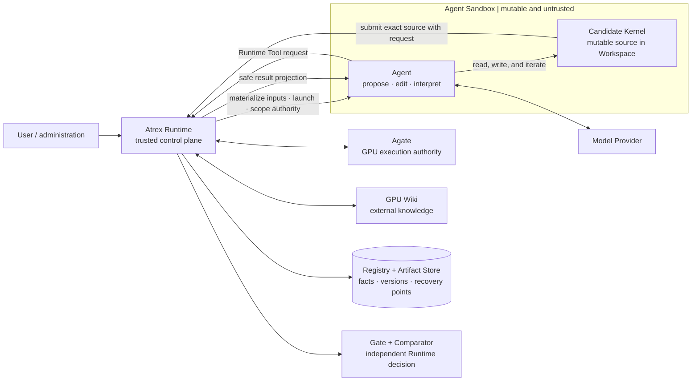
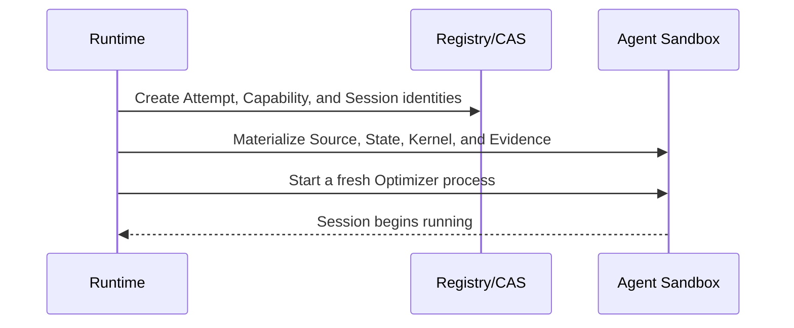
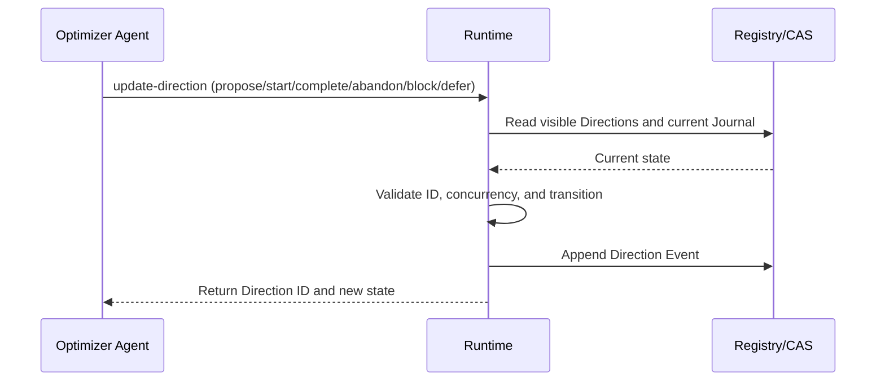
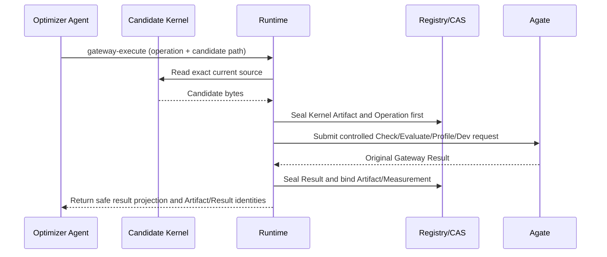
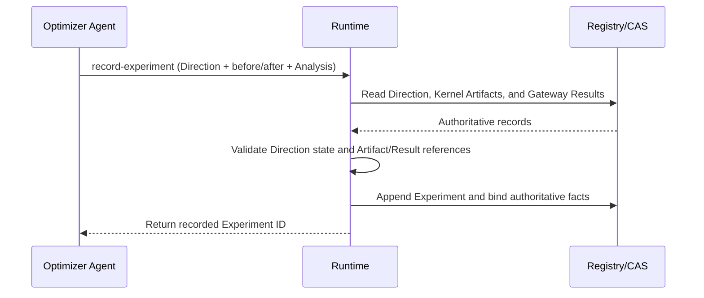
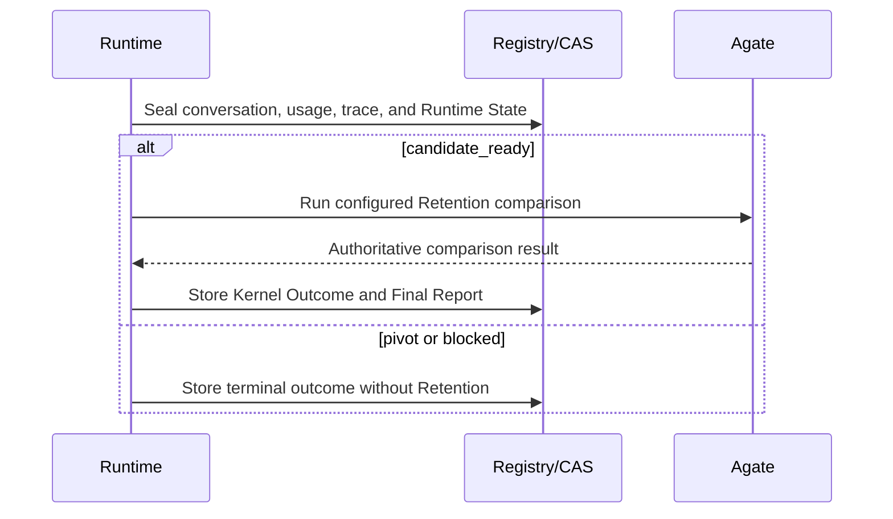

# Atrex Kernel Agent Runtime design and implementation

English | [中文](DESIGN.zh.md)

This document explains why a trusted Runtime is needed beyond the Atrex Kernel Agent (AKA) Harness, how Runtime and Agent responsibilities are divided, and how Kernel optimization and Agent evolution operate across that boundary. The executable authorities for interfaces, configuration, and persistent schemas remain [Interfaces](docs/interfaces.md), [Configuration](docs/configuration.md), the Pydantic models, and database migrations.

The AKA analysis uses upstream commit `d2ff1df`, checked out under `third_party/atrex-kernel-agent/`. AKA already has a Long Horizon Journal, Live Memory, Supervisor-owned canonical memory, worktree recovery, and independent terminal verification. This document does not present early issues already fixed upstream as current behavior.

## 1. Executive summary

AKA already provides a Long Horizon Journal, recovery, Supervisor verification, and other substantial mechanisms. The Optimizer nevertheless combines Kernel exploration with prescribed phases, tool invocation, result interpretation, cross-Session state, and handoff protocols. Independent terminal verification does not automatically create a unified record of intermediate exploration. Execution facts, Agent analysis, and current search state remain partly coupled through Agent-maintained protocols, increasing context and reconciliation costs and creating risks of stale state or incomplete records.

Atrex Runtime starts from one central conclusion: trusted facts must not depend on an Agent recalling and narrating them at the end of a long Session, and adding more Prompt constraints is not a reliable substitute. Runtime does not take over the Kernel search Workflow. It establishes a stable control plane outside the Sandbox with the following authority boundary:

- the **Optimizer Agent** chooses research Directions, edits Kernels, calls scoped Tools, and supplies reinterpretable Analysis;
- **Agate** performs actual compilation, correctness, performance, and Profile measurement;
- **Runtime** binds and persists Sessions, Kernel Artifacts, Gateway Results, Journal records, and version identities when actions occur, and independently owns capabilities, Gates, comparison, publication, recovery, and audit;
- the **Evolver Agent** reads frozen Agent Source/State, conversations, and optimization outcomes to create a Candidate Agent, but cannot evaluate that Candidate or decide promotion.

At execution time, one Campaign may create an independent Lineage for each DSL. Bootstrap establishes the first correct Kernel `v0`. Each later Epoch runs the Active and configured Challengers under matched task conditions in isolated Branches, with fresh Sessions for every Attempt. Agents may continue to propose Directions and Experiments, while Runtime automatically preserves the exact Kernel and authoritative result for every Gateway operation. At Epoch completion, Runtime makes Kernel Retention and Agent Promotion as separate decisions based on measured outcomes rather than terminal Agent narrative.

Agent evolution is likewise not an Optimizer rewriting itself while it runs. Each Evolver Session produces one versioned Challenger. It may change Prompt, Workflow, or implementation in Agent Source; curate Skills and Tools in Runtime State; or reuse, continue from, and deliberately combine several historical Agents. A Candidate becomes the new Active only by winning real Kernel-optimization competition in the next Epoch. Losing versions and their Evidence remain in the DSL Lineage for audit, rollback, and future reuse.

Runtime does not guarantee a faster Kernel or a genuinely stronger Agent. It provides traceable execution records, independently controlled comparisons, and persisted recovery points, so historical conclusions can be checked and revised. These are foundations for testing optimization and evolution hypotheses, not proof that any particular Agent change is beneficial.

## 2. Core limitations of current AKA

### 2.1 Binding Workflow Prompts add process and context overhead

AKA currently maintains Fast and Full episodes. Fast episodes prescribe a fixed number of
`plan -> implement -> evaluator` trials, plan reviewers, one evaluation per trial, and a strict
handoff. Full episodes prescribe profiling, research, planning, review, implementation,
correctness, benchmark, recording, and handoff loops.

The rules improve consistency but impose three costs:

- every Session must understand a large set of phases, prohibitions, paths, and JSON protocols;
- a stage may remain mandatory even when it has little value for the current operator, DSL, or
  evidence;
- as Prompt, Skill, and recovery protocols grow, duplicated or inconsistent instructions become
  harder to avoid.

### 2.2 Summary files cannot reliably represent current state across episodes

AKA retains canonical `memory/vN.json`, plans, profiles, episode Journals, and telemetry. The next
episode nevertheless reconstructs history primarily from compressed canonical memory. Detailed
Journals are archived without becoming a uniform, query-first history of Directions, Experiments,
Kernel Trials, measurements, and failures.

`open_directions` makes the problem concrete. An episode submits free-form
`outcome.next_directions` strings in its terminal Journal, and the Supervisor copies those strings
into that round's `memory/vN.json` as `open_directions`. Each round adds and commits a new Memory
file; later exploration does not update earlier files. A Direction has no stable identity, no
mergeable lifecycle such as `proposed`, `in_progress`, `completed`, `refuted`, `abandoned`, or
`superseded`, and no `resolved_by` or `supersedes` relationship.

At the start of episode `vN`, `vN-1` is therefore the snapshot closest to the current state. Earlier
files mean “considered open at that time,” not necessarily “still open now.” For example:

```text
memory/v2.json: open_directions = ["increase the tile size"]
memory/v3.json: an Experiment finds that large tiles regress on large Shapes
memory/v4.json: open_directions = ["retry large tiles with asynchronous copies"]
```

There is no machine-readable relation saying that the `v2` Direction was refuted or that the `v4`
entry is its revision. The resolution may appear in a later `experience.experiments`, terminal
summary, plan, profile, or archived Journal, or it may not exist because the Agent did not report
it. Even when every fact was recorded, the facts are distributed across versions and artifact
types. The next Agent must read them all and perform semantic reconciliation. It can easily mistake
a stale `open_directions` entry for a current task or miss a later refutation, correction, or
qualification.

The current Prompt does tell the Agent to treat all `memory/v*.json` records as evidence rather than
orders and to identify dead ends and open directions from them. That still delegates cross-version
state reduction to the model. There is no authoritative view answering: which Directions remain
open now, which have terminated, and which Experiments terminated them? Strictly speaking, an old
summary is not false as historical evidence; it is an immutable snapshot that lacks later state
transitions. The newest summary is also only the latest compressed Agent report and is not
guaranteed to be complete.

AKA supports bounded same-session handoff recovery, worktree recovery, and interrupted outcomes. These mechanisms retain already-written workspace and Journal data. An event absent from the Journal may still be recoverable from Provider traces, Evaluator logs, or source files, but that requires additional reconstruction and may not recover its exact associations. If the original evidence is also absent, exact reconstruction may be impossible; incomplete handoff alone does not establish permanent loss.

File handoff is not itself the problem. The problem is that a small set of summary files must serve
as the next context entry point, the explanation of historical fact, and the current-state index.
As episodes grow, the system must either expand context indefinitely or compress away detail.

### 2.3 Intermediate Journal records depend on Agent reporting without enforced binding to original results

Current AKA no longer asks the Agent to write canonical memory at episode completion. Instead, the
Agent must call the Journal CLI after every decisive experiment. This replaces one terminal recall
step with repeated in-flight reporting, but the chain is still:

```text
Agent decides whether an experiment is worth recording
  -> Agent parses Evaluator output
  -> Agent constructs evaluation/result/decision
  -> Agent invokes the Journal CLI
  -> Journal refreshes memory/live.json
  -> Supervisor derives canonical memory from Journal
```

To be clear, a Full episode terminal Candidate can receive independent Supervisor ABBA, while Fast
episodes can match official Evaluator results by Kernel hash. Final correctness and improvement no
longer depend only on Agent claims. The remaining issue is the intermediate process: Journal fields
such as `correctness`, `performance`, `latency_us`, bottleneck, and decision are still the Agent's
retelling of tool output. Schema validation proves that JSON is well-formed, not that it faithfully
represents the original result.

If the Agent forgets a call, crashes before recording, omits a failure, or miscopies a latency or Kernel hash, the structured Journal may be incomplete or inconsistent with the original output. Recovering the missing association then depends on separately retained evidence. `memory/live.json` mirrors the Journal rather than independently verifying its claims; the reporting chain still mixes measurement transcription with Agent analysis.

## 3. Related research on Agent and Harness evolution

“Agent self-evolution” does not name one optimization problem. Existing methods modify different
surfaces: Prompts, a complete Harness, Agent Source, an external SkillBank, or model weights. Their
results are therefore not directly comparable. The evidence below comes from representative work,
much of which remains in 2026 preprints.

### 3.1 Main method families

| Family | Evolvable object | Representative methods | Core mechanism |
| --- | --- | --- | --- |
| Prompt / LM Program search | Instructions, few-shot examples, module Prompts | [MIPROv2](https://arxiv.org/abs/2406.11695), [GEPA](https://arxiv.org/abs/2507.19457) | Bayesian or reflective mutation with Pareto/surrogate Candidate selection under a fixed evaluation budget |
| Bounded Harness repair | Declared Prompt, Tool, Memory, Recovery, and Runtime Policy interfaces | [Self-Harness](https://arxiv.org/abs/2606.09498), [HarnessFix](https://arxiv.org/abs/2606.06324) | Cluster or attribute failures from traces, generate scoped repairs, and apply regression validation |
| Full-component Harness evolution | Prompts, Tool implementations, Middleware, Skills, Subagents, Memory, and Control Loops | [AHE](https://arxiv.org/abs/2604.25850), [Meta-Harness](https://arxiv.org/abs/2603.28052), [HarnessBank](https://arxiv.org/abs/2607.13683) | Expose a file-level editing surface, provide historical Source/Trace/Evidence, and select revisions through rollback, archives, or Gates |
| Open Agent Source evolution | Complete Agent code and Workflow | [DGM](https://arxiv.org/abs/2505.22954) | An Agent edits its own code while an archive retains runnable descendants and possible stepping stones |
| Skill/Policy co-evolution | External SkillBank, retrieval, and model Policy | [SkillRL](https://arxiv.org/abs/2602.08234), [D2Skill](https://arxiv.org/abs/2603.28716) | Distill skills from successful and failed trajectories, then update SkillBank, retrieval, and Policy through RL |
| Skill internalization | Training-time Skill Context and model weights | [Skill0](https://arxiv.org/abs/2604.02268) | Gradually withdraw Skill Context during training until the capability resides in parameters and no Skill is loaded at inference |

The first four families freeze the Backbone and change the deployed Agent. The last two require
offline model training and operate under different engineering conditions from on-the-fly Harness
evolution.

### 3.2 Main conclusions from method papers

| Method | Main conclusion | Interpretation boundary |
| --- | --- | --- |
| GEPA | Reflective Prompt mutation can use natural-language execution feedback more efficiently than scalar rewards alone; Pareto selection reduces greedy local optima | Prompt-only; Kernel studies place target tasks inside the search loop, demonstrating inference-time search rather than cross-operator generalization |
| DGM | Complete Agent Source self-modification plus an archive can discover structural improvements to Tools, Workflows, Best-of-K, history reuse, and recovery; a weak descendant may remain a useful stepping stone | Open search is expensive and lacks a statistical promotion Gate; external re-evaluation shows that it can select noise spikes or deploy regressions |
| AHE | Exposing Harness components as files and organizing raw traces as drill-down Evidence supports joint evolution across multiple component classes | Ablations place useful edits mainly in Tools, Middleware, and Long-term Memory; System-Prompt-only changes are unreliable |
| Meta-Harness | Letting an Evolver search all historical Source, Score, and Trace through a filesystem is better matched to code-level Harness search than aggressively compressed summaries | Full-history retrieval has high Token and runtime cost, and depends on a strong Coding Agent for retrieval and attribution |
| Self-Harness | The same Agent can diagnose its failures and improve a Harness with a declared edit surface without a stronger external model; useful edits are strongly model-specific | Starts from a minimal Harness; held-out scores participate in acceptance, while repeats and cost reporting are limited |
| HarnessFix | Aligning Trace steps with Harness artifacts and mapping diagnoses to scoped repair operators improves localization, auditability, and regression safety | Exploration is bounded by HTIR attribution quality and predefined repair-operator coverage |
| HarnessBank | A quality-diversity archive preserves semantically different Candidates; validity, activation, and paired-significance Gates reduce search collapse, inert edits, and phantom progress | Requires additional evaluation budget; experiments use an Evolver stronger than the Task Agent and are closer to Meta-Harness |
| SkillRL | Distilling raw trajectories into a hierarchical SkillBank is more useful than storing raw memory; evolving the SkillBank with the Policy accelerates learning and reduces context redundancy | Skill and Policy are jointly updated through RL rather than deployment-time evolution of a frozen model |
| D2Skill | Task Skills and Step Skills support global planning and local correction; hindsight utility from paired rollouts supports Skill retrieval, valuation, and pruning | Requires training-time rollouts and model updates, while utility estimation remains sensitive to execution noise |
| Skill0 | External Skills can be internalized by gradually withdrawing training-time Skill Context until inference no longer needs Skill retrieval | The evolved capability resides in model weights and is no longer independently versioned, editable external Agent State |

The results establish both Harness and Skill as real optimization surfaces. They do not establish
continuous, monotonic, or inexpensive open-ended self-evolution. Several methods start from an
intentionally weak Seed, so early gains include adding missing Tools, Recovery, and Runtime Control.
Later rounds commonly show early saturation, local search, Context bloat, or harmful edits.

### 3.3 Constraints introduced by evaluation research

[Rethinking Harness Evolution Evaluation](https://arxiv.org/abs/2607.12227) argues that Harness
Evolution is itself iterative search and must be compared with Parallel Sampling, Sequential
Refinement, or Best-of-K under matched feedback and inference budgets. In its matched-budget study,
simple Parallel Sampling often beats AHE-style Harness Evolution; when search tasks and final tests
are strictly separated, the evolution gain shrinks sharply. The study covers one AHE-style
implementation and a short evolution budget, so it does not reject all Harness Evolution. It does
show that gains cannot be attributed to better Harness design without a matched-search baseline.

[Harness Updating Is Not Harness Benefit](https://arxiv.org/abs/2605.30621) separates the ability to
generate useful updates from the Task Agent's ability to benefit from them. A 9B Evolver can produce
skills procedurally similar to those from Opus, while realized benefit is governed primarily by Task
Agent activation, Tool-call conformance, and long-horizon adherence, with a benchmark-dependent
inverted-U. A stronger Evolver does not automatically produce a stronger Task Agent.

[EvoAgentBench](https://arxiv.org/abs/2607.05202) finds that curator-routed Anchor Skills produce
consistently positive transfer, while Memento, ReasoningBank, and GEPA all exhibit negative transfer.
Reusable procedural content can transfer, but automatic extraction, routing, and retrieval remain
major bottlenecks. [Evo-Bench](https://arxiv.org/abs/2608.09096) shows that strong models can evolve
a minimal Harness into a structure approaching manual design, but evolvability differs sharply by
domain. Runs are single-shot, and most models peak early before later regression.

### 3.4 Conclusions supported by current evidence

- A complete Harness is a real optimization surface. Tools, Middleware, Recovery, Memory, and
  Control Loops often matter more than Prompt-only changes.
- Large improvements from a minimal Seed are relatively easy and do not imply that a mature Agent
  can improve itself continuously.
- Archives, Pareto frontiers, and quality-diversity search reduce greedy search collapse, but evidence
  that they outperform simpler multi-Candidate retention remains incomplete.
- Whether a Candidate activates, beats noise, and survives a test excluded from search matters more
  than whether its generated rationale sounds plausible.
- More Skills do not guarantee benefit. Stale or misrouted Skills cause negative transfer, and weak
  Agents may fail to load or sustain adherence to correct Skills.
- Existing results do not establish open-ended, long-term, monotonic Agent self-evolution. Strong
  claims require sealed tests, matched-budget test-time scaling, repeated measurements, Token/time
  accounting, and retained failure revisions.

## 4. AKA cannot yet treat the Agent itself as an evaluable, rollback-safe revision

AKA can generate Kernel Candidates, evaluate them, and select a better Kernel. The Agent that
produces those Kernels, however, remains one shared implementation in the repository. Kernels have
Candidate and Incumbent identities; the Agent itself has no corresponding revision, competition, or
promotion relationship.

To determine whether an Agent has genuinely improved itself, a system must at least answer:

1. Which Source, Prompt, Workflow, Skill, Tool, and accumulated runtime State constitute the Agent
   being modified?
2. Which historical version produced the new one, what changed, and for which Operator, DSL, and
   environment is the change applicable?
3. Were the before and after versions compared repeatedly under the same task, Kernel, Evidence,
   Model, budget, and evaluation policy?
4. Does the observed difference come from Agent design, or from one lucky Kernel, model sampling,
   or evaluation noise?
5. If modification fails, execution crashes, or performance regresses, do the previous version,
   failure Evidence, and recovery point remain intact?

Current AKA cannot answer these questions completely. Its main gaps are:

| Gap | Direct consequence |
| --- | --- |
| The complete Agent form is undefined | The system cannot state precisely whether evolution changed Prompt, Source, Workflow, Backend adapter, Skill, Tool, or accumulated State, nor reproduce the exact before and after states. |
| No stable version origin or applicability scope | Changes overwrite a shared directory; there is no durable answer for where a version came from, which Operator/DSL it benefits, or whether a later change corrected or replaced it. |
| No fair, repeatable control | If starting Kernel, Evidence, Model, run count, or evaluation policy differ, an outcome difference cannot be attributed to the Agent change. |
| Kernel outcome and Agent capability are conflated | One lucky Kernel does not prove that an Agent is generally more effective; one failed Kernel does not disprove it either. |
| Failed exploration has no unified history | Failed conversations, reverted Kernels, and reasons for earlier modifications are easily lost or fragmented, making repeated failures likely. |
| Missing failure isolation and security boundary | Timeout, crash, or invalid self-modification may damage the usable implementation; editing complete Agent code may also affect evaluation, private data, or other tasks. |

Allowing an Agent to edit Prompt or Harness files in an existing worktree therefore creates a mutable
directory, not an Agent evolution process that can be reproduced, compared, attributed, rolled back,
and audited.

## 5. A separate control plane for verifiable Agent evolution

The gaps in the previous section are not unrelated missing features. They arise from one boundary
conflict: the Agent is both the subject being modified and evaluated, and the component expected to
define its own revision, preserve evidence, recover failures, and decide whether it improved. If
mutable Agent Source, Prompt, or Workflow retains those duties, every evolution may change both the
contestant and the rules used to judge it. A crashed Session or incomplete record also leaves no
independent account of what actually happened. More Prompt constraints can ask the Agent to perform
these duties more carefully, but cannot make the record or decision independent of the Agent.

Verifiable Agent evolution therefore needs a control plane outside the Agent that remains stable
through a version comparison. Atrex Runtime is that control plane, not another Agent
that optimizes Kernels. The Agent proposes directions, edits code, and interprets results; Runtime
owns identity, execution facts, state transitions, comparison conditions, and recovery points. The
evolvable subject is separated from the scale used to measure it.

### 5.1 Separate the evolvable subject from the stable control plane

Runtime is an ordinary Python deterministic state machine. It neither writes Kernel code nor
chooses research hypotheses. Instead, it moves out of Prompt protocol the matters that a competing
Agent cannot establish authoritatively for itself:

| Problem from the previous section | Stable Runtime mechanism |
| --- | --- |
| The complete Agent form is unclear | Seal exact Agent Source and accumulated runtime State as separate immutable Artifacts, then combine them into a reproducible version. |
| Version origin and applicability are unstable | Registry records code provenance, ancestry, task/DSL scope, and configuration binding independently of Agent narration. |
| No fair, repeatable control | Freeze the same task, starting Kernel, visible Evidence, Model, budget, and evaluation rules for competing Agents, then schedule independent runs. |
| Kernel outcome and Agent capability are conflated | Persist Sessions, Kernel Artifacts, Gateway Results, and cost separately, and treat Kernel Retention and Agent Promotion as distinct decisions. |
| Failed exploration lacks a unified history | Append execution records, conversations, Journal entries, and failure states without replacing old Evidence with a new run. |
| Failure isolation and security boundaries are missing | Constrain Agent authority through scoped capabilities, Workspace isolation, private evaluation inputs, and controlled tool entry points. |

This does not mean Runtime can never change. It means an Agent Candidate cannot modify the identity,
facts, or promotion rules used to evaluate that same Candidate. Runtime changes go through the
ordinary software release process; Agent evolution within a controlled task remains inside this boundary.



### 5.2 Functional boundary and interaction model

The Sandbox is the Agent's execution environment and the only place where a Candidate may be
modified directly. Runtime controls which inputs the Sandbox can see and which operations it may
request, but does not dictate how the Agent reasons or organizes its Kernel optimization Workflow.

| Boundary area | May do | May not do |
| --- | --- | --- |
| Agent inside Sandbox | Read the public problem and visible history; propose Directions; edit the Candidate Kernel; request Wiki, evaluation, and local Journal operations through Runtime Tools; interpret results and nominate a Candidate | Read private validation; mutate authoritative history; fabricate Gateway Results; decide Kernel or Agent promotion |
| Candidate Kernel inside Sandbox | Remain the Agent's writable, runnable, and restorable implementation | Become an authoritative version before Runtime sealing and evaluation, or directly access Registry, private inputs, and external evaluation credentials |
| Runtime | Materialize and freeze inputs; create the Sandbox and scoped Capability; proxy Gateway/Wiki requests; capture the Session; seal exact Kernel, Agent, Result, and Trace bytes as immutable Artifacts; persist the Journal synchronously; perform Gates (is it admissible), Comparators (which is better), publication, recovery, and audit | Generate Kernels, choose research directions, or invent experiment interpretation for the Agent |
| Agate | Execute Check, Evaluate, Profile, Dev, Disassemble, and authoritative comparisons on the target GPU | Choose optimization directions, version ancestry, or promotion relationships |
| GPU Wiki | Return external GPU and Kernel knowledge | Store the Agent's own persistent memory or decide experiment conclusions and promotion |
| Model Provider | Provide model inference to the Agent inside the Sandbox | Access Runtime Registry, private Evaluation Contract, or promotion authority |

An Artifact here is an exact byte snapshot that Runtime copies out of the Sandbox and seals by
content digest, not merely a file the Agent claims to have saved. A Kernel Artifact represents one
exact Kernel source snapshot. An Agent Artifact represents exact Agent Source and combines with
separately sealed Runtime State to form a runnable Agent version. A Capability is the scoped
authority Runtime issues to the current Sandbox, exposing only tools and data relevant to its task.

A typical interaction has three steps. Runtime materializes frozen inputs into the Sandbox. The
Agent edits the Kernel and sends a Runtime Tool request. Runtime seals the exact Candidate before
proxying an external service, preserving the original result, and returning a safe projection. The
Agent may interpret those facts and nominate a Candidate, while Gates, comparison, version
publication, and recovery always remain outside the Sandbox.

The diagram uses an Optimizer as its example. Evolver also runs in an untrusted Sandbox, but modifies
Candidate Agent Source/State and receives no Kernel evaluation, Wiki, Registry, or promotion
authority.

### 5.3 What this boundary changes relative to current AKA

Runtime does not replace AKA's existing Kernel generation and evaluation abilities. It relocates
control responsibilities that were previously distributed across the Orchestrator, Prompt, Agent
files, and Supervisor:

| Dimension | Current AKA | Atrex Runtime design |
| --- | --- | --- |
| Control form | Orchestrator plus Prompt/Skill protocol the Agent must follow | Python state machine plus minimal role Prompt |
| Optimization subject | Primarily `kernel.py` | Separately versioned Kernel and complete Agent Bundle |
| Intermediate measurement | Original Evaluator output exists; Journal Evaluation is Agent-retold | Gateway operation automatically seals Kernel, Result, and Measurement when it occurs |
| Experiment | Agent actively appends Episode Journal | Agent authors semantics; Runtime Journal synchronously binds authoritative Artifact/Result identities |
| Cross-session state | Canonical memory, plan, profile, and archived Journal | Registry, CAS, Session Trace, Journal, Evidence Checkpoint, and on-demand queries |
| Observability | Distributed files, Git, telemetry, and Provider Sessions | CLI/HTTP catalogs join Agent, Kernel, Session, and Evaluation |
| Agent version | Globally fixed implementation in the repository | Task-local sealed and traceable Agent Source plus Runtime State Bundle |
| Competition | One episode Kernel Candidate versus incumbent | Runtime performs isolated, repeatable Agent Candidate comparisons under frozen inputs |
| Promotion | Supervisor selects Kernel | Runtime independently performs Kernel Retention and Agent Promotion |
| Recovery | Episode/worktree/handoff recovery | Append-only execution records, Sessions, checkpoints, and mutually exclusive recovery control |
| Private evaluation | Supervisor/Sandbox retains hidden inputs | Sealed Evaluation Contract; Worker sees only `shape_train` and opaque Shape IDs |

### 5.4 What Runtime captures and what the Agent still explains

The most important result of this separation is that reviewable execution facts no longer share an
authority boundary with Agent analysis that may later be corrected:

| Event | Runtime-owned durable data | Agent-owned interpretation |
| --- | --- | --- |
| Gateway call | Operation, request binding, Candidate Kernel Artifact, Job/Result, correctness, latency, profile, errors, and retry | Why it was called and what the result means |
| Submitted Kernel experiment | Validated `before`/`after` Kernel Artifact and Gateway Result references | Hypothesis, evidence interpretation, action, and lesson |
| Session | Backend, Model, Workspace, conversation, Event ledger, usage, terminal state, and failure | No requirement to reconstruct the full conversation |
| Agent run | Parent Kernel, Gateway-mediated measurements, accepted Journal records, terminal nomination, and Finalization | Engineering narrative and Findings in the terminal Report |
| Evolution | Input Agent catalog/Evidence, Candidate Source/State, Trace, and Report | Evolution hypothesis, expected effect, and unimplemented capability |
| Promotion | Comparator, Gate, winner, version, and ancestry | No Agent authority |

The authority rule is that Agent analysis cannot rewrite already-persisted execution records. Gateway results are captured at the proxy boundary; Direction and Experiment semantics still require Agent submission. Runtime cannot infer every unsubmitted local edit or research conclusion, and its current Direction view represents recorded transitions rather than guaranteed coverage of all exploration. Authoritative results establish provenance; they do not establish that the Evaluator is defect-free or the measurement noiseless.

### 5.5 Summary: how Runtime addresses AKA's core limitations

Runtime does not replace AKA's Workflow with a longer fixed Workflow. It moves outside the Sandbox
the control responsibilities that should not depend on voluntary Agent compliance:

| AKA core limitation | Runtime design response |
| --- | --- |
| Mandatory Prompt/Skill protocols add maintenance work and may not fit every task | Runtime fixes safety, evaluation, persistence, and promotion boundaries; research Workflow, Skills, and Tools remain Agent decisions and may evolve as Source/State. |
| Canonical Memory summarizes Agent-submitted Journal records, while detailed history remains distributed | Runtime captures conversations and Gateway records and persists submitted Journal updates. Later Evidence is assembled from those records instead of relying only on terminal recall. |
| Historical Direction snapshots require cross-version reconciliation to distinguish past state from current state | Stable IDs and append-only Direction Events let Runtime derive a current view from recorded transitions; Agent submission and semantic accuracy are still required. |
| Journal Evaluation and Profile interpretation depend on Agent narration and may be incomplete or distorted | Runtime proxies Gateway calls and automatically seals original Results plus normalized Measurements. Agent Analysis is stored separately and may be reinterpreted later. |
| Invalid handoff can require correction or Recovery, while retained raw evidence determines what can be reconstructed | Journal updates are validated and persisted individually. Terminal Report rejection permits correction and retry without invalidating already-persisted Kernel and measurement records. |
| Traces, telemetry, Journals, and Evaluator outputs exist but require cross-file correlation and parsing | CLI/HTTP views join persisted Agent, Kernel, Session, Journal, and Evaluation identities for progress and outcome queries. |
| Agent modifications lack independent identity, fair controls, promotion, and rollback | Runtime seals Agent Source and Runtime State separately, executes Candidates in isolation under matched frozen inputs, and leaves promotion to an external Comparator. Previous versions, failure Evidence, and recovery points remain available. |
| Mutable code, evaluation protocol, and result interpretation share an ambiguous trust boundary | The Sandbox receives only public inputs and scoped capabilities. Runtime owns private evaluation, authoritative facts, Registry, and version decisions. Runtime provides filesystem/process isolation; deployment remains responsible for the network boundary. |

Runtime provides a basis for reviewing recorded actions, measurements, comparisons, and recovery points; Kernel search quality still depends on the Agent and Model. Completeness at crash boundaries, recovery correctness, and isolation enforcement require targeted integration, fault-injection, and security tests. Successful optimization runs alone do not verify those guarantees.

## 6. How Agents run in the current Runtime

### 6.1 Runtime terms and topology

| Term | Meaning in this document |
| --- | --- |
| Campaign | One top-level Kernel optimization task that freezes the operator, target GPU environment, evaluation definition, initial Agent/Evolver code, Models, Policy, and selected DSLs. One Campaign may contain multiple DSL Lineages. |
| Lineage | The independent evolution history for one DSL within a Campaign, owning its Kernel, Agent, Evidence, and version relationships. A Lineage persists across rounds and is not a parallel search path. |
| Optimizer / Core | The Agent that actually optimizes a Kernel inside a Sandbox. It proposes Directions, edits the Candidate Kernel, calls controlled tools, interprets results, and submits a terminal Report. Core is the default Optimizer Agent Bundle. |
| Evolver | A separate Agent that analyzes frozen Agent Source/State, conversations, and optimization outcomes, then creates, reuses, or evolves a Candidate Agent from history. It does not evaluate Kernels or decide promotion. |
| Bootstrap | Initialization of one Lineage. Optimizer establishes the first correct baseline from the input Reference/framework Kernel, then Runtime publishes initial Kernel `v0` and Agent `agent-v0`. No Challenger exists yet. |
| Epoch | One Agent search and comparison round after Bootstrap. Participants start from frozen common Kernel, Evidence, and State inputs; Runtime selects the best Kernel and next-round Agent at the end. |
| Active / Challenger | Active is the Agent Revision already in use when the round starts. A Challenger is a Candidate Agent Revision proposed by Evolver. These names denote competition roles for one round, not revision ancestry. |
| Branch | The execution branch of one Active or Challenger Agent in the current round. Each Branch uses one exact Agent Revision and runs in isolation from competing Branches. |
| Trajectory | One independent Kernel search path from the common start within a Branch. Multiple Trajectories may run concurrently and each receives independent writable Runtime State. |
| Attempt | One serial logical optimization step in a Trajectory. Each Attempt launches a fresh Optimizer Session, may perform multiple Kernel edits and Gateway calls, and ends with one validated, correctable terminal Report. |
| Generation | One physical retry appended when the same logical work encounters infrastructure failure. A Generation never overwrites the failed run and does not count as another Agent search Attempt. |
| Session | One real model-backed Agent process with its conversation, tool events, usage, and terminal state. Optimizer, Bootstrap, and Evolver all produce Sessions. |
| Artifact | An immutable byte snapshot sealed by Runtime under a content digest. A Kernel Artifact is exact Kernel source. An Agent Artifact is exact Agent Source and combines with a separate Runtime State Artifact into a runnable Agent Bundle. |
| Revision | Runtime's historical reference for a registered version. A Kernel Revision binds a Kernel Artifact and authoritative measurement to `vN`; an Agent Revision binds Agent Artifact, Runtime State, ancestry, and status to `agent-vN`. |
| Journal / Evidence | Journal is the Direction, Experiment, and analysis persisted immediately during execution. Evidence is the visible historical view frozen by Runtime for a later Agent. Journal may contain Agent judgment; execution facts such as Gateway Results remain separately Runtime-owned. |
| Retention / Promotion | Kernel Retention decides whether a Candidate Kernel becomes a new Kernel Revision. Agent Promotion independently decides whether a Candidate Agent becomes the next Active. |

```text
Campaign
├── Lineage: CUDA
├── Lineage: Triton
└── Lineage: CuteDSL

Lifecycle of one Lineage:

Bootstrap ──→ agent-v0 + Kernel v0 ──→ Epoch 1 ──→ Epoch 2 ──→ …

Internal structure of one Epoch:

Epoch N (every participant uses the same starting Kernel, Evidence, and State)
├── Active Branch: current Agent Revision
│   ├── Trajectory 1: Attempt 1 → Attempt 2 → … → Attempt X
│   ├── Trajectory 2: Attempt 1 → Attempt 2 → … → Attempt X
│   └── Trajectory Y: Attempt 1 → Attempt 2 → … → Attempt X
├── Challenger Branch 1: Candidate Agent 1 produced by Evolver
│   └── Y Trajectories with the same structure
├── Challenger Branch 2: Candidate Agent 2 produced by Evolver
│   └── Y Trajectories with the same structure
└── Challenger Branch K: Candidate Agent K produced by Evolver
    └── Y Trajectories with the same structure

All Branches complete
└── independent Runtime selection
    ├── best Kernel Revision in this Epoch
    ├── Active Agent Revision for the next Epoch
    └── Evidence Checkpoint ──→ Epoch N+1
```

Branches in one Epoch may run concurrently, as may Trajectories in one Branch. Only Attempts within
one Trajectory are serial. Every Attempt starts a fresh Optimizer Session; infrastructure retries
append Generations beneath the same logical Attempt. `K` is the Challenger count, `Y` is the number
of Trajectories per Branch, and `X` is the number of Attempts per Trajectory. Evolver produces
Challengers before the Epoch when needed and does not participate in Kernel optimization inside
those Branches.

### 6.2 Bootstrap: establish the initial Lineage baseline

Runtime creates an independent Lineage for every selected DSL and may Bootstrap them concurrently.
Bootstrap does not run an ordinary Epoch. It establishes the initial Agent, correct Kernel, and
Evidence required by later search. If the Campaign does not provide public operator constraints,
Runtime may first run an independent Problem Generalization Session; exact validation Shapes remain
private to Runtime.

Bootstrap then:

1. safely import the complete Core commit, rejecting links, unsafe paths, unapproved submodules,
   and oversized Bundles;
2. create a stable Bootstrap Attempt and materialize Agent Source, public contract, input Kernel,
   and Runtime Tools;
3. launch a fresh `framework_baseline` Core Session;
4. let the Agent create Directions, call Gateway, record Experiments, and nominate a Candidate via
   `attempt-report`;
5. resolve the Candidate from persistent Gateway records and apply the Bootstrap Gate;
6. publish Lineage-local `agent-v0`, Kernel `v0`, Bootstrap Report/conversation, and initial Evidence
   Checkpoint;
7. on infrastructure failure, append a new physical Generation under the same logical Bootstrap
   Attempt without overwriting the earlier run.

### 6.3 One Optimizer Attempt

Every Attempt launches a fresh physical Agent Session and does not inherit Provider conversation
context. Runtime materializes read-only Agent Source, the current Kernel, public problem, authorized
Evidence, root-level writable `memory/`, `docs/`, `skills/`, `tools/`, and `scratch/`. Active and every losing Challenger
Branch from completed Epochs remain keyed by Branch, and each Epoch summary identifies the selected
Branch. During the current Epoch, only earlier Attempts from the same Trajectory are exposed;
concurrent sibling Branches and private evaluation inputs remain invisible.

#### 6.3.1 Records inside an Attempt

| Object | Definition and authority boundary |
| --- | --- |
| Direction | A research or exploration direction with a stable ID, Hypothesis, Rationale, Plan, Success Criteria, and Stop Conditions. The Agent registers it when exploration begins. A Direction may come from history or be proposed in the current Attempt, but only one may be `in_progress` at a time. No Direction may remain `in_progress` at terminal reporting; a started Direction may `complete`, `abandon`, `block`, or `defer`, while an unstarted future Direction may remain Proposed. |
| Gateway Result | Authoritative execution fact automatically preserved when Runtime proxies an Agate operation, including operation status, correctness, per-Shape latency, profile, or error. Runtime seals the exact Kernel Artifact before sending the request. The Agent does not transcribe, generate, or mutate Gateway Results. |
| Experiment | The Agent's structured interpretation of one concrete Kernel change, measurement, or abandonment conclusion. It must belong to an in-progress Direction. `keep_after`/`restore_before` must cite complete `before`/`after` Kernel Artifacts and Gateway Results; `abandon_direction` may omit both sides. It records Hypothesis, Change, Evidence, Analysis, and Action, but never replaces Runtime-owned measurement facts. |
| Attempt Journal | The set of current Direction Events and Experiments synchronously persisted by Runtime. Each successful tool call updates it immediately, so recorded content survives a later Session crash. |
| Attempt Report | The Agent's terminal engineering handoff with status `candidate_ready`, `pivot`, or `blocked`. It cites the Journal and contains Diagnosis, Approach, Findings, an optional Candidate, and the historical Kernel Trial IDs actually used by this work. Runtime validates references, terminal Direction state, and Candidate identity. The Report does not decide Retention or Promotion, and provenance declarations do not change Kernel ancestry. |

Gateway Results provide facts. Experiments place those facts in the context of one Direction.
Attempt Report then forms the terminal handoff from the complete Journal and uses
`contributing_kernel_trial_ids` to declare historical Trials whose code or approach the Attempt
actually used. This Agent-authored provenance is not a measurement and does not replace Experiment
`before`/`after` bindings.

```text
Direction (research direction)
└── drives one or more Kernel changes
    └── gateway-execute
        ├── Runtime first seals the Kernel Artifact
        └── Agate executes ──→ Gateway Result (authoritative fact)

Direction + before/after Kernel Artifacts + Gateway Results (measured Experiment)
└── record-experiment ──→ Experiment (Agent analysis)
    └── update-direction ──→ complete / abandon / block / defer / continue exploration

No Direction is in_progress + Attempt Journal
└── attempt-report
    ├── candidate_ready: nominate one measured Candidate
    ├── pivot: nominate no Candidate and change direction later
    └── blocked: declare a concrete blocker
        ↓
Runtime validates
├── candidate_ready ──→ perform Kernel Retention
└── pivot / blocked ──→ record terminal outcome without Retention

The Agent cannot retain its own Candidate
```

The Agent may propose any number of future Directions, but one Attempt may start at most three and
advance only one at a time. A measured Experiment must cite an existing Gateway Result. When the
same Kernel already has a trustworthy equivalent result under matched conditions, the operation
should not be repeated. The Agent need not postpone Report preparation until all work is done; it
may maintain the Journal and Report draft incrementally during experimentation.

#### 6.3.2 Per-action call sequences

Each diagram below describes one action only. Except for startup and terminal submission, Direction,
Gateway, and Experiment actions may be repeated as needed within one Attempt.

**Action 1: create and start the Session**



**Action 2: register or update a Direction**



**Action 3: execute one Gateway operation**



**Action 4: record an Experiment**



**Action 5: submit the Attempt Report**

```mermaid
sequenceDiagram
    participant A as Optimizer Agent
    participant R as Runtime
    participant S as Registry/CAS

    A->>R: attempt-report
    R->>S: Read Journal, Artifacts, and Results
    S-->>R: Authoritative records
    R->>R: Validate Report, no in-progress Direction, and Candidate identity
    alt Validation fails
        R-->>A: Return structured errors; correction and retry are allowed
    else Validation succeeds
        R->>S: Publish immutable terminal Report
        R-->>A: Return accepted
    end
    Note over A,R: After validation failure, the Agent corrects and repeats this action
```

**Action 6: Runtime Finalization**



An Attempt may produce several Kernel Artifacts and Gateway Results, but only one Direction may be
in progress at a time and at most three distinct Directions may be advanced. A rejected
`attempt-report` is not published and can be corrected; its first successful publication is
immutable. Terminal Runtime State is sealed and restored into the next serial Attempt of the same
Trajectory.

### 6.4 How the Agent evolves

“Self-evolution” here does not mean that a running Optimizer rewrites itself in place, nor does
Runtime push generated changes back to the upstream Core repository. It is a controlled Candidate
experiment across Epochs: Runtime freezes the completed optimization process, Evolver creates a
Candidate Agent from that Evidence, and the next Epoch decides whether the Candidate merits
promotion through actual Kernel-optimization outcomes.

```text
Epoch N completes
  |
  +-- Runtime freezes conversations, Journal, Gateway facts, and selection
  +-- Runtime selects current Active Source and the common next-round Runtime State seed
  |
  v
One Evolver Session produces each Challenger
  +-- evolve current Active
  +-- reuse a historical Agent unchanged
  +-- continue evolution from a historical Agent
  |
  v
Runtime validates and seals the Candidate Agent Revision
  |
  v
Epoch N+1: Active and Challenger Branches optimize under matched task conditions
  |
  v
Runtime Comparator selects the next Active; losing versions remain auditable and reusable
```

#### Evolution input

At the Epoch boundary, Runtime selects a canonical Active Runtime State. It prefers the terminal
State of the winning Agent's Trajectory that produced the best Kernel. If Kernel Retention and Agent
Promotion selected different winners, it uses the winning Agent's own fastest retained-Kernel
Trajectory, followed by a deterministic fallback for legacy data. This State seeds the next Active
and also initializes each Challenger Candidate before Evolver edits it.

Each Challenger is produced by one independent Session of the fixed, commit-pinned Evolver. All
directories are keyed by stable Lineage-local `agent-vN`, not temporary Active/Challenger roles from
one Epoch. Evolver receives frozen read-only inputs:

- Source, per-Trajectory Runtime State, and optimization summary for every visible Lineage Agent;
- per-Attempt conversations and Attempt Reports for every Branch in the latest completed Epoch;
- prior Evolution Reports with Source base, produced version, exact changed paths, and contributing
  Source paths;
- current Parent, DSL, evolution ordinal, and the catalog of same-Epoch Challengers already created
  but not yet evaluated.

These inputs let Evolver connect Agent behavior to real Kernel outcomes. It can inspect failures,
repeated work, wasted tokens, Tool misuse, Direction quality, missing Evidence, and successful
patterns instead of guessing solely from the previous Agent's source. Full historical conversations
are not materialized for every old Agent; detailed conversations primarily cover participants in the
latest completed Epoch.

#### What Evolver may change

A Candidate is one logical Agent Bundle with two separately sealed components:

| Component | Meaning | Evolver authority |
| --- | --- | --- |
| Agent Source | Versioned Prompts, Workflow, configuration, and Agent implementation | Add, modify, refactor, or remove content |
| Runtime State | `memory/`, `docs/`, `skills/`, and `tools/` accumulated by Optimizer during execution, each with a maintained README index | Inherit, curate, extend, or remove content to seed the new Revision |

Evolver may consolidate repeatedly useful behavior into Source, leave capabilities that still need
validation in adaptive Runtime State, add a Tool or Workflow, or remove redundant instructions to reduce
unproductive context and token use. It is not limited to material from one base: when Evidence
supports it, Source and Runtime State from several visible Agents may be combined into one Candidate.
It cannot change the Lineage DSL, evaluation protocol, Runtime Policy, capabilities, or frozen
Evidence, and it cannot call Gateway to evaluate the Candidate Agent.

Evolver can submit three proposal types:

1. `evolved`: use current Active as the Source base and produce new Source and/or Runtime State;
2. `reuse`: create no new content and use one visible non-Active historical Revision unchanged;
3. `evolve_from_history`: use one visible non-Active historical Revision as the Source base and
   produce a new Revision.

Evolver submits through retryable `evolution-report`, reporting the Source base, changed Source
paths, evolution hypothesis, expected effect, capabilities it could not implement, and
`contributing_revision_ids` for every content contributor other than the base. Contribution is
provenance only: it adds no parent edge and does not change the single Source diff base. Runtime validates base visibility, DSL
identity, Source/State file policy, manifest, report structure, and the existence of a real change.
Validation failures return correctable issues; only the first successful submission seals the
immutable Agent Revision. Evolver cannot declare its Candidate a winner.

#### How a Candidate is evaluated and promoted

Every configured Challenger becomes an independent Agent Revision and Branch. In the next Epoch, Active and Challengers share the frozen starting Kernel, Evidence, Evaluation Contract, Model/budget policy, and Gate Policy, while each uses its own Source and Runtime State. Every Branch may expand into the same configured number of Trajectories and Attempts. Promotion uses measured Kernel outcomes under the configured comparison rules, not the Evolution Report, source diff, or Evolver self-assessment. Winning one Epoch establishes that selection outcome; repeated controlled runs are still needed to attribute a stable gain to Agent design rather than sampling or measurement noise.

At Epoch completion, Runtime performs Kernel Retention and Agent Promotion separately. The winning
Agent becomes the next Active and the selected terminal Trajectory State becomes the new canonical
Runtime State. Losing Challengers remain in Lineage history together with their Source, State,
conversations, Evolution Report, and optimization outcomes, so they can later be reused unchanged or
selected as an evolution base. Evolution remains local to one Lineage and DSL; it does not create
global Agent promotion, and the fixed Evolver does not currently evolve itself recursively.

### 6.5 Epoch completion and the next round

Each Attempt Candidate independently passes Kernel Retention. Runtime computes a Branch Outcome from
that Branch's best correct retained Kernel, not its last Attempt. After the Epoch barrier, Runtime:

1. publishes the best Kernel Revision;
2. chooses the Active Agent Revision through the independent Agent comparator and records the reason
   applied in the final pairwise selection step—authoritative comparison, direct latency, secondary
   criteria, an identical Kernel, or incumbent retention; with multiple Challengers this field is not
   a complete tournament history;
3. selects the terminal Runtime State from the winning Agent's Trajectory that produced its best
   Kernel; if it did not produce the global best Kernel, uses its fastest retained-Kernel Trajectory,
   then a deterministic fallback;
4. assembles all completed Active/Challenger Attempts, Journals, conversations, measurements,
   Evolution Reports, and selection into a new immutable Evidence Checkpoint;
5. advances the Lineage to the next Epoch. Failed Branches remain retained, while unfinished sibling
   work is not exposed to a running next round.

Agent Source, adaptive State, Kernel, and Evidence therefore retain distinct identities while being
combined as one Agent Bundle in one Lineage.

## 7. Conclusion

Current AKA is a mature Kernel optimization Harness with Journals, recovery, and Supervisor
verification, but it still asks the Agent to execute much of the Workflow and intermediate Evidence
protocol. Atrex Runtime completes the authority separation: facts are persisted at the execution
boundary, Agent analysis remains reinterpretable, and stable control-plane code owns version and
promotion.

Agent evolution on this boundary is a Lineage-local, same-DSL Bundle experiment with explicit version, comparison, and recovery mechanisms. Those mechanisms make hypotheses testable; they do not establish that evolution is always useful.

In the archived [Fused MoE FP8 experiment](experiments/production-qwen35-35b-fp8-atrex-gdn-4k256-20260814--fused-moe-fp8--l20n--claude/report.md), retained ran without an Evolver. Within each DSL it used the same Bootstrap Kernel seed as AKA; excluding Bootstrap, retained consumed 41.8% fewer total Tokens than two AKA runs while reaching final best latencies comparable to the better AKA result for each DSL. The traces also show more tool/profiling maintenance and historical-state reconstruction in AKA. This supports the Runtime design motivation and an observed benefit of the tested configuration, not a causal attribution of all savings to one mechanism.

The study does not isolate the effects of Prompt simplification, tool encapsulation, Journal structure, or state reuse, and Episode/Attempt counts do not establish matched inference budgets. It also does not systematically measure stale-Direction errors or Journal-to-Evaluator discrepancies. Completed evolution sessions and version/selection records demonstrate that the competition workflow ran, but evolve showed no consistent performance advantage across the three DSLs. Stable evolution benefits and cross-operator generalization remain unverified.
