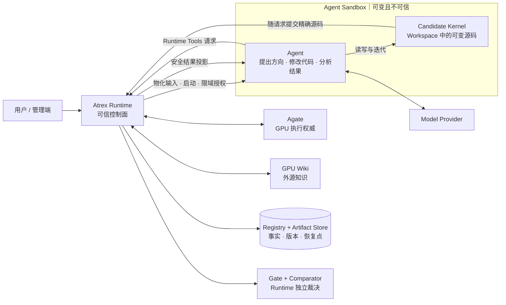
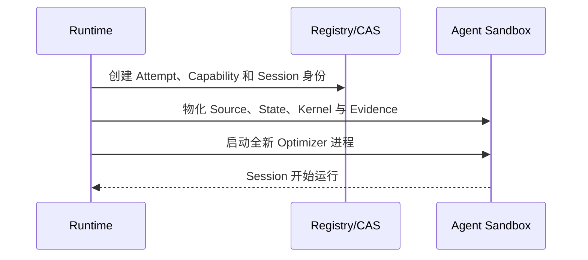
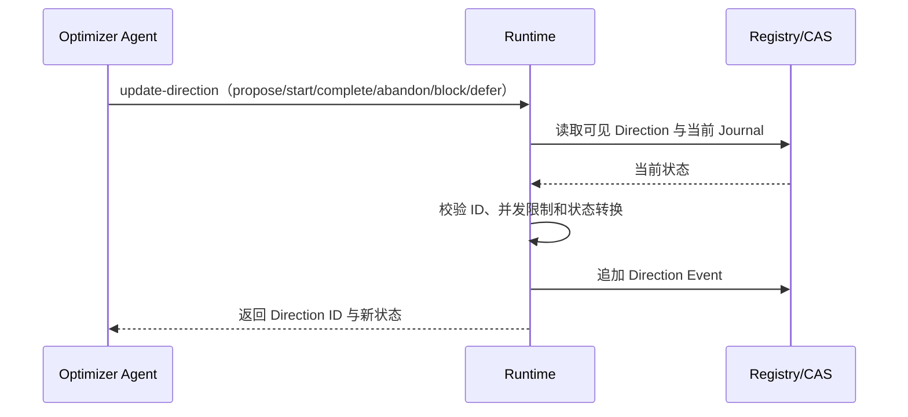
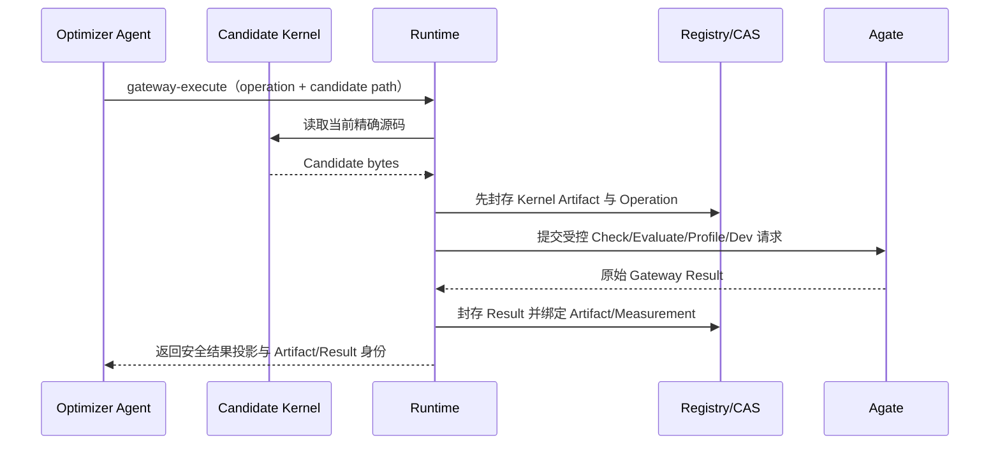
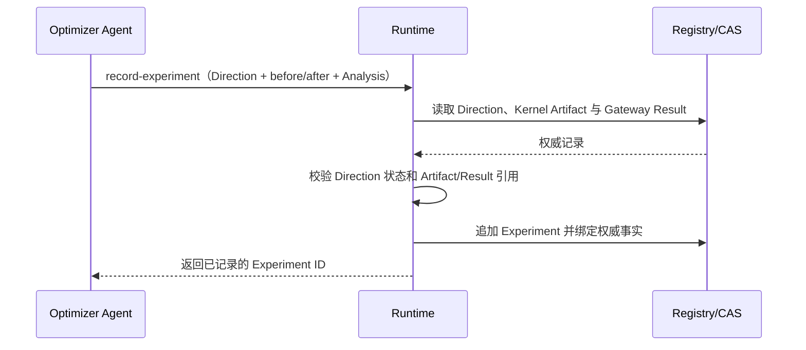
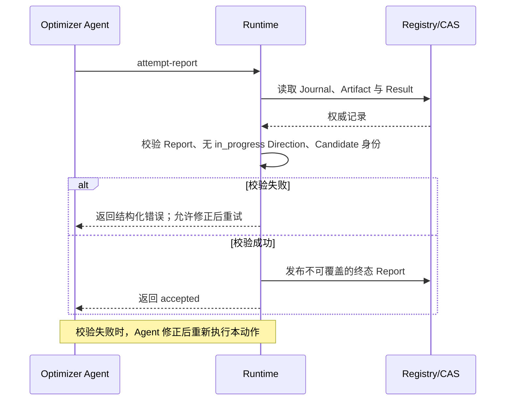
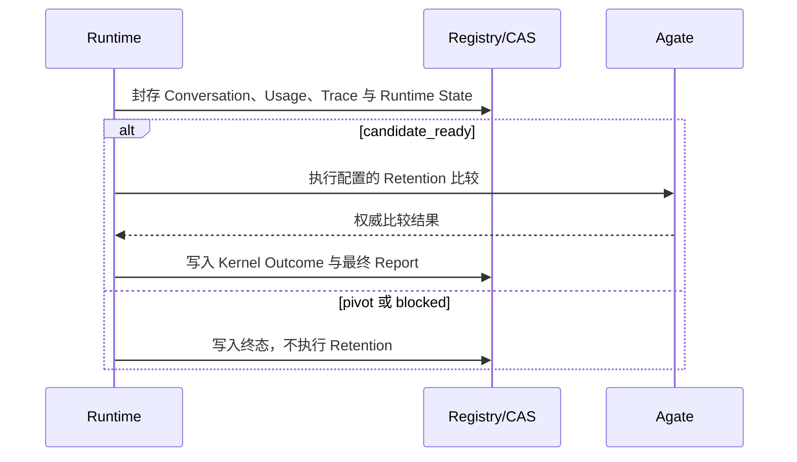

# Atrex Kernel Agent Runtime 设计与实现

[English](DESIGN.md) | 中文

本文说明为什么要从 Atrex Kernel Agent（AKA）的 Agent Harness 进一步抽象出可信 Runtime、Runtime 与 Agent 如何分工，以及 Kernel 优化和 Agent 演化如何在这条边界上运行。接口、配置和持久 Schema 的可执行权威仍分别是[接口参考](docs/interfaces.zh.md)、[配置参考](docs/configuration.zh.md)、代码中的 Pydantic Model 与数据库 Migration。

本文对 AKA 的判断以 `third_party/atrex-kernel-agent/` 中检出的上游 `d2ff1df` 为基线。AKA 已经拥有 Long Horizon Journal、Live Memory、Supervisor-owned canonical memory、Worktree Recovery 和终态独立验证；本文不会把早期版本已经修复的问题继续描述为当前事实。

## 1. 结论摘要

AKA 已经具备 Long Horizon Journal、Recovery、Supervisor Verification 等完整机制；问题不是再缺少一套更严格的 Workflow，而是 Optimizer 同时承担了过多职责：它既要探索 Kernel，又要遵守固定流程、调用评测、解释结果、更新跨 Session 状态并生成交接文件。Supervisor 可以独立验证最终 Candidate，却不能仅凭控制面记录完整重建中间探索过程。执行事实、Agent 分析和当前搜索状态因而仍部分耦合在 Agent 主动维护的协议中，带来上下文膨胀、历史状态漂移、记录遗漏以及运行过程难以观测等问题。

Atrex Runtime 的核心判断是：可信事实不应依赖 Agent 在长 Session 结束时回忆和转述，也不应通过增加更多 Prompt 约束来获得。Runtime 因此不接管 Kernel 搜索 Workflow，而是在 Sandbox 外建立稳定控制面，形成以下权责边界：

- **Optimizer Agent** 决定研究 Direction、修改 Kernel、调用受控工具并给出可被重新解释的 Analysis；
- **Agate** 执行实际编译、正确性、性能与 Profile 测量；
- **Runtime** 在动作发生时自动绑定并持久化 Session、Kernel Artifact、Gateway Result、Journal 和版本身份，独立执行 Capability、Gate、比较、发布、恢复与审计；
- **Evolver Agent** 读取冻结的 Agent Source/State、Conversation 和优化结果，生成 Candidate Agent，但不能评测 Candidate 或决定晋升。

运行时，一个 Campaign 可以为不同 DSL 建立独立 Lineage。Bootstrap 建立首个正确 Kernel `v0`；后续每个 Epoch 让 Active 与若干 Challenger 从相同的任务条件出发，在隔离 Branch 中执行多个全新 Attempt。Agent 可以持续提出 Direction 和 Experiment；Runtime 自动保存每次 Gateway 操作对应的精确 Kernel 与权威结果。Epoch 结束时，Kernel Retention 与 Agent Promotion 分别由 Runtime 根据实际测量完成，而不是依据 Agent 的终态叙述。

Agent 自进化也不是运行中的 Optimizer 原地改写自己。每个 Evolver Session 产生一个版本化 Challenger：它可以修改 Agent Source 中的 Prompt、Workflow 与实现，也可以整理 Runtime State 中的 Skill 和 Tool，还可以复用、继续修改或有依据地融合多个历史 Agent。Candidate 只有在下一 Epoch 的真实 Kernel 优化竞争中胜出才会成为新的 Active；失败版本及其 Evidence 继续保留在该 DSL Lineage 中，可供审计、回滚和后续再利用。

因此，Runtime 不保证 Agent 一定生成更快的 Kernel。它解决的是另一组基础问题：系统能否知道 Agent 实际做了什么，测量是否可信，Agent 修改是否真的更有效，历史结论能否被重新解释，以及运行失败后能否从已持久化的事实继续。只有先建立这条可信边界，Kernel Agent 的长期运行与自进化才是可比较、可归因、可恢复的工程过程。

## 2. 当前 AKA 的核心局限

### 2.1 强制 Workflow Prompt 导致流程僵化和上下文膨胀

AKA 当前同时维护 Fast Episode 和 Full Episode。Fast Episode 规定固定次数的
`plan -> implement -> evaluator` Trial、每次 Plan 的 Reviewer、每 Trial 一次评测及严格 Handoff；
Full Episode 又规定 Profile、Research、Plan、Review、Implementation、Correctness、Benchmark、
Recording 与 Handoff Loop。

这些规则提高了行为一致性，但也带来三个成本：

- Agent 必须在每个 Session 中重新理解大量流程、禁止项、路径和 JSON 协议；
- 某个阶段即使对当前算子、DSL 或已知瓶颈价值有限，也可能仍是必经步骤；
- Prompt、Skill 与恢复协议持续增长后，不同文件之间容易出现重复甚至语义不一致。

### 2.2 摘要文件无法可靠表达跨 Episode 的当前状态

AKA 保存 canonical `memory/vN.json`、Plan、Profile、Episode Journal 与 Telemetry，但下一 Episode
主要通过压缩后的 canonical memory 重建历史。详细 Journal 虽然被归档，却没有自然形成统一、按需
查询的 Direction、Experiment、Kernel Trial、Measurement 与失败历史。

`open_directions` 能更具体地说明这个问题。当前实现要求 Episode 在终态 Journal 中提交自由文本形式的
`outcome.next_directions`，Supervisor 再把这些字符串复制到本轮 `memory/vN.json` 的
`open_directions`。每轮会新增并提交一个 Memory 文件，旧文件不会因后续探索而更新。Direction 没有
稳定 ID，也没有 `proposed`、`in_progress`、`completed`、`refuted`、`abandoned` 或 `superseded`
之类可归并的生命周期状态，更没有 `resolved_by` 或 `supersedes` 关系。

因此，在 Episode `vN` 开始时，`vN-1` 是最接近当前状态的摘要；更早的文件只能视为“当时认为仍然
开放”的历史快照，不能直接解释为今天仍然开放。例如：

```text
memory/v2.json: open_directions = ["增大 tile"]
memory/v3.json: 某个 Experiment 发现大 tile 在大 Shape 上回退
memory/v4.json: open_directions = ["结合异步拷贝重新尝试大 tile"]
```

系统没有机器可读的关系说明 `v2` 的方向已经被否定，或 `v4` 是它的修正版。相关信息可能存在于后续
Memory 的 `experience.experiments`、终态 Summary、Plan、Profile 或归档 Journal 中，也可能因为 Agent
没有主动记录而根本不存在。即使信息都存在，它们仍分散在不同版本和不同种类的摘要文件里，需要下一
个 Agent 逐文件阅读并进行语义消歧。旧的 `open_directions` 很容易被误认为仍然有效；后续的否定、
修正或条件化结论也很容易被忽略。

当前 Prompt 已提醒 Agent 将全部 `memory/v*.json` 视为 Evidence 而不是命令，并要求从中识别 Dead
Ends 和 Open Directions；但这仍把跨版本状态归并交给了模型。它没有提供“截至当前，哪些 Direction
仍开放、哪些已结束、由什么 Experiment 结束”的权威视图。严格地说，旧摘要并非历史事实错误，而是
缺少后来状态变化的历史快照；同时，最新摘要也只是最新一次 Agent 申报的压缩结果，并不天然保证完整。

AKA 已支持 bounded same-session Handoff Recovery、Worktree 恢复和 interrupted outcome。这些机制能
继续执行、保留已写入的工作区和 Journal，但无法还原从未上报的 Kernel 修改、Gateway 输出或失败。
Recovery 可以修复“没有正确结束”，不能保证恢复“此前实际发生过什么”。

文件交接本身不是问题。问题是少数总结文件同时承担了“下一轮上下文入口”“历史事实说明”和“当前
状态索引”三种职责。随着 Episode 数量增长，系统只能不断扩张上下文，或继续压缩并损失细节。

### 2.3 中间实验事实依赖 Agent 申报，既不完整也不权威

最新版 AKA 已经不要求 Agent 在 Episode 结束时直接写 canonical memory，而是要求在每个决定性实验
之后调用 Journal CLI。这个改动把“一次终态回忆”改进为“运行中多次记录”，但当前链路仍然是：

```text
Agent 判断实验是否值得记录
  -> Agent 解析 Evaluator 输出
  -> Agent 构造 evaluation/result/decision
  -> Agent 调用 Journal CLI
  -> Journal 刷新 memory/live.json
  -> Supervisor 根据 Journal 生成 canonical memory
```

需要说明的是，Full Episode 的终态 Candidate 可以由 Supervisor 独立执行 ABBA，Fast Episode 也会
匹配官方 Evaluator 的 Kernel Hash。因此，最终 Kernel 是否正确、是否更快，已经不再仅依赖 Agent
声明。问题集中在中间过程：Journal 中的 `correctness`、`performance`、`latency_us`、瓶颈和 Decision
仍由 Agent 从工具输出转述；格式校验只能证明 JSON 合法，不能证明它与原始结果完全一致。

因此，Agent 忘记调用、在调用前崩溃、遗漏失败实验、错误抄写 Latency/Kernel Hash，或者在上下文压缩
后丢失前期探索，都会形成永久缺口。`memory/live.json` 只是 Journal 镜像，不是独立事实来源。原始测量
事实与 Agent 分析仍然混合在同一条申报链路中。

## 3. Agent 与 Harness 自进化的相关研究

现有研究中的“Agent 自进化”并非单一问题。不同方法分别修改 Prompt、完整 Harness、Agent Source、
外部 SkillBank 或模型权重；它们的结果不能直接放在同一尺度上比较。以下结论来自当前代表性论文，
其中相当一部分仍是 2026 年预印本。

### 3.1 主要方法谱系

| 路线 | 进化对象 | 代表方法 | 基本机制 |
| --- | --- | --- | --- |
| Prompt / LM Program Search | Instruction、Few-shot、模块 Prompt | [MIPROv2](https://arxiv.org/abs/2406.11695)、[GEPA](https://arxiv.org/abs/2507.19457) | Bayesian 或 Reflective Mutation；用 Pareto/Surrogate 在固定评测预算内选 Candidate |
| 受限 Harness Repair | 预先声明的 Prompt、Tool、Memory、Recovery、Runtime Policy 接口 | [Self-Harness](https://arxiv.org/abs/2606.09498)、[HarnessFix](https://arxiv.org/abs/2606.06324) | 从失败 Trace 聚类或归因，产生范围受控的修复，再做回归验证 |
| 全组件 Harness Evolution | Prompt、Tool Implementation、Middleware、Skill、Subagent、Memory 与 Control Loop | [AHE](https://arxiv.org/abs/2604.25850)、[Meta-Harness](https://arxiv.org/abs/2603.28052)、[HarnessBank](https://arxiv.org/abs/2607.13683) | 暴露文件级编辑面，向 Evolver 提供历史 Source/Trace/Evidence，并通过回退、Archive 或 Gate 选择版本 |
| 开放式 Agent Source Evolution | Agent 自身完整代码与 Workflow | [DGM](https://arxiv.org/abs/2505.22954) | Agent 修改自身代码；Archive 保存所有可运行后代及潜在 Stepping Stone |
| Skill 与 Policy 协同演化 | 外部 SkillBank、检索策略和模型 Policy | [SkillRL](https://arxiv.org/abs/2602.08234)、[D2Skill](https://arxiv.org/abs/2603.28716) | 从成功与失败 Trajectory 蒸馏 Skill，并在 RL 中更新 SkillBank、Retrieval 与 Policy |
| Skill 内化 | 训练期 Skill Context 与模型权重 | [Skill0](https://arxiv.org/abs/2604.02268) | 训练中逐步撤去 Skill Context，使能力进入模型参数，推理时不再加载 Skill |

前四条路线冻结 Backbone，改变部署期 Agent；后两条需要离线训练模型，和 on-the-fly Harness
Evolution 属于不同工程条件。

### 3.2 方法论文的主要结论

| 方法 | 主要结论 | 结论边界 |
| --- | --- | --- |
| GEPA | 读取自然语言执行反馈并进行 Reflective Prompt Mutation，可以比只依赖标量奖励更高效；Pareto Selection 能减轻 Greedy Search 的局部最优 | 只修改 Prompt；Kernel 实验把待解任务放进 Search Loop，证明的是 Inference-time Search，不是跨算子泛化 |
| DGM | 完整 Agent Source 自修改配合 Archive，能够发现 Tool、Workflow、Best-of-K、历史复用和恢复机制等结构性改进；低分后代也可能成为 Stepping Stone | 开放搜索成本高且缺少统计晋升 Gate；外部复评显示它可能选择噪声尖峰或部署回退版本 |
| AHE | 将 Harness 组件显式暴露为文件，并把原始 Trace 组织成可下钻 Evidence，可以支持稳定的多组件联合演化 | 消融显示有效改动主要位于 Tool、Middleware 和 Long-term Memory，单独修改 System Prompt 并不可靠 |
| Meta-Harness | 让 Evolver 通过文件系统自行检索全部历史 Source、Score 和 Trace，比把历史压缩成短摘要更适合代码级 Harness 搜索 | 完整历史检索带来很高的 Token 和运行成本，方法效果依赖强 Coding Agent 的检索与归因能力 |
| Self-Harness | 不借助更强外部模型，同一个 Agent 也可以从自身失败轨迹中诊断并改进一个预先声明编辑面的 Harness；有效修改呈明显 Model-specific | 从极简 Harness 起步；Held-out 分数参与接受决策，重复测量与成本报告也较弱 |
| HarnessFix | 将 Trace Step 与 Harness Artifact 对齐，再映射到 Scoped Repair Operator，可以提高修复的定位精度、可审计性和回归安全性 | 可探索空间受 HTIR 归因质量和预定义修复算子覆盖范围限制 |
| HarnessBank | Quality-Diversity Archive 能保留语义不同的候选；Validity、Activation 与配对显著性 Gate 能减少 Search Collapse、无效修改和噪声进展 | 需要额外评测预算；实验使用了强于 Task Agent 的外部 Evolver，因此更接近 Meta-Harness |
| SkillRL | 将原始 Trajectory 蒸馏为层次化 Skill，比直接保存 Raw Memory 更有效；SkillBank 随 Policy 更新可以加快学习并降低上下文冗余 | Skill 与 Policy 通过 RL 共同更新，不是冻结模型的 Deployment-time Evolution |
| D2Skill | Task Skill 与 Step Skill 分别支持全局计划和局部纠错；配对 Rollout 得到的 Hindsight Utility 可用于检索、估值和裁剪 Skill | 依赖训练期 Rollout 和模型更新，Utility 估计本身仍受执行噪声影响 |
| Skill0 | 外部 Skill 可以通过逐步撤去训练期 Skill Context 被内化进模型，使推理不再依赖 Skill Retrieval | 进化结果进入模型权重，不再是可独立版本化和修改的 Agent 外部 State |

这些结果说明 Harness 和 Skill 都是有效优化面，但不能据此推导出持续、单调或低成本的开放式自进化。
多个方法从刻意简化的 Seed 起步，前几轮收益包含补齐缺失 Tool、Recovery 和 Runtime Control 的效果；
随着轮次增加，普遍出现 Early Saturation、Local Search、Context Bloat 或有害修改。

### 3.3 评测研究对这些结果的约束

[Rethinking Harness Evolution Evaluation](https://arxiv.org/abs/2607.12227) 指出 Harness Evolution
本身也是 Iterative Search，必须和等反馈、等推理预算的 Parallel Sampling、Sequential Refinement 或
Best-of-K 比较。其对齐预算实验中，简单 Parallel Sampling 经常优于 AHE 式 Harness Evolution；将
搜索任务与最终测试严格隔离后，Harness Evolution 的增益又大幅缩小。该实验只覆盖一种 AHE 式实现
和较短演化预算，不能否定所有 Harness Evolution，但说明未与等预算搜索比较时，不能把增益直接归因
于 Harness 变好。

[Harness Updating Is Not Harness Benefit](https://arxiv.org/abs/2605.30621) 将能力拆成“能否生成有用更新”
与“Task Agent 能否从更新中受益”。实验中，9B Evolver 也能生成与 Opus 程序结构近似的 Skill；最终
收益主要受 Task Agent 的 Activation、Tool-call 合规性和长程 Adherence 影响，并呈 Benchmark-dependent
的倒 U 型。强 Evolver 并不自动带来强 Task Agent。

[EvoAgentBench](https://arxiv.org/abs/2607.05202) 进一步发现，使用人工 Ability Label 路由的 Anchor
Skill 能稳定带来正收益，但 Memento、ReasoningBank、GEPA 等自动方法都出现 Negative Transfer。
这说明可复用程序性内容能够迁移，自动 Extraction、Routing 和 Retrieval 仍是主要瓶颈。
[Evo-Bench](https://arxiv.org/abs/2608.09096) 表明强模型能够从极简 Harness 演化出接近人工设计的
完整结构，但不同任务域的可演化程度差异很大；实验只运行一次，且多数模型在早期达到峰值后发生退化。

### 3.4 当前证据能够支持的结论

- 完整 Harness 是真实的优化面；Tool、Middleware、Recovery、Memory 和 Control Loop 往往比单纯
  Prompt 修改更重要。
- 从极简 Seed 获得大幅提升相对容易，但这不等价于成熟 Agent 能持续自我改进。
- Archive、Pareto Frontier 与 Quality-Diversity Search 能减少 Greedy Search Collapse；它们是否优于
  更简单的多 Candidate 保留策略，仍缺少充分消融。
- Candidate 是否真的激活、收益是否超过噪声、是否通过未参与搜索的测试，比 Evolver 生成的修改说明
  是否合理更重要。
- Skill 数量增长不保证收益。过时或错误路由的 Skill 会产生 Negative Transfer，且弱 Agent 可能无法
  正确加载或持续遵循正确 Skill。
- 现有结果尚未证明开放式、长期、单调的 Agent 自进化。严格结论必须同时报告 Sealed Test、等预算
  Test-time Scaling、重复测量、Token/时间成本和失败版本。

## 4. AKA 还不能把 Agent 本身作为可评测、可回滚的版本

AKA 已经能够生成 Kernel Candidate、执行评测并选择更好的 Kernel；但负责生成 Kernel 的 Agent
实现仍是仓库中的一套共享代码。Kernel 有 Candidate 和 Incumbent，Agent 自身却没有对应的版本、
竞争和晋升关系。

要判断 Agent 是否真的完成了一次有效进化，系统至少需要回答下面几个问题：

1. 被修改的“Agent”具体包括哪些 Source、Prompt、Workflow、Skill、Tool 和运行中积累的 State？
2. 修改后的版本从哪个历史版本产生，具体改变了什么，适用于什么 Operator、DSL 和运行环境？
3. 修改前后是否在相同任务、Kernel、Evidence、Model、预算和评测策略下进行了足够的重复比较？
4. 观测到的性能差异来自 Agent 设计，还是一次偶然的 Kernel、模型采样或评测噪声？
5. 修改失败、运行崩溃或结果回退时，原版本、失败证据和恢复点是否仍然完整？

当前 AKA 无法完整回答这些问题。主要缺口是：

| 缺口 | 直接后果 |
| --- | --- |
| Agent 的完整形态没有明确定义 | 无法准确说明一次进化修改了 Prompt、Source、Workflow、Backend Adapter、Skill、Tool，还是运行中积累的 State，也无法复现修改前后的精确状态。 |
| 缺少稳定的版本来源和适用范围 | 修改只能覆盖共享目录；无法回答新版本从哪里产生、在哪个 Operator/DSL 上有效、后来是否又被修正或替代。 |
| 缺少公平、可重复的对照 | 如果修改前后的起始 Kernel、Evidence、Model、运行次数或评测策略不同，就无法把结果差异归因于 Agent 修改。 |
| Kernel 结果与 Agent 能力混在一起 | 偶然生成一次好 Kernel，不等于 Agent 整体更有效；一次 Kernel 失败也不能直接否定 Agent。 |
| 失败探索没有统一历史 | 失败 Conversation、被回退 Kernel 和历史修改理由容易丢失或分散，后续修改可能重复相同错误。 |
| 缺少失败隔离和安全边界 | 自修改超时、崩溃或产生错误代码时，可能损坏当前可用实现；修改 Agent 完整代码还可能影响评测、私有数据或其他任务。 |

因此，仅允许 Agent 在现有 Worktree 中修改 Prompt 或 Harness 文件，得到的是一个可变目录，而不是
一套能够复现、比较、归因、回滚和审计的 Agent 演化过程。

## 5. 用独立控制面支撑可验证的 Agent 演化

上一节的缺口并不是几项彼此独立的功能遗漏，而是来自同一个边界冲突：Agent 既是被修改和评测的对象，
又被要求自行定义版本、保存证据、恢复失败并判断自己是否变好。如果这些职责仍由可变的 Agent Source、
Prompt 或 Workflow 承担，那么 Agent 每次进化都有可能同时改变“参赛者”和“裁判规则”；一旦 Session
崩溃或记录不完整，系统也没有独立依据还原实际发生过什么。继续增加 Prompt 约束只能要求 Agent 更认真
地履行这些职责，不能让记录和裁决脱离 Agent 自身。

因此，支持可验证的 Agent 演化需要一个位于 Agent 外部、在一次版本比较期间保持稳定的
控制面。Atrex Runtime 正是这个控制面，而不是另一个负责优化 Kernel 的 Agent：Agent 负责提出方向、
修改代码和解释结果；Runtime 负责身份、执行事实、状态转换、比较条件与恢复点。被进化的对象和用于衡量
它的尺度由此分离。

### 5.1 将可进化对象与稳定控制面分开

Runtime 使用普通 Python 实现确定性状态机。它不生成 Kernel，也不替 Agent 判断优化方向，而是把上一节
中不能由参赛 Agent 自证的事项移出 Prompt 协议：

| 上一节的问题 | Runtime 提供的稳定机制 |
| --- | --- |
| Agent 的完整形态不明确 | 把精确 Agent Source 与运行中积累的 State 分别封存为不可变 Artifact，再组合成可复现版本。 |
| 版本来源和适用范围不稳定 | 由 Registry 保存代码来源、祖先关系、任务/DSL 范围和配置绑定，不依赖 Agent 自述。 |
| 缺少公平、可重复的对照 | 为参与比较的 Agent 冻结相同任务、起始 Kernel、可见 Evidence、Model、预算和评测规则，并调度独立运行。 |
| Kernel 结果与 Agent 能力混在一起 | 分别保存 Session、Kernel Artifact、Gateway Result 和成本，并把 Kernel Retention 与 Agent Promotion 作为不同决策。 |
| 失败探索缺少统一历史 | 以追加方式保留执行记录、Conversation、Journal 和失败状态，不用新运行覆盖旧 Evidence。 |
| 缺少失败隔离和安全边界 | 通过限域 Capability、Workspace 隔离、私有评测输入和受控工具入口限制 Agent 权限。 |

这并不意味着 Runtime 的实现永远不能变化，而是意味着 Agent Candidate 不能在接受评测的同时修改本次
评测所依据的身份、事实和晋升规则。Runtime 的升级由正常的软件发布流程完成；受控任务内的 Agent
演化则只能在这条边界之内进行。



### 5.2 功能边界与交互方式

Sandbox 是 Agent 的执行环境，也是唯一允许直接修改 Candidate 的区域。Runtime 在 Sandbox 外部控制它
能看到的输入和能够发起的操作，但不干预 Agent 如何思考或如何组织 Kernel 优化 Workflow。

| 边界区域 | 可以做什么 | 不能做什么 |
| --- | --- | --- |
| Sandbox 内的 Agent | 阅读公开问题与历史 Evidence；提出 Direction；修改 Candidate Kernel；通过 Runtime Tools 请求 Wiki、评测和本地 Journal；分析结果并提交 Candidate | 读取私有 Validation；直接修改权威历史；伪造 Gateway Result；自行决定 Kernel 或 Agent 晋升 |
| Sandbox 内的 Candidate Kernel | 作为 Agent 当前可写、可运行和可回退的实现 | 在未经 Runtime 封存和评测时成为权威版本，或直接访问 Registry、私有输入和外部评测凭证 |
| Runtime | 物化并冻结输入；创建 Sandbox 和限域 Capability；代理 Gateway/Wiki 请求；捕获 Session；把精确 Kernel、Agent、Result 和 Trace 封存为不可变 Artifact；同步保存 Journal；执行 Gate（是否合格）、Comparator（谁更好）、版本发布、恢复和审计 | 生成 Kernel、选择研究方向，或替 Agent 编造实验解释 |
| Agate | 在目标 GPU 上执行 Check、Evaluate、Profile、Dev、Disassemble 和权威比较 | 决定优化方向、版本祖先或晋升关系 |
| GPU Wiki | 返回外部 GPU/Kernel 知识 | 保存 Agent 自己的持久记忆，或决定实验结论与晋升 |
| Model Provider | 为 Sandbox 内的 Agent 提供模型推理 | 获得 Runtime 的 Registry、私有 Evaluation Contract 或晋升权限 |

这里的 Artifact 是 Runtime 从 Sandbox 中复制并按内容摘要封存的精确字节，而不是 Agent 声称已经保存
的文件：Kernel Artifact 对应某个确定的 Kernel 源码快照；Agent Artifact 对应确定的 Agent Source，
再与独立封存的 Runtime State 共同形成可运行 Agent 版本。Capability 则是 Runtime 发给当前 Sandbox
的限域授权，只允许调用与当前任务相关的工具和数据。

一次典型交互只有三步：Runtime 把冻结输入物化进 Sandbox；Agent 修改 Kernel 并通过 Runtime Tools
发起请求；Runtime 在请求发生时先封存精确 Candidate，再代理外部服务、保存原始结果并返回安全投影。
Agent 可以解释这些事实并提名 Candidate，但 Gate、比较、版本发布和恢复始终在 Sandbox 外完成。

图中以 Optimizer 为例。Evolver 也运行在不可信 Sandbox 中，但它修改的是 Candidate Agent Source/State，
不获得 Kernel 评测、Wiki、Registry 或晋升权限。

### 5.3 这一边界相对当前 AKA 改变了什么

Runtime 并不否定 AKA 已有的 Kernel 生成和评测能力，而是重新安放原本散落在 Orchestrator、Prompt、
Agent 文件和 Supervisor 中的控制职责：

| 维度 | 当前 AKA | Atrex Runtime 方案 |
| --- | --- | --- |
| 控制形态 | Orchestrator + Agent 必须遵循的 Prompt/Skill 协议 | Python 状态机 + 最小角色 Prompt |
| 优化对象 | 主要是 `kernel.py` | Kernel 与完整 Agent Bundle 分层版本化 |
| 中间测量 | Evaluator 有原始输出，Journal Evaluation 由 Agent 转述 | Gateway 操作发生时自动封存 Kernel、Result 与 Measurement |
| Experiment | Agent 主动追加 Episode Journal | Agent 提供语义；Runtime Journal 同步持久化并绑定权威 Artifact/Result |
| 跨 Session 状态 | canonical memory、Plan、Profile、归档 Journal | Registry、CAS、Session Trace、Journal、Evidence Checkpoint 和按需 Query |
| 观测 | 文件、Git、Telemetry 与 Provider Session 分散查看 | CLI/HTTP Catalog 统一查询 Agent、Kernel、Session 与 Evaluation |
| Agent 版本 | 仓库内全局固定 Agent 实现 | 任务内封存、可追溯的 Agent Source + Runtime State Bundle |
| 竞争 | 每 Episode 只有 Kernel Candidate 与 Incumbent | Runtime 在冻结输入下组织隔离、可重复的 Agent Candidate 比较 |
| 晋升 | Supervisor 选择 Kernel | Runtime 独立执行 Kernel Retention 与 Agent Promotion |
| 恢复 | Episode/Worktree/Handoff Recovery | 追加式执行记录、Session、Checkpoint 与互斥恢复控制 |
| 私有评测 | Supervisor/Sandbox 持有隐藏输入 | 封存 Evaluation Contract，Worker 只见 `shape_train` 与不透明 Shape ID |

### 5.4 Runtime 自动记录什么，Agent 仍需表达什么

这套划分最关键的结果，是把可复核的执行事实与可被修正的 Agent 分析分开：

| 事件 | Runtime 自动持久化 | Agent 负责补充 |
| --- | --- | --- |
| Gateway 调用 | Operation、请求绑定、Candidate Kernel Artifact、Job/Result、正确性、Latency、Profile、错误和重试 | 为什么调用、如何解释结果 |
| Kernel 修改实验 | `before`/`after` 的精确 Kernel Artifact 与 Gateway Result 引用 | Hypothesis、Evidence 解释、Action 与 Lesson |
| Session | Backend、Model、Workspace、Conversation、Event Ledger、Usage、终态和失败 | 无需自行总结完整对话 |
| Agent 运行 | Parent Kernel、全部测量、Journal、终态提名与 Finalization | 终态 Report 中的工程叙述和 Findings |
| Evolution | 输入 Agent Catalog/Evidence、Candidate Source/State、Trace 与 Report | 进化假设、期望效果、未实现能力 |
| 晋升 | Comparator、Gate、Winner、版本和祖先关系 | 无 Agent Authority |

核心约束是：Agent Analysis 可以缺失、出错或被未来 Agent 推翻；已经发生的执行事实不能因此丢失或被
改写。

### 5.5 小结：Runtime 如何回应 AKA 的核心局限

Runtime 不是用一套更长的固定 Workflow 替换 AKA Workflow，而是把 AKA 中不应依赖 Agent 自觉完成的
控制职责移到 Sandbox 外：

| AKA 的核心局限 | Runtime 的设计回应 |
| --- | --- |
| Workflow 依赖大量强制 Prompt/Skill 指令，运行成本高且难以适配任务 | Runtime 只固定安全、评测、持久化和晋升边界；研究方向、Kernel Workflow、Skill 和 Tool 仍由 Sandbox 内 Agent 决定，并可作为 Agent Source/State 演化。 |
| 跨 Session 状态主要依赖 Agent 在结束前生成的 Memory、Plan、Profile 等总结文件 | Runtime 在执行发生时保存 Conversation、工具事件、Kernel Artifact、Gateway Result 和 Journal；后续 Evidence 由这些记录机械组装，不要求 Agent 从压缩后的上下文重建全部历史。 |
| 历史摘要同时承担历史事实、当前状态和下一轮入口，旧 Open Direction 容易过期或相互矛盾 | Direction 与 Experiment 使用稳定 ID 和追加式状态变化；当前视图由 Runtime 从完整历史生成，旧记录无需被 Agent 反复改写。 |
| Journal Evaluation 和 Profile 解释依赖 Agent 主动转述，可能遗漏或失真 | Runtime 代理 Gateway 调用并自动封存原始 Result 与标准化 Measurement；Agent Analysis 单独保存，可以被未来 Agent 重新解释。 |
| Memory/Report 格式错误可能让整个运行结果被废弃并触发昂贵 Recovery | Journal 工具逐次校验并立即持久化；终态 Report 校验失败可以修正后重试，已发生的 Session、Kernel 和测量不会随 Report 失败而丢失。 |
| 运行过程近似黑盒，只能在 Episode 结束后查看少数交接文件 | Registry、Artifact、Session、Journal 和 Evaluation 在运行中持续可查询，CLI/HTTP 可以按 Agent、Kernel 和 Session 检查进度、成本、结果与失败。 |
| Agent 修改没有独立身份、公平对照、晋升和回滚机制 | Runtime 分别封存 Agent Source 与 Runtime State，在相同冻结输入下隔离运行 Candidate，并由 Sandbox 外 Comparator 决定晋升；旧版本、失败 Evidence 和恢复点保持可用。 |
| Agent 同时接触可变代码、评测协议和结果解释，信任边界模糊 | Sandbox 只持有公开输入和限域 Capability；私有评测、权威事实、Registry 与版本裁决由 Runtime 掌握。文件/进程隔离由 Runtime 提供，网络边界仍由部署环境负责。 |

因此，Runtime 解决的不是“怎样保证 Agent 一定生成更快的 Kernel”，而是“怎样知道它实际做了什么、
结果是否可信、修改是否真的更好，以及失败后能否继续”。Kernel 搜索质量仍取决于 Agent 和 Model；
Runtime 提供的是让这种搜索能够被观测、比较、归因、恢复和演化的可信基础。

## 6. 当前 Runtime 中 Agent 如何运行

### 6.1 运行术语与拓扑

| 术语 | 本文含义 |
| --- | --- |
| Campaign | 一次顶层 Kernel 优化任务，冻结算子、目标 GPU 环境、评测定义、初始 Agent/Evolver 代码、Model、Policy 和需要优化的 DSL。一个 Campaign 可以包含多条 DSL Lineage。 |
| Lineage | Campaign 中针对一个 DSL 的独立演进历史，拥有自己的 Kernel、Agent、Evidence 和版本关系。Lineage 是跨轮次身份，不表示某条并行搜索路径。 |
| Optimizer / Core | 在 Sandbox 内实际优化 Kernel 的 Agent。它提出 Direction、修改 Candidate Kernel、调用受控工具、分析结果并提交终态报告；Core 是默认 Optimizer Agent Bundle。 |
| Evolver | 分析冻结的 Agent Source/State、Conversation 和优化结果，并生成、复用或从历史修改 Candidate Agent 的独立 Agent。它不运行 Kernel 评测，也不决定 Candidate 是否晋升。 |
| Bootstrap | 每条 Lineage 的初始化过程。它使用 Optimizer 从输入 Reference/Framework Kernel 建立首个正确基线，并发布初始 Kernel `v0` 和 Agent `agent-v0`；此时不存在 Challenger。 |
| Epoch | Bootstrap 后的一轮 Agent 搜索与比较。参与者从冻结的共同 Kernel、Evidence 和 State 起点出发，轮末由 Runtime 选择最佳 Kernel 和下一轮 Agent。 |
| Active / Challenger | Active 是进入本轮时已经在用的 Agent Revision；Challenger 是 Evolver 提出的候选 Agent Revision。二者只表示本轮竞争角色，不表示版本祖先关系。 |
| Branch | 一个 Active 或 Challenger Agent 在本轮中的执行分支。每个 Branch 使用一个确定 Agent Revision，并与其他 Branch 隔离运行。 |
| Trajectory | Branch 内从同一起点展开的一条独立 Kernel 搜索路径。多条 Trajectory 可以并行，各自拥有独立可写 Runtime State。 |
| Attempt | Trajectory 中串行推进的一次逻辑优化步骤。每个 Attempt 启动全新 Optimizer Session，可以进行多次 Kernel 修改和 Gateway 调用，最后提交一个可校验、可修正的终态报告。 |
| Generation | 同一逻辑工作因基础设施错误重试时追加的一次物理运行。Generation 不覆盖失败运行，也不被计作新的 Agent 搜索 Attempt。 |
| Session | 一次真实的 Model-backed Agent 进程及其 Conversation、工具事件、用量和终态。Optimizer、Bootstrap 和 Evolver 都会产生 Session。 |
| Artifact | Runtime 按内容摘要封存的不可变字节快照。Kernel Artifact 是精确 Kernel 源码；Agent Artifact 是精确 Agent Source，并与单独的 Runtime State Artifact 组成可运行 Agent Bundle。 |
| Revision | Runtime 对已登记版本的历史引用。Kernel Revision 绑定 Kernel Artifact 与权威测量并获得 `vN`；Agent Revision 绑定 Agent Artifact、Runtime State、祖先和状态并获得 `agent-vN`。 |
| Journal / Evidence | Journal 是运行中立即持久化的 Direction、Experiment 和分析；Evidence 是 Runtime 为后续 Agent 冻结的可见历史视图。Journal 可包含 Agent 判断，Gateway Result 等执行事实仍由 Runtime 单独保存。 |
| Retention / Promotion | Kernel Retention 决定 Candidate Kernel 是否成为新 Kernel Revision；Agent Promotion 决定 Candidate Agent 是否成为下一轮 Active。两项决策相互独立。 |

```text
Campaign
├── Lineage：CUDA
├── Lineage：Triton
└── Lineage：CuteDSL

一条 Lineage 的生命周期：

Bootstrap ──→ agent-v0 + Kernel v0 ──→ Epoch 1 ──→ Epoch 2 ──→ …

一个 Epoch 的内部结构：

Epoch N（所有参与者使用相同的起始 Kernel、Evidence 和 State）
├── Active Branch：当前 Agent Revision
│   ├── Trajectory 1：Attempt 1 → Attempt 2 → … → Attempt X
│   ├── Trajectory 2：Attempt 1 → Attempt 2 → … → Attempt X
│   └── Trajectory Y：Attempt 1 → Attempt 2 → … → Attempt X
├── Challenger Branch 1：Evolver 产生的 Candidate Agent 1
│   └── Y 条同结构 Trajectory
├── Challenger Branch 2：Evolver 产生的 Candidate Agent 2
│   └── Y 条同结构 Trajectory
└── Challenger Branch K：Evolver 产生的 Candidate Agent K
    └── Y 条同结构 Trajectory

全部 Branch 完成
└── Runtime 独立选择
    ├── 本轮最佳 Kernel Revision
    ├── 下一轮 Active Agent Revision
    └── Evidence Checkpoint ──→ Epoch N+1
```

同一 Epoch 的 Branch 可以并行；同一 Branch 的 Trajectory 也可以并行；只有一条 Trajectory 内的
Attempt 必须串行。每个 Attempt 启动一个全新 Optimizer Session；基础设施重试在同一逻辑 Attempt 下
追加 Generation。图中的 `K` 是 Challenger 数，`Y` 是每个 Branch 的 Trajectory 数，`X` 是每条
Trajectory 的 Attempt 数。Evolver 在 Epoch 开始前按需产生 Challenger，不参与这些 Branch 内的
Kernel 优化。

### 6.2 Bootstrap：建立 Lineage 初始基线

Runtime 为每个被选 DSL 创建独立 Lineage，并可并发执行 Bootstrap。Bootstrap 的目标不是运行普通
Epoch，而是建立后续搜索所需的初始 Agent、正确 Kernel 和 Evidence。Campaign 未提供公开算子约束时，
Runtime 可以先运行独立 Problem Generalization Session；精确 Validation Shape 始终保留在 Runtime。

Bootstrap 依次执行：

1. 安全导入完整 Core Commit，拒绝链接、不安全路径、未批准 Submodule 和超限 Bundle；
2. 创建稳定 Bootstrap Attempt，物化 Agent Source、公开 Contract、输入 Kernel 与 Runtime Tools；
3. 启动全新的 `framework_baseline` Core Session；
4. Agent 可创建 Direction、调用 Gateway、记录 Experiment，并通过 `attempt-report` 提名 Candidate；
5. Runtime 从持久 Gateway 记录解析 Candidate，执行 Bootstrap Gate；
6. 发布 Lineage 内 `agent-v0`、Kernel `v0`、Bootstrap Report/Conversation 与初始 Evidence Checkpoint；
7. 基础设施失败时在同一逻辑 Bootstrap Attempt 下追加新的物理 Generation，不覆盖旧 Run。

### 6.3 一个 Optimizer Attempt

每个 Attempt 都启动新的物理 Agent Session，不继承 Provider 对话上下文。Runtime 物化的 Workspace
包含只读 Agent Source、当前 Kernel、公开问题和授权 Evidence，以及根级可写 `skills/`、`tools/`、
`scratch/`。已完成 Epoch 的 Active 与所有失败 Challenger Branch 都按 Branch 保留，Epoch Summary 标明
当时的获胜分支；当前 Epoch 中仍只暴露同一 Trajectory 的较早 Attempt，并发兄弟 Branch 和私有
Evaluation 输入不可见。

#### 6.3.1 Attempt 内的记录对象

| 对象 | 定义与权威边界 |
| --- | --- |
| Direction | 一个具有稳定 ID 的研究或探索方向，包括 Hypothesis、Rationale、Plan、Success Criteria 和 Stop Conditions。Agent 应在开始探索时立即登记；Direction 可以来自历史或在当前 Attempt 新建，但同一时刻只能有一个处于 `in_progress`。终态报告前不能留下 `in_progress` Direction；已启动方向可以 `complete`、`abandon`、`block` 或 `defer`，未启动的未来方向可以保持 Proposed。 |
| Gateway Result | Runtime 代理 Agate 操作后自动保存的权威执行事实，包括操作状态、正确性、逐 Shape Latency、Profile 或错误。Runtime 在请求发出前先封存精确 Kernel Artifact；Agent 不负责抄写、生成或修改 Gateway Result。 |
| Experiment | Agent 对一次具体 Kernel 修改、测量或放弃结论的结构化解释，必须关联一个正在进行的 Direction。`keep_after`/`restore_before` 必须引用完整的 `before`/`after` Kernel Artifact 与 Gateway Result；`abandon_direction` 可以没有两侧测量。它记录 Hypothesis、Change、Evidence、Analysis 和 Action，但不替代 Runtime 保存的测量事实。 |
| Attempt Journal | Runtime 同步持久化的当前 Direction Event 与 Experiment 集合。每次工具调用成功后立即更新，因此即使 Session 后续崩溃，已登记内容仍然存在。 |
| Attempt Report | Agent 对本次 Attempt 的终态工程交接，状态只能是 `candidate_ready`、`pivot` 或 `blocked`。它引用 Journal，给出 Diagnosis、Approach、Findings、可选 Candidate，以及本次工作实际借鉴过的历史 Kernel Trial ID；Runtime 校验引用、Direction 终态和 Candidate 身份。Report 不决定 Retention 或 Promotion，历史来源声明也不改变 Kernel 祖先关系。 |

它们的关系是：Gateway Result 提供事实，Experiment 把事实放进某个 Direction 的探索语境，Attempt
Report 再从整个 Journal 中形成终态交接，并用 `contributing_kernel_trial_ids` 声明本次工作实际取用过
代码或思路的历史 Trial。该字段是 Agent 提供的 Provenance，不是测量事实，也不替代 Experiment 的
`before`/`after` 绑定。

```text
Direction（研究方向）
└── 推动一次或多次 Kernel 修改
    └── gateway-execute
        ├── Runtime 先封存 Kernel Artifact
        └── Agate 执行 ──→ Gateway Result（权威事实）

Direction + before/after Kernel Artifact + Gateway Result（测量型 Experiment）
└── record-experiment ──→ Experiment（Agent 分析）
    └── update-direction ──→ complete / abandon / block / defer / 继续探索

没有 Direction 处于 in_progress + Attempt Journal
└── attempt-report
    ├── candidate_ready：提名一个已测 Candidate
    ├── pivot：本次不提名 Candidate，后续更换方向
    └── blocked：存在明确阻塞
        ↓
Runtime 校验
├── candidate_ready ──→ 执行 Kernel Retention
└── pivot / blocked ──→ 记录终态，不执行 Retention

Agent 不能自行宣布保留
```

Agent 可以先提出任意数量的未来 Direction，但一个 Attempt 最多实际启动三个，且同一时刻只能推进一个。
测量型 Experiment 必须引用已经存在的 Gateway Result；同一 Kernel 在相同条件下已有可信的等价操作
结果时，不应重复测量。终态 Report 不要求等所有工作结束后才开始准备，Agent 可以在实验过程中持续
完善 Journal 和 Report 草稿。

#### 6.3.2 分动作调用时序

下面每张图只描述一种动作。除启动和终态提交外，Direction、Gateway 与 Experiment 动作都可以在一个
Attempt 中按需要重复调用。

**动作一：创建并启动 Session**



**动作二：登记或更新 Direction**



**动作三：执行一次 Gateway 操作**



**动作四：记录 Experiment**



**动作五：提交 Attempt Report**



**动作六：Runtime Finalization**



一个 Attempt 可以产生多个 Kernel Artifact 和 Gateway Result，但同一时刻最多推进一个 Direction，
最多推进三个不同 Direction。`attempt-report` 校验失败不会发布，Agent 可以根据结构化错误修正后重试；
第一次成功发布后不可覆盖。Runtime State 在 Session 结束时封存，串行的下一个 Attempt 从该
Trajectory 的前一终态恢复。

### 6.4 Agent 如何自进化

这里的“自进化”不是让正在优化 Kernel 的 Optimizer 在 Session 中原地改写自己，也不是把生成结果推回
Core 上游仓库。它是一个跨 Epoch 的受控候选实验：Runtime 冻结已经发生的优化过程，Evolver 据此
生成 Candidate Agent，下一 Epoch 再用真实 Kernel 优化结果判断 Candidate 是否值得晋升。

```text
Epoch N 完成
  │
  ├── Runtime 冻结 Conversation、Journal、Gateway 事实与选择结果
  ├── 确定当前 Active Source 和下一轮共同起始 Runtime State
  │
  ▼
每个 Evolver Session 产生一个 Challenger
  ├── 修改当前 Active
  ├── 直接复用历史 Agent
  └── 从历史 Agent 继续修改
  │
  ▼
Runtime 校验并封存 Candidate Agent Revision
  │
  ▼
Epoch N+1：Active Branch 与各 Challenger Branch 在相同任务条件下优化 Kernel
  │
  ▼
Runtime Comparator 选择下一轮 Active；未获胜版本保留为可审计、可复用的历史
```

#### 进化输入

Runtime 在 Epoch 边界选择一个规范的 Active Runtime State：优先取获胜 Agent 产生最佳 Kernel 的
Trajectory 终态；当 Kernel Retention 与 Agent Promotion 的获胜者不同，则取获胜 Agent 自己最快的
Retained Kernel 所在 Trajectory，并使用确定性 Fallback 处理旧数据。这个 State 一方面成为下一 Epoch
Active 的起点，另一方面作为 Challenger Candidate 的初始 State；Evolver 可以在此基础上继续修改。

每个 Challenger 都由一次独立、固定 Evolver Commit 的 Session 产生。所有目录按稳定的 Lineage 内
`agent-vN` 命名，而不是按某一 Epoch 中的 Active/Challenger 临时角色命名。Evolver 获得冻结的只读输入：

- Lineage 内所有可见 Agent 的 Source、逐 Trajectory Runtime State 与优化汇总；
- 最近完成 Epoch 中全部参赛 Branch 的逐 Attempt Conversation 与 Attempt Report；
- 以前的 Evolution Report，其中包含 Source Base、生成版本、准确 Changed Paths 与其他贡献 Source；
- 本次 Parent、DSL、Evolution 序号，以及同一 Epoch 中此前已经生成但尚未参赛的 Challenger Catalog。

这些输入让 Evolver 能把 Agent 行为与实际 Kernel Outcome 对齐：它可以检查失败、重复尝试、无效 Token
消耗、工具误用、Direction 质量、遗漏的 Evidence 和成功模式，而不是只根据上一版 Agent 的代码猜测
应该修改什么。历史 Agent 没有对应的完整历史 Conversation；完整对话主要针对最近完成 Epoch 的参赛者
提供。

#### Evolver 可以修改什么

Candidate 是由两部分组成的逻辑 Agent Bundle：

| 部分 | 含义 | Evolver 的权限 |
| --- | --- | --- |
| Agent Source | 版本化的 Prompt、Workflow、配置和 Agent 实现 | 可以增加、修改、重构或删除内容 |
| Runtime State | Optimizer 在运行中积累的 `skills/` 和 `tools/` | 可以继承、整理、补充或删除，作为新 Revision 的初始 State |

Evolver 可以把反复有效的经验固化进 Source，也可以把仍需验证的能力保留在 Skill/Tool State 中；可以增加
新工具或 Workflow，也可以删除冗余指令以减少无意义的上下文和 Token 消耗。它不局限于一个 Base 的
内容：在 Evidence 支持时，可以从多个可见 Agent 分别取用 Source、Skill 或 Tool 并融合进同一个
Candidate。它不能改变 Lineage DSL、评测协议、Runtime Policy、Capability 或冻结 Evidence，也不能调用
Gateway 评测 Candidate Agent。

Evolver 可以提交三类提案：

1. `evolved`：以当前 Active 为 Source Base，产生新的 Source 和/或 Runtime State；
2. `reuse`：不创建新内容，直接让一份可见的非 Active 历史 Revision 作为 Challenger；
3. `evolve_from_history`：选择一份可见的非 Active 历史 Revision 作为 Source Base，再产生新 Revision。

Evolver 通过可重试的 `evolution-report` 提交提案，报告 Source Base、发生变化的 Source 路径、进化假设、
预期作用、自身无法实现的能力，以及除 Base 外实际贡献内容的 `contributing_revision_ids`。贡献关系只
记录 Provenance，不产生额外 Parent Edge，也不改变 Source Diff 的唯一 Base。
Runtime 校验 Base 是否可见、DSL 是否一致、Source/State 文件策略、Manifest、报告结构以及是否存在真实
变化；校验失败时返回可修正的问题，第一次成功提交后才封存不可变 Agent Revision。Evolver 无权宣布
Candidate 获胜。

#### Candidate 如何被评估与晋升

配置的每个 Challenger 对应一个独立 Agent Revision 和 Branch。下一 Epoch 中，Active 与 Challenger
共享冻结的起始 Kernel、Evidence、Evaluation Contract、Model/预算策略和 Gate Policy，但分别使用自己
的 Source 与 Runtime State；每个 Branch 可以再展开相同数量的 Trajectory 和 Attempt。Candidate 的价值
由它实际完成 Kernel 优化后产生的权威结果判断，而不是由 Evolution Report、代码 Diff 或 Evolver 的
自评决定。

Epoch 结束时，Runtime 分别完成 Kernel Retention 和 Agent Promotion。获胜 Agent 成为下一轮 Active，
其选定 Trajectory 终态成为新的规范 Runtime State；失败 Challenger 及其 Source、State、Conversation、
Evolution Report 和优化结果仍保留在 Lineage 历史中，之后可以被直接复用或作为新的进化 Base。整个
过程限定在同一 Lineage 和 DSL 内，不形成全局 Agent 晋升；固定 Evolver 本身当前也不递归自进化。

### 6.5 Epoch 结束与下一轮

每个 Attempt 的 Candidate 先独立经过 Kernel Retention。Runtime 使用一个 Branch 中最好且正确的
retained Kernel 计算 Branch Outcome，而不是使用最后一个 Attempt。Epoch Barrier 后，Runtime：

1. 发布本轮最佳 Kernel Revision；
2. 通过独立 Agent Comparator 选择 Active Agent Revision，并记录最后一次两两选择使用的原因：权威
   比较、直接延迟、次级条件、相同 Kernel 或保留 Incumbent；多个 Challenger 并存时，这个字段不代表
   完整淘汰过程；
3. 从获胜 Agent 中选择与最佳 Kernel 生产 Trajectory 对应的终态 Runtime State；若该 Agent 没有生产
   全局最佳 Kernel，则选择其最快 retained Kernel 的 Trajectory，最后使用确定性 Fallback；
4. 把所有已完成 Active/Challenger Attempt、Journal、Conversation、测量、Evolution Report 和选择结果
   组装进新的不可变 Evidence Checkpoint；
5. 推进 Lineage 到下一 Epoch。失败分支仍保留，但运行中的下一轮不会看到未完成兄弟工作。

这使 Agent Source、Adaptive State、Kernel 和 Evidence 分别有明确身份，同时作为一个 Agent Bundle
和一条 Lineage 被组合使用。

## 7. 总结

AKA 当前已经是一个具备 Journal、Recovery 和 Supervisor Verification 的成熟 Kernel 优化 Harness，
但它仍主要把 Workflow 与中间 Evidence 协议交给 Agent 执行。Atrex Runtime 的设计不是否定这些改进，
而是进一步完成权责分离：执行事实在边界自动持久化，Agent 只提供可被重新解释的分析，版本与晋升由
稳定控制面决定。

在此基础上，Agent 自进化被限制为 Lineage 内、同 DSL、可回滚、可比较的 Agent Bundle 实验。即使
最终证明某些场景不需要自进化，这套 Runtime 仍然提供可靠的测量、历史、恢复和可观测性价值。
