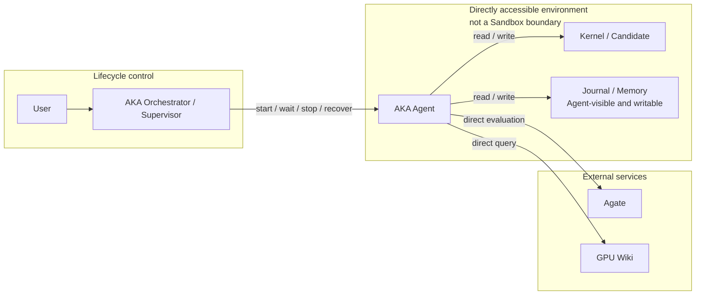
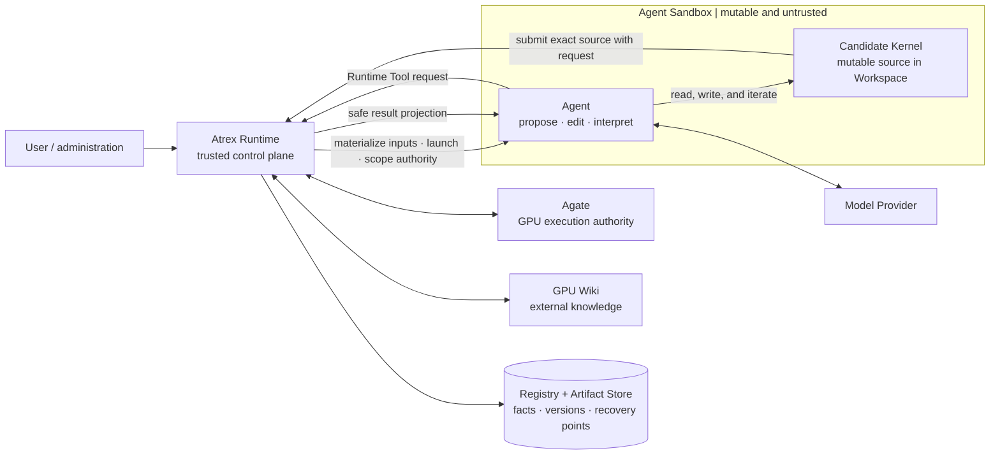
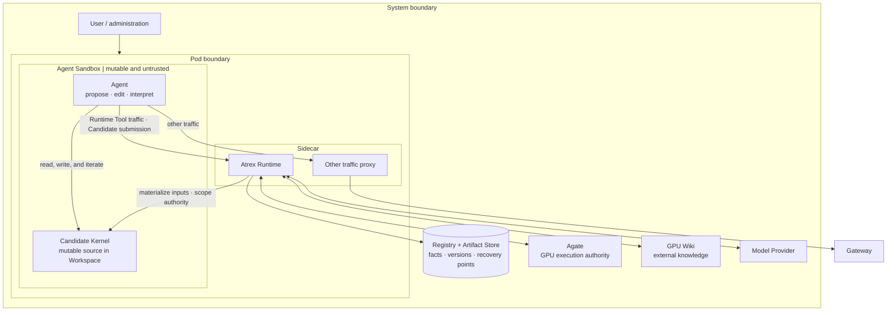

# Atrex Kernel Agent Runtime：系统边界与责任

本文档是架构思考目录的入口，先聚焦 Atrex Kernel Agent Runtime 的系统边界与
责任划分。完整背景、运行流程和实现约束见项目根目录的
[DESIGN.md](../DESIGN.md)；接口、配置、Pydantic Model 与数据库 Migration 仍是
可执行行为的权威定义。

## AKA 的现有设计

AKA 当前没有 Agent Sandbox，也没有位于 Agent 与外部服务之间的 Runtime Tool
代理边界。Agent 直接运行在工作环境中，可以直接操作 Agate、查询 GPU Wiki，并直接
读写自己的 Kernel、Journal 和 Memory。

外层 Orchestrator（即 Supervisor，以下统一称 **Orchestrator**）管理 Agent 的生命周期，
例如启动、等待、终止、恢复或重新运行 Agent；但 Orchestrator 不位于 Agent 每一次
文件操作和外部工具调用的执行路径上，
因此它并不约束 Agent 在一次运行中的具体行为。

### 存在的问题

1. **Agent 与 Agate、GPU Wiki 的交互缺少独立、结构化的可观测记录。** Agent 直接操作
   Agate 和 GPU Wiki，使其对两个服务的请求、响应与消费历史混在冗长的 Agent 对话
   历史中。后续需要从对话记录中解析并重建交互过程，很难准确回答 Agent 在什么时间
   向哪个服务发送了什么请求、获得了什么结果，以及实际消费了哪些 Wiki 内容，因而
   给可观测性建设带来很大挑战。

   一种可能的路径是在 Agate 和 GPU Wiki 服务端记录请求日志，但这仍不能完整解决
   问题。Agate 是无状态网关，GPU Wiki 将来也大概率是无状态知识库；它们只处理单次
   请求，并不知道 Agent 当前所处的运行状态。即使服务端保存了请求与响应日志，也很难
   将这些日志准确对应到 Agent 的具体运行阶段，因而
   服务日志与 Agent 运行历史之间仍然存在关联困难。

2. **Agate 与 GPU Wiki 的原始响应并不是面向 Agent 的最小信息视图。** Agent 直接
   操作 Agate 和 GPU Wiki，因此会看到服务返回的完整原始输出。特别是 Agate，其
   服务对象既包括人，也包括 Agent；为了方便人类调试，原始响应会保留较多诊断和
   过程信息，例如 Job ID、Trace ID、时间戳以及其他中间状态字段。这些字段对问题
   排查和服务端追踪有价值，但通常不是 Agent 继续优化 Kernel 所需的信息。

   将原始响应直接放入 Agent 对话，会消耗额外 Token，并要求 Agent 从大量中间字段中
   找出正确性、性能、错误和 Profile 等真正需要的信息。这既增加了 Agent 的解析压力，
   也使与任务无关的信息持续进入后续上下文。

   此外，Agate、GPU Wiki 等外部服务很难做到百分之百可靠。Agent 直接操作这些服务时
   必然会遇到请求失败、超时或暂时不可用。在现有结构下，Agent 需要自行判断失败原因、
   执行重试，甚至决定是否进行服务降级。

   这些与 Kernel 优化本身无关的故障处理过程会大量进入 Agent 对话。较轻时，它们会
   消耗额外 Token；较重时，连续错误、重试和降级判断会占据 Agent 的注意力，使其偏离
   Kernel 优化目标，最终降低优化效果。

3. **Agent-local Journal 不可信，导致重复评测和观测数据篡改风险。** AKA 的 Journal，
   特别是评测记录，保存在 Agent 本地可见、可写的位置。Agent 可以修改这些记录，因此
   不能直接将 Agent 报告的评测结果作为权威事实。

   现有 AKA 的解决方法，是在 Agent 运行结束后取出其产出的 Kernel，再执行一次独立的
   权威终评。这个设计可以避免直接相信 Agent 的本地报告，但很可能浪费评测资源：Agent
   在提交 Kernel 前通常已经自行完成过评测，只是因为这次评测及其报告不可信，外层不得不
   对同一个 Candidate 再做一次冗余评测。

   如果后续可观测性建设增加更多观测指标，而这些指标仍然写在 Agent 本地，就会面临同样
   甚至更严重的篡改风险。Kernel 性能至少可以通过重新运行 Candidate 再次测量；其他与
   当次运行过程绑定的观测指标则未必容易重新获取，部分信息可能无法在事后准确重放。
   因此，仅靠运行结束后的重新评测，只能补救少数可重复测量的结果，不能为全部运行观测
   数据提供可信性。

## 核心思想

1. **在 Agent 与外部服务交互的必经链路上建立可观测性。** Agent 对 Agate、GPU Wiki
   等服务的请求不再直接到达服务，而是统一经过一个公共中间端点，再由该端点间接访问
   目标服务。这样可以在请求实际发生的位置记录请求、响应和消费历史，并将它们与 Agent
   的运行过程关联，而不需要事后从冗长对话中反向解析。

2. **由中间组件向 Agent 提供最小信息视图。** 中间组件负责对不同服务进行封装和抽象，
   从原始服务响应中提取 Agent 当前任务真正需要的信息，再以统一、精简的形式返回给
   Agent。失败重试、错误分类和服务降级也由该组件处理，不让这些基础设施细节进入 Agent
   的优化上下文。

3. **将 Journal 从 Agent 工作区独立出来。** Journal 不再是 Agent 可以直接读写和修改的
   本地文件，而是由 Agent 工作区之外的组件持有。Agent 只能通过受控接口提交 Journal
   内容，不能直接修改或删除已经保存的记录。

## 系统边界图

## 系统整体架构图

