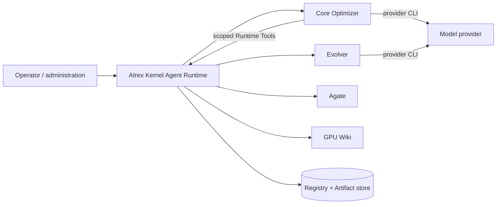

# Architecture

English | [中文](architecture.zh.md)

Atrex Kernel Agent Runtime is a single-node trusted Python control plane for self-evolving GPU
Kernel Agents. Core and Evolver are separately versioned, commit-pinned Agent repositories. Agate
is the GPU execution authority; GPU Wiki is an external query-only knowledge service.

For the rationale behind these boundaries, start with [Design Principles](design-principles.md).

## Terminology

| Term | Meaning |
| --- | --- |
| Campaign | Immutable operator, hardware, Evaluation Contract, Gate policy, Agent commits, and one or more DSL Lineages. |
| Lineage | One DSL-specific, independently evolving Agent and Kernel history. |
| Epoch | One competition starting from a frozen Active Agent, Kernel, Runtime State, and Evidence checkpoint. |
| Branch | The Active or one Challenger Agent participating in an Epoch. |
| Trajectory | One independent Kernel-search path inside a Branch. |
| Attempt | One logical optimization step in a Trajectory, starting a fresh Optimizer process. |
| Session | One Worker execution; infrastructure recovery starts another Session. Report-only provider continuations stay inside the same Session and Attempt. |
| Kernel Trial | One exact measured experimental Kernel; it does not consume a `vN` label. |
| Kernel Revision | A Lineage-local retained Kernel labeled `vN`. |
| Agent Revision | A Lineage-local Agent Bundle labeled `agent-vN`, including its versioned search Workflow program. |
| Agent Workflow | Untrusted versioned code that orchestrates one Epoch by calling a bounded set of trusted Runtime services within a fixed resource envelope. |
| Runtime State | Adaptive `prompts/`, `insights/`, `skills/`, and `tools/` associated with Agent execution, stored separately from versioned source. |
| Artifact | Immutable content-addressed data in Runtime's local CAS. |

Use these terms consistently. “Lineage” never means a parallel Trajectory, “Attempt” never means a
provider retry, and “Agent” should be qualified as Optimizer, Evolver, Active, or Challenger when
the role matters.

## Ownership and trust

- Runtime owns identities, lifecycle transitions, fencing, capabilities, private evaluation data,
  policy, comparison, promotion, recovery, Session capture, immutable Artifacts, and adaptive State
  persistence.
- Core owns Optimizer prompts, the Agent Workflow program, Backend adapters, Runtime Tool bindings, and Agent-authored
  Direction/Experiment/Attempt reports.
- Evolver owns one same-DSL Agent-change hypothesis and may modify the Candidate Bundle, or report
  `no_change` when evidence does not support an Agent-controllable improvement. It does not evaluate Kernels.
- Agate owns compilation, correctness, profiling, and performance execution.
- GPU Wiki supplies external knowledge. Runtime freezes each query interaction before returning
  knowledge to Core and never uploads Agent history, query consumption, or Session traces.

Worker output is untrusted evidence. Registry transitions and Runtime-selected Gateway outcomes are
authoritative.

## Lifecycle

### Bootstrap

Campaign schema v3 supplies the Core commit, DSL Lineages, seed Kernels, public `shape_train`
contract, private Evaluation Contract, models, and Epoch topology. Runtime resolves the Agate
environment, freezes the returned architecture and GPU selector, imports and seals Core, freezes
the configured Evolver commit, and optionally builds a missing Roofline.

Each DSL runs a Core `framework_baseline` Session. Bootstrap is a special Attempt: it uses the same
Gateway, Direction, Experiment, Report, Session, and Runtime State machinery, but has no earlier
Lineage history or incumbent Kernel. Success publishes `agent-v0`, Kernel `v0`, and Epoch-0
Evidence. Physical Bootstrap retries are append-only Generations under one stable Bootstrap
Attempt identity.

Each session is a fresh process. Optimizer model context is never reused; Evolver resumes its
Lineage/Backend conversation. Attempt Evidence contains earlier
Attempts only from the same Trajectory. The Optimizer view contains every completed Active/Challenger
branch's Attempt reports and conversations keyed by branch, and each completed Epoch names the
selected branch, while the Evolver view adds Agent selection result, Attempt outcome, and exact
referenced Kernel artifact. Runtime additionally
freezes versioned Agent/Kernel catalogs and every historical Kernel Artifact. The Evolver workspace
presents one complete Bundle per visible version under `input/agents/agent-vN/`, with summaries and
per-Trajectory resource snapshots under `input/evidence/agent-vN/`. Both trees
are keyed by Lineage version, so no directory name encodes an Epoch role. Every version has an
optimization summary; only the branches that competed in the last completed Epoch also have that
Epoch's Attempt conversations and Attempt reports. Each summary records the version's branch and
outcome, plus the rule applied in the final pairwise selection step; with multiple Challengers that
rule is not a complete tournament history. Prior
Agent-creation reports are read-only files under `input/evolution-reports/`; full Evolution traces
remain private. Detailed Epoch trees remain Runtime-private. Each visible Bundle directly contains its selected adaptive directories. Every
Optimizer Session seals its terminal `prompts/insights/skills/tools` as an immutable Runtime State Artifact and the
producing Attempt records its `runtime_state_digest`; the Attempt ID is the producer identity, so
there is no second checkpoint ID. A later serial Attempt restores that exact State if its local
cache is missing. Runtime uses the terminal State after the last Attempt of the latest completed
Epoch winner's best-Kernel Trajectory as the common seed for the next Active Branch and Evolver
Candidate (falling back to that Trajectory's Epoch-start State, the revision seed, then packaged defaults). Evolver seals Candidate Source plus State as one logical Agent Bundle. Evidence stores normalized
summaries and source Session digests. Agent workspaces materialize original unredacted Session
Artifacts from those digests. Wiki Query exposes the external service's complete safe
`records`/`notes` projection with stable Record IDs as mapping keys. Runtime freezes each Query
interaction but Core exposes only knowledge content. Runtime sends no post-Epoch data to the Wiki.

### Epoch

Runtime snapshots the Active Agent, starting Kernel, common Runtime State, Evidence, and a fixed
resource envelope. It then runs the Active Agent Revision's versioned Workflow program once in an
isolated process. Workflow may ask Runtime to attach Active replicas, invoke Evolver serially for up
to `K` Challengers, divide the bounded Optimizer Attempt capacity among Branches and Trajectories,
execute those Branches, and request trusted Kernel and Agent selection. A Challenger proposal may create a
revision from Active, reuse a visible historical revision, create one from history, or return
`no_change`. Revision ancestry remains a tree; reuse and Epoch participation are separate provenance.

Workflow implements one `run_epoch(epoch)` function. Its public SDK creates Branch-local Pools and
advances synchronized rounds without exposing Attempt ordinals or the wire protocol. After each
round, code may inspect trusted outcomes, broadcast an accepted Kernel across sibling Trajectories,
or copy compatible Runtime State by naming its producing Attempt. The SDK privately translates
rounds into replay-safe Attempt operations. Normal organizations spend the full configured capacity;
controlled Challenger-only evolution organizations execute only one Challenger and spend the exact
single-Branch budget. Branch capacity, Runtime-State policy,
Challenger set, and Workflow program hash remain frozen and the configured Attempt budget must still
be spent exactly. Runtime—not Workflow—schedules Epochs, launches and recovers every Attempt,
performs Gateway evaluation and trusted comparison, validates cross-Trajectory inputs and selection
identities, and commits promotion. Physical provider calls may include
infrastructure retries and bounded report-only continuations; neither increases the configured
Attempt count.

Completed Evidence becomes the next Epoch checkpoint. Optimizers see every completed Epoch Branch,
plus only earlier Attempts in their own in-progress Trajectory. Evolver sees every participant in the
latest completed Epoch, all visible historical Agent source/State and career summaries, and earlier
Evolution reports.

### Additional roots and ablation

`seed-lineage` creates an independent Lineage from sealed Agent/Kernel Artifacts or registered
Revision IDs after Runtime revalidates the Agent and re-evaluates the Kernel under the destination
Campaign Contract.

Production Bootstrap selects the Runtime-owned `evolve_3.py` construction template when sealing its
initial Agent Revision. Each ablation Lineage derives its own immutable `agent-v0` from the same
Optimizer source while selecting the controlled Isolated, Isolated-Evolve, Retained-Evolve,
Isolated-Pool-Evolve, Retained, Pool-3, or Pool-Retained-3 template. Runtime materializes only the selected program as `workflow/main.py`; the
sealed Revision does not contain the alternative arm programs, so Optimizer and Evolver see only
the organization that actually runs. Repeated control instances keep independent Revision
identities even when their selected Workflow content is identical. They share the exact Bootstrap
Kernel, not the source Lineage's Agent Artifact identity.

The Workflow program belongs to the immutable Agent Revision, but its execution state does not.
Only the Epoch's Active Revision orchestrates that Epoch; a Challenger's changed Workflow takes
effect only after that Agent wins and becomes Active in a later Epoch. Registry records the frozen
Challenger set, Branch topology, State policy, program hash, and every resulting Attempt, so a
restart can replay idempotent service calls without letting changed code reinterpret completed
decisions. Runtime never imports Workflow code into its control process. Workflow cannot alter
evaluation, hidden Shapes, Gate policy, Runtime retries, promotion, rollback, capabilities, or the
resource envelope.

`seed-ablation-arm` creates a control Lineage in a separate Campaign from another Lineage's frozen
Bootstrap baseline. `challenger_count` defaults to 0 but can enable evolution-frequency controls;
`challenger_start_epoch` defaults to 2. `ephemeral_agent_state` controls
whether `prompts/`, `insights/`, `skills/`, and `tools/` reset after every Attempt. The arm shares the source evaluation
identity needed for comparison but has independent lifecycle and version histories.

With `first_epoch_same_agent=true`, the initial Challenger is a Runtime-created `replica` of
the Active revision, not an Evolution. Branch identity isolates mutable State and attempts while
the Agent revision remains unchanged. A normal competition executes both Branches. The controlled
Challenger-only evolution topologies execute only this replica/Challenger: they have no same-Epoch
Active control, retain the best Kernel against the Epoch starting Kernel, and promote the sole
executed Agent for the next Epoch. Isolated-Evolve resets State before every Attempt;
Retained-Evolve carries it across serial Attempts. Replica provenance has no Evolution trace.

## Private evaluation boundary

Exact validation Shapes, reference/input code, metadata, and Roofline remain Runtime-private in all
launcher modes. Agents receive only a public train-domain contract and opaque Shape IDs. Runtime
constructs Agate requests from the sealed Contract and sanitizes Worker responses. Administration
may retrieve bounded exact Artifacts; Agent tools cannot select arbitrary Campaign, Lineage, or
Attempt history.

New Campaigns seal a fixed-seed (`42`) randomized 50/50 Valid/Test partition (odd extra: Valid;
at least two Shapes), then randomly sample at most 15 Shapes per subset. The private Contract
archives the source population and selected IDs; extra Shapes do not participate in evaluation.
Agent operations and ordinary evaluation use Valid only; authoritative Runtime ABBA uses both.
Agent-facing historical measurements omit Test rows and recompute latency aggregates over Valid;
only Runtime acceptance/selection verdicts reflect the full Gate. See [evaluation](evaluation.md).

## Agent source and Runtime State

One full Optimizer commit is read from the initialized local checkout without executing repository
content or accessing the network. Runtime verifies the exact commit and submodule gitlinks, rejects
unsafe paths, links, special files, unresolved submodules, manifest violations, and size-limit
violations, then seals a complete Agent source Artifact. Git commit and Artifact digest are both
retained: the commit names reviewed source provenance, while the digest names the exact validated
snapshot.

Optimizer Sessions mount Agent source, `prompts/`, `insights/`, and `skills/` read-only; only
`tools/` remains writable reusable state. Runtime seals the terminal State of every Session. Serial
Attempts restore the preceding State. Evolution presents
read-only Active/Challenger/historical source and State, plus a writable Candidate
`candidate/` containing implementation and `{prompts,insights,skills,tools}/`; Runtime validates and seals both as the new Agent
Bundle. Runtime never pushes evolved content back to the Core repository.

## Storage and recovery

SQLite Registry state and Gateway control records hold lifecycle authority; the local Artifact
store holds immutable source, results, reports, traces, Evidence, and State. IDs and creation keys
make operations idempotent. Renewable Lineage and Task fences prevent two schedulers from committing
the same transition. Failed Epoch recovery advances a generation instead of rewriting prior
authority. Garbage collection is bounded, offline, and dry-run by default.

## Worker launch modes

- `development`: trusted local debugging; no production isolation claim.
- `container`: bubblewrap filesystem/process boundary inside a dedicated outer OCI container;
  aggregate resource limits belong to that container.
- `sandbox`: the same bubblewrap boundary plus a systemd-managed per-Session cgroup v2.

Both production modes expose only the current workspace at `/home/agent/workspace`, mask Runtime
storage and sibling Worker roots, drop capabilities, and preserve the surrounding host/container
network namespace. Public egress and reachable host services are intentionally not restricted.

The design deliberately defers multi-node scheduling, global cross-Lineage Agent promotion,
cross-Campaign memory sharing, and recursive Evolver self-evolution.

## Source organization

| Area | Responsibility |
| --- | --- |
| `api/`, `cli/` | HTTP and command-line entrypoints and presentation. |
| `composition/` | Configuration-to-object assembly only. |
| `domain/`, `controller/` | Identities, lifecycle, scheduling, Evidence, fencing, and Tasks. |
| `workers/` | Core/Evolver workspaces, launch, Session capture, usage, and reports. |
| `gateway/` | Capability control, Agate adapter, private result projection, evaluation, and journals. |
| `registry/`, `artifacts/` | Durable authority and immutable content storage. |
| `kernel_agents/`, `git_import.py` | Safe commit import and Agent Bundle sealing. |
| `knowledge/` | Query-only GPU Wiki client and proxy. |
| `src/atrex-kernel-agent-{core,evolver}/` | Separately versioned Agent submodules. |
| `third_party/atrex-bench/` | Commit-pinned trusted evaluator/builder source. |
| `local-wiki/` | Development-only wire-compatible Wiki service. |

Entrypoints call composition, composition wires application services, and domain code does not
depend on SQLite, HTTP, subprocess, or SDK implementations. Moving code must not silently change
persisted schemas, Artifact formats, Worker layouts, or public responses.
