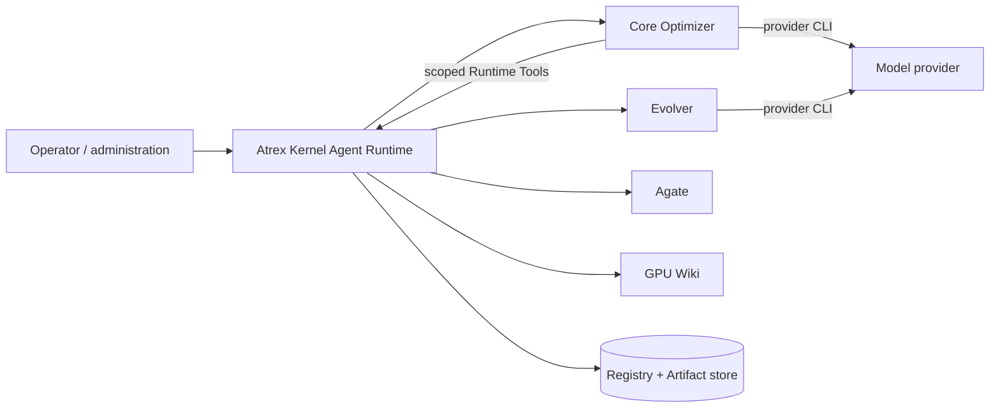

# Architecture

English | [中文](architecture.zh.md)

Atrex Kernel Agent Runtime is a single-node trusted Python control plane for self-evolving GPU
Kernel Agents. Core and Evolver are separately versioned, commit-pinned Agent repositories. Agate
is the GPU execution authority; GPU Wiki is an external query-only knowledge service.

For the rationale behind these boundaries, start with [Design Principles](design-principles.md).

## Terminology

| Term | Meaning |
| --- | --- |
| Campaign | Immutable operator, hardware, Evaluation Contract, Gate policy, Agent commits, and one or more DSL Lineages. |
| Lineage | One DSL-specific, independently evolving Agent and Kernel history. |
| Epoch | One competition starting from a frozen Active Agent, Kernel, Runtime State, and Evidence checkpoint. |
| Branch | The Active or one Challenger Agent participating in an Epoch. |
| Trajectory | One independent Kernel-search path inside a Branch. |
| Attempt | One fresh Optimizer process and Session in a Trajectory. |
| Session | One physical model-backed process execution; retries create new Sessions without rewriting logical history. |
| Kernel Trial | One exact measured experimental Kernel; it does not consume a `vN` label. |
| Kernel Revision | A Lineage-local retained Kernel labeled `vN`. |
| Agent Revision | A Lineage-local Agent Bundle labeled `agent-vN`. |
| Runtime State | Adaptive `prompts/`, `memory/`, `knowledge/`, `skills/`, `tools/`, and `hooks/` associated with Agent execution, stored separately from versioned source. |
| Artifact | Immutable content-addressed data in Runtime's local CAS. |

Use these terms consistently. “Lineage” never means a parallel Trajectory, “Attempt” never means a
provider retry, and “Agent” should be qualified as Optimizer, Evolver, Active, or Challenger when
the role matters.

## Ownership and trust

- Runtime owns identities, lifecycle transitions, fencing, capabilities, private evaluation data,
  policy, comparison, promotion, recovery, Session capture, immutable Artifacts, and adaptive State
  persistence.
- Core owns Optimizer prompts, workflow, Backend adapters, Runtime Tool bindings, and Agent-authored
  Direction/Experiment/Attempt reports.
- Evolver owns one same-DSL Agent-change hypothesis and may modify Candidate source plus the
  Candidate Runtime State seed. It does not evaluate Kernels.
- Agate owns compilation, correctness, profiling, and performance execution.
- GPU Wiki supplies external knowledge. Runtime freezes each query interaction before returning
  knowledge to Core and never uploads Agent history, query consumption, or Session traces.

Worker output is untrusted evidence. Registry transitions and Runtime-selected Gateway outcomes are
authoritative.

## Lifecycle

### Bootstrap

Campaign schema v3 supplies the Core commit, DSL Lineages, seed Kernels, public `shape_train`
contract, private Evaluation Contract, models, and Epoch topology. Runtime resolves the Agate
environment, freezes the returned architecture and GPU selector, imports and seals Core, freezes
the configured Evolver commit, and optionally builds a missing Roofline.

Each DSL runs a Core `framework_baseline` Session. Bootstrap is a special Attempt: it uses the same
Gateway, Direction, Experiment, Report, Session, and Runtime State machinery, but has no earlier
Lineage history or incumbent Kernel. Success publishes `agent-v0`, Kernel `v0`, and Epoch-0
Evidence. Physical Bootstrap retries are append-only Generations under one stable Bootstrap
Attempt identity.

Each session is a fresh process. Model context is never reused. Attempt Evidence contains earlier
Attempts only from the same Trajectory. The Optimizer view contains every completed Active/Challenger
branch's Attempt reports and conversations keyed by branch, and each completed Epoch names the
selected branch, while the Evolver view adds Agent selection result, Attempt outcome, and exact
referenced Kernel artifact. Runtime additionally
freezes versioned Agent/Kernel catalogs and every historical Kernel Artifact. The Evolver workspace
presents one complete Bundle per visible version under `input/agents/agent-vN/`, with summaries and
per-Trajectory resource snapshots under `input/evidence/agent-vN/`. Both trees
are keyed by Lineage version, so no directory name encodes an Epoch role. Every version has an
optimization summary; only the branches that competed in the last completed Epoch also have that
Epoch's Attempt conversations and Attempt reports. Each summary records the version's branch and
outcome, plus the rule applied in the final pairwise selection step; with multiple Challengers that
rule is not a complete tournament history. Prior
Agent-creation reports are read-only files under `input/evolution-reports/`; full Evolution traces
remain private. Detailed Epoch trees remain Runtime-private. Each visible Bundle directly contains its selected adaptive directories. Every
Optimizer Session seals its terminal `prompts/memory/knowledge/skills/tools/hooks` as an immutable Runtime State Artifact and the
producing Attempt records its `runtime_state_digest`; the Attempt ID is the producer identity, so
there is no second checkpoint ID. A later serial Attempt restores that exact State if its local
cache is missing. Runtime uses the terminal State after the last Attempt of the latest completed
Epoch winner's best-Kernel Trajectory as the common seed for the next Active Branch and Evolver
Candidate (falling back to that Trajectory's Epoch-start State, the revision seed, then packaged defaults). Evolver seals Candidate Source plus State as one logical Agent Bundle. Evidence stores normalized
summaries and source Session digests. Agent workspaces materialize original unredacted Session
Artifacts from those digests. Wiki Query exposes the external service's complete safe
`records`/`notes` projection with stable Record IDs as mapping keys. Runtime freezes each Query
interaction but Core exposes only knowledge content. Runtime sends no post-Epoch data to the Wiki.

### Epoch

Runtime snapshots the Active Agent, starting Kernel, common Runtime State, and Evidence. It invokes
the Evolver serially to construct `K` Challengers. Each proposal may create a revision from Active,
reuse a historical revision, or create a revision from history. Revision ancestry remains a tree;
reuse and Epoch participation are separate provenance.

After the pool is frozen, Active and Challenger Branches run concurrently up to
`max_parallel_branches`. Each Branch runs `Y` Trajectories concurrently; each Trajectory runs `X`
fresh-session Attempts serially. All participants start from the same Epoch Kernel and cannot see
sibling in-progress work. Runtime then selects the best Kernel and independently compares Agent
revisions. An Epoch therefore contains `(1 + K) × Y × X` Optimizer Sessions and `K` Evolver
Sessions, excluding retries.

Completed Evidence becomes the next Epoch checkpoint. Optimizers see every completed Epoch Branch,
plus only earlier Attempts in their own in-progress Trajectory. Evolver sees every participant in the
latest completed Epoch, all visible historical Agent source/State and career summaries, and earlier
Evolution reports.

### Additional roots and ablation

`seed-lineage` creates an independent Lineage from sealed Agent/Kernel Artifacts or registered
Revision IDs after Runtime revalidates the Agent and re-evaluates the Kernel under the destination
Campaign Contract.

`seed-ablation-arm` creates a control Lineage in a separate Campaign from another Lineage's frozen
Bootstrap baseline. `challenger_count` defaults to 0 but can enable evolution-frequency controls;
`challenger_start_epoch` defaults to 2. `ephemeral_agent_state` controls
whether `prompts/`, `memory/`, `knowledge/`, `skills/`, `tools/`, and `hooks/` reset after every Attempt. The arm shares the source evaluation
identity needed for comparison but has independent lifecycle and version histories.

With `first_epoch_same_agent=true`, the initial Challenger is a Runtime-created `replica` of
the Active revision, not an Evolution. Branch identity isolates mutable State and attempts while
the Agent revision remains unchanged. Kernel selection covers both Branches; the best producer's
terminal Trajectory State seeds the next Active and Evolver. Replica provenance has no Evolution trace.

## Private evaluation boundary

Exact validation Shapes, reference/input code, metadata, and Roofline remain Runtime-private in all
launcher modes. Agents receive only a public train-domain contract and opaque Shape IDs. Runtime
constructs Agate requests from the sealed Contract and sanitizes Worker responses. Administration
may retrieve bounded exact Artifacts; Agent tools cannot select arbitrary Campaign, Lineage, or
Attempt history.

## Agent source and Runtime State

One full Core commit is imported without executing repository content, checked for unsafe paths,
links, special files, unresolved submodules, manifest violations, and size limits, then sealed as a
complete Agent source Artifact. Git commit and Artifact digest are both retained: the commit names
reviewed source provenance, while the digest names the exact validated snapshot.

Optimizer Sessions mount Agent source read-only and writable `prompts/`, `memory/`, `knowledge/`, `skills/`, `tools/`, and `hooks/`. Runtime seals the
terminal State of every Session. Serial Attempts restore the preceding State. Evolution presents
read-only Active/Challenger/historical source and State, plus a writable Candidate
`candidate/` containing implementation and `{prompts,memory,knowledge,skills,tools,hooks}/`; Runtime validates and seals both as the new Agent
Bundle. Runtime never pushes evolved content back to the Core repository.

## Storage and recovery

SQLite Registry state and Gateway control records hold lifecycle authority; the local Artifact
store holds immutable source, results, reports, traces, Evidence, and State. IDs and creation keys
make operations idempotent. Renewable Lineage and Task fences prevent two schedulers from committing
the same transition. Failed Epoch recovery advances a generation instead of rewriting prior
authority. Garbage collection is bounded, offline, and dry-run by default.

## Worker launch modes

- `development`: trusted local debugging; no production isolation claim.
- `container`: bubblewrap filesystem/process boundary inside a dedicated outer OCI container;
  aggregate resource limits belong to that container.
- `sandbox`: the same bubblewrap boundary plus a systemd-managed per-Session cgroup v2.

Both production modes expose only the current workspace at `/home/agent/workspace`, mask Runtime
storage and sibling Worker roots, drop capabilities, and preserve the surrounding host/container
network namespace. Public egress and reachable host services are intentionally not restricted.

The design deliberately defers multi-node scheduling, global cross-Lineage Agent promotion,
cross-Campaign memory sharing, and recursive Evolver self-evolution.

## Source organization

| Area | Responsibility |
| --- | --- |
| `api/`, `cli/` | HTTP and command-line entrypoints and presentation. |
| `composition/` | Configuration-to-object assembly only. |
| `domain/`, `controller/` | Identities, lifecycle, scheduling, Evidence, fencing, and Tasks. |
| `workers/` | Core/Evolver workspaces, launch, Session capture, usage, and reports. |
| `gateway/` | Capability control, Agate adapter, private result projection, evaluation, and journals. |
| `registry/`, `artifacts/` | Durable authority and immutable content storage. |
| `kernel_agents/`, `git_import.py` | Safe commit import and Agent Bundle sealing. |
| `knowledge/` | Query-only GPU Wiki client and proxy. |
| `src/atrex-kernel-agent-{core,evolver}/` | Separately versioned Agent submodules. |
| `third_party/atrex-bench/` | Commit-pinned trusted evaluator/builder source. |
| `local-wiki/` | Development-only wire-compatible Wiki service. |

Entrypoints call composition, composition wires application services, and domain code does not
depend on SQLite, HTTP, subprocess, or SDK implementations. Moving code must not silently change
persisted schemas, Artifact formats, Worker layouts, or public responses.
