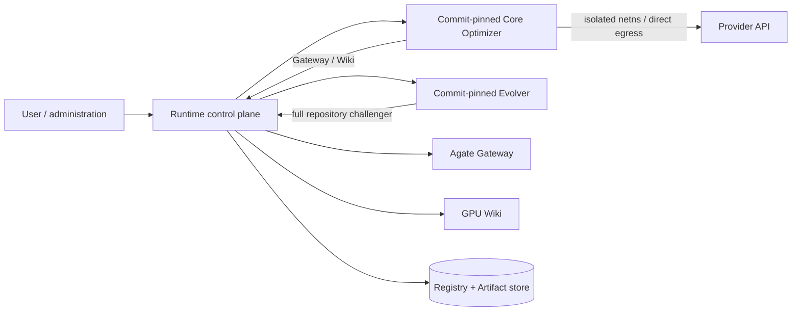

# Architecture

English | [中文](architecture.zh.md)

Atrex Kernel Agent Runtime is a Python trusted control plane. Core and Evolver are untrusted, separately versioned Git repositories imported by full commit; GPU Wiki and Agate are external services. Production Workers use bubblewrap plus per-Session cgroup v2 isolation. The explicit `development` launcher uses only a lightweight read-only mount namespace when host CLI login state is reused; it lacks the remaining production boundaries and is never a production fallback.

## Ownership boundaries

Runtime owns Campaign/Epoch state, fencing, capabilities, immutable Artifacts, Backend/model policy, token-report validation, comparison, promotion, recovery, Wiki feedback, and process lifetime. Core owns its Adapter implementations, prompts, skills, tool bindings, and optimization workflow. Evolver owns the hypothesis and source choice for one same-DSL Challenger, plus repository edits when it creates a revision. Agate owns correctness and performance measurement. GPU Wiki owns external knowledge; lineage experience is not Wiki data.

## Private evaluation boundary

The Campaign Evaluation Contract is always trusted private state. Exact Shapes, `reference.py`,
`input.py`, Metadata, and Roofline inputs are never materialized in Optimizer, Baseline, or Evolver
workspaces and no private host path is injected through their environment. A supplied or generated
public Agent Problem must declare private exact cases, must use synthetic development cases, and is
rejected if it contains private fields or copies an evaluator case.

Gateway calls resolve the sealed contract inside Runtime. Full raw Agate jobs are preserved in the
Artifact store for administration and authoritative selection, while Workers receive a separate
projection: aggregate correctness and latency, per-case latency keyed only by opaque ids, and
generic hidden-case failure text. Profiling uses one private case selected by opaque id (or a
trusted default), and request/spec/case material is removed from the returned profile. Runtime's
authoritative Bootstrap and retention comparators always evaluate the complete hidden set.

This protocol is identical in `development` and `sandbox` modes. `development` prevents accidental
disclosure through workspaces, requests, results, and environments, but remains an unisolated local
debug mode and cannot defend against a malicious same-user process scanning host storage. `sandbox`
adds that adversarial filesystem boundary by automatically masking Runtime storage and all sibling
Worker roots before mounting only the current workspace.

## Lifecycle

Campaign bootstrap accepts only a separate Campaign schema-v3 definition and one full Core commit. Runtime deployment configuration owns services, Backend selection, credentials, and policy but not DSL topology or concrete model identity; the Campaign `lineages` keys are the complete initial Bootstrap DSL set and each Lineage binds its Optimizer/Evolver models. Bootstrap copies the configured full Evolver Commit into immutable Campaign state, so later scheduling and debugging reject deployment drift before resolving the Evolver Bundle. Before Agent execution, an optional trusted, commit-pinned Atrex Bench Builder fills a missing Roofline and Runtime seals it into the Campaign-shared Evaluation Contract; an existing Campaign reuses its sealed result. Runtime then imports Core once, creates or validates the shared Agent Problem, and runs `framework_baseline` sequentially for each selected DSL. A stable Bootstrap Attempt owns append-only physical execution Generations; each Generation has fresh authority and durable Session, token, report, failure, workspace, operation, and result audit. An active Campaign may later add an independent Lineage from sealed Agent and Kernel Artifacts; Runtime revalidates the Agent and re-evaluates the Kernel under the destination contract before creating fresh `agent-v0`/`v0` roots. The new Lineage inherits the Campaign-frozen Evolver Commit.

One Epoch snapshots its Active Agent, starting Kernel, and Evidence, then sequentially proposes `K`
Challengers. Each Evolver invocation chooses one of three forms: create a revision from Active
(`evolved`), reuse one historical revision unchanged (`reuse`), or create a revision from a
historical revision (`evolve_from_history`). It can inspect every Agent revision already attached to
the Lineage, including earlier Challengers from the same Epoch. Runtime persists proposal provenance
on Epoch participation separately from revision ancestry. For `evolve_from_history`, a constrained
Runtime tool atomically resets the Candidate to completed Lineage history and records the base before
the Evolver edits it; final sealing reconciles that record, the proposal, and the actual repository
diff. New revisions still have exactly one
parent, so the revision graph remains a tree; reuse and promotion form a separate Epoch timeline.
After freezing the pool, Runtime runs Active and Challenger Branches concurrently up to deployment
policy `max_parallel_branches`. Within every admitted Branch, its `Y` independent Trajectories also
run concurrently; each Trajectory starts from the same Epoch Kernel and serially runs `X`
fresh-session Attempts. It
then selects one retained Kernel across all Trajectories, promotes at most one Agent revision,
appends one cumulative Evidence checkpoint, and atomically enqueues optional Wiki feedback. Thus an
Epoch contains `(1 + K) × Y × X` Optimizer Sessions and `K` Evolver Sessions.

Each session is a fresh process. Model context is never reused. Attempt Evidence contains earlier
Attempts only from the same Trajectory. The Optimizer view contains only the promoted completed
Agent lineage, while the Evolver view contains every completed Active/Challenger branch, Agent
selection result, Attempt outcome, and exact referenced Kernel artifact. Runtime additionally
freezes versioned Agent/Kernel catalogs, every historical Kernel Artifact, and a read-only local
inspection client into each Evolution workspace. Evidence stores normalized
summaries and source Session digests. Agent workspaces materialize original unredacted Session
Artifacts from those digests. Wiki Query exposes the external service's complete safe
`records`/`notes` projection with stable Record IDs as mapping keys. Runtime freezes each Query
interaction but Core exposes only knowledge content. Post-Epoch Wiki feedback separately uploads exact bounded Session
files and frozen Wiki interactions.

## Security posture

Capabilities are scoped to an Attempt, operation set, call quota, and expiry. Signing keys remain in
Runtime-owned environment resolution. Git import rejects unresolved revisions, links, special
files, unapproved submodules, unsafe archives, and size-limit violations.

The Sandbox overlays the host root read-only, masks Runtime storage and every configured Worker root, mounts only the current Session read-write at `/home/agent/workspace`, supplies private `/home`, `/tmp`, `/run`, `/dev`, and `/proc`, drops all capabilities, and unshares user/PID/IPC/UTS/cgroup namespaces. The system manager runs bwrap as a configured non-root Worker in a unique transient-service cgroup with memory, swap, CPU, and PID limits. The same system-manager identity creates and probes Worker roots directly; Runtime does not depend on root-create-then-chown, because ownership changes may be ineffective on Lima virtiofs. Cross-process locking makes the shared host check safe when several DSL Bootstrap processes start together. Workers intentionally retain the host network namespace and a read-only resolver projection, so provider CLIs use the same DNS/routing as the host and can reach host services and peer Workers. The Lima reference suite and live Claude/Codex/QoderCLI checks cover this declared boundary, while exact production-image escape and resource-exhaustion acceptance remains a release gate.

The design is single-node and uses SQLite plus renewable Registry fencing. Multi-node scheduling, global Agent promotion, cross-Campaign sharing, and recursive Evolver self-evolution are deferred.
