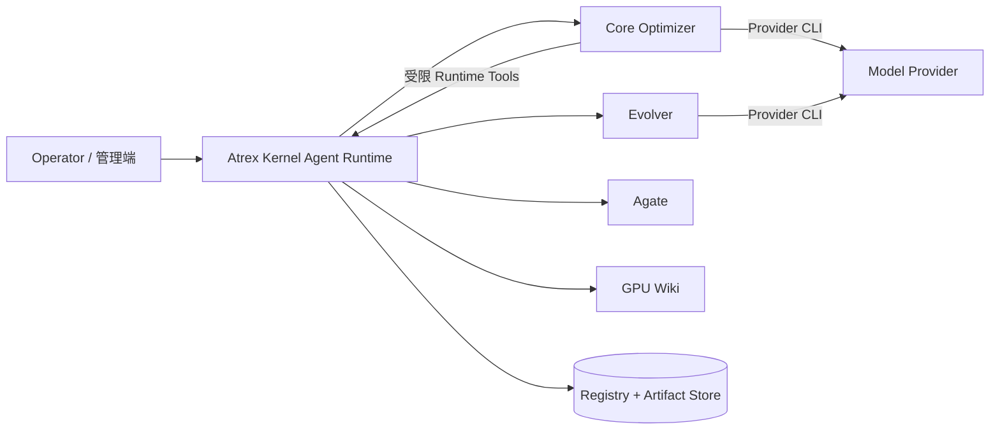

# 架构

[English](architecture.md) | 中文

Atrex Kernel Agent Runtime 是单节点可信 Python 控制平面，用于运行可自进化 GPU Kernel Agent。
Core 与 Evolver 是独立版本化、Commit 固定的 Agent 仓库；Agate 是 GPU 执行权威；GPU Wiki 是外部
只查询知识服务。

这些边界的设计理由见[设计理念](design-principles.zh.md)。

## 术语

| 术语 | 含义 |
| --- | --- |
| Campaign | 不可变的算子、硬件、Evaluation Contract、Gate 策略、Agent Commit 与一条或多条 DSL Lineage。 |
| Lineage | 一条 DSL 专属、独立进化的 Agent 与 Kernel 历史。 |
| Epoch | 从冻结的 Active Agent、Kernel、Runtime State 和 Evidence Checkpoint 开始的一次竞争。 |
| Branch | 参与 Epoch 的 Active 或某个 Challenger Agent。 |
| Trajectory | Branch 内一条独立 Kernel 搜索路径。 |
| Attempt | Trajectory 中一次逻辑优化，从全新的 Optimizer 进程开始。 |
| Session | 一次 Worker 执行；基础设施恢复创建新 Session，报告补交的 Provider 调用仍归属同一 Session 和 Attempt。 |
| Kernel Trial | 一份精确测量的实验 Kernel，不消耗 `vN`。 |
| Kernel Revision | Lineage 内被保留并标记为 `vN` 的 Kernel。 |
| Agent Revision | Lineage 内标记为 `agent-vN` 的 Agent Bundle，包含其版本化搜索 Workflow 程序。 |
| Agent Workflow | 不可信的版本化代码，在固定资源包络内调用一组受限的可信 Runtime 服务，编排一个完整 Epoch。 |
| Runtime State | Agent 执行产生的自适应 `prompts/`、`skills/` 与 `tools/`，与版本化源码分开存储。 |
| Artifact | Runtime 本地 CAS 中不可变的内容寻址数据。 |

术语必须保持一致：“Lineage”不表示并行 Trajectory，“Attempt”不表示 Provider 重试；角色相关时
应明确写 Optimizer、Evolver、Active 或 Challenger Agent。

## 权责与信任

- Runtime 持有身份、生命周期、Fencing、Capability、私有评测数据、策略、比较、晋升、恢复、
  Session 捕获、不可变 Artifact 与自适应 State 持久化。
- Core 持有 Optimizer Prompt、Agent Workflow 程序、Backend Adapter、Runtime Tool Binding，以及 Agent 编写的
  Direction、Experiment 与 Attempt Report。
- Evolver 持有一个同 DSL Agent 修改假设，可以修改 Candidate Bundle；没有证据支持 Agent 可控改进时，
  也可以提交 `no_change`。它不评测 Kernel。
- Agate 持有编译、正确性、Profile 与性能执行。
- GPU Wiki 提供外源知识。Runtime 在向 Core 返回知识前冻结查询交互，不上传 Agent 历史、消费
  记录或 Session Trace。

Worker 输出是不可信 Evidence；Registry Transition 与 Runtime 选择的 Gateway Outcome 才是权威。

## 生命周期

### Bootstrap

Campaign schema v3 提供 Agent Commit、DSL Lineage、Seed Kernel、公开 `shape_train` Contract、私有
Evaluation Contract、Model、Workflow 命令与资源包络。Runtime 解析 Agate Environment，冻结返回的架构与 GPU
Selector，导入并封存 Core，冻结配置的 Evolver Commit，并可选构建缺失 Roofline。

每个 DSL 运行一次 Core `framework_baseline` Session。Bootstrap 是特殊 Attempt：使用与普通
Attempt 相同的 Gateway、Direction、Experiment、Report、Session 与 Runtime State 机制，但没有
更早 Lineage 历史或 Incumbent Kernel。成功后发布 `agent-v0`、Kernel `v0` 与 Epoch-0 Evidence。
物理 Bootstrap 重试在一个稳定 Bootstrap Attempt 身份下追加 Generation。

Session 永远使用全新进程。Optimizer 不复用模型上下文，Evolver 会恢复同一 Lineage/Backend 的
对话。Attempt Evidence 只包含同一 Trajectory 内较早的
Attempt。Optimizer View 按分支包含每个已完成 Active/Challenger 分支的 Attempt Report 与
Conversation，且每个已完成 Epoch 都标明被选中的分支；Evolver View 还额外包含 Agent 选择结果、
Attempt Outcome 与被引用的精确 Kernel Artifact。
Runtime 还会冻结版本化 Agent/Kernel Catalog 和全部历史 Kernel Artifact。Evolver Workspace
将每个可见版本组装为完整 Bundle（`input/agents/agent-vN/`），效果汇总和逐 Trajectory
补充资源放在 `input/evidence/agent-vN/`。两棵树都按 Lineage 版本索引，任何目录名都不再
编码 Epoch 角色。每个版本都有效果汇总；只有在上一个已完成 Epoch 中参赛的全部分支还额外拥有该 Epoch 的
Attempt Conversation 与 Attempt Report。每份汇总都记录该版本的分支与胜负，以及最后一次两两选择使用
的规则；存在多个 Challenger 时，该规则不代表完整淘汰过程。
此前 Agent 创建时的报告位于只读
`input/evolution-reports/`，完整 Evolution Trace 保持私有；详细 Epoch Tree 仅供 Runtime 内部使用，每个可见 Bundle 直接包含所选自适应目录。每个 Optimizer Session 都把终态 `prompts/skills/tools` 封存为不可变
Runtime State Artifact，生产它的 Attempt 记录 `runtime_state_digest`；Attempt ID 本身就是生产者
身份，因此不再引入第二个 Checkpoint ID。Workflow 获得该输出的不透明引用，可以显式路由给后续
轮次；否则后续 Attempt 使用不可变 Trajectory Seed。同一逻辑 Attempt 的物理重试在本地缓存丢失时
会恢复其最新封存 State。Runtime 使用最近完成 Epoch 获胜分支中、产出最佳 Kernel 的 Trajectory 在最后一个 Attempt
结束后的终态 State，作为下一 Epoch Active Branch 与 Evolver Candidate 的共同种子；缺失时依次回退
到该 Trajectory 的 Epoch 起始 State、Revision Seed 和打包默认内容。Evolver 把 Candidate Source 与 State
一起封存为一个逻辑
Agent Bundle。Evidence 保存规范化摘要和 Session 来源 Digest；Agent Workspace 按 Digest 物化原始、未
脱敏 Session Artifact。Wiki Query 暴露外部服务完整、安全的 `records`/`notes` 投影，并以稳定
Record ID 作为 Mapping Key；Runtime 冻结每次 Query 交互，Core 只暴露知识内容。Runtime 不向
Wiki 发送 Epoch 后数据。

### Epoch

Runtime 冻结 Active Agent、起始 Kernel、公共 Runtime State、Evidence 和固定资源包络，然后在隔离
子进程中只运行一次 Active Agent Revision 的版本化 Workflow。Workflow 可以请求 Runtime 挂接 Active
副本、串行调用 Evolver 构造最多 `K` 个 Challenger、把有界 Optimizer Attempt 容量分配到 Branch 与
Trajectory、执行这些 Branch，并请求可信 Kernel/Agent 选择。Challenger 提案可以从 Active 创建
Revision、复用可见历史 Revision、从历史创建新 Revision，或用 `no_change` 停止继续构建；Revision
祖先关系仍是树，复用和 Epoch 参赛来源单独记录。

Workflow 只实现一个 `run_epoch(epoch)` 函数。其公开 SDK 创建 Branch 内 Pool 并推进同步轮次，不向
Workflow 暴露 Attempt 序号或底层协议。每轮结束后，代码可以检查可信结果、把已接受 Kernel 广播给
兄弟 Trajectory，或把已完成 Attempt 的不透明输出 State 显式路由到指定 Trajectory 的下一轮；若不
路由，下一轮重新使用该 Trajectory 的初始 State。SDK 在内部把轮次翻译成可重放的 Attempt 操作。
普通组织必须花完整体容量；受控的仅 Challenger 进化拓扑只执行唯一 Challenger，并精确花完单 Branch
预算。准确 Branch 容量、Challenger 集合与 Workflow 程序 Hash 仍会冻结。
Runtime 而非 Workflow 负责调度 Epoch、启动和恢复每个 Attempt、执行 Gateway
评测与可信比较、校验跨 Trajectory 输入与选择身份并提交晋升。物理 Provider 调用可能包含基础设施
重试和有上限的报告补交，均不增加 Attempt 数量。

完成后的 Evidence 成为下一 Epoch Checkpoint。Optimizer 可以看到全部已完成 Epoch Branch，以及当前
Trajectory 中更早的 Attempt；Evolver 可以看到上一完成 Epoch 的全部参赛者、所有可见历史 Agent 的
Source/State 与生涯汇总，以及更早的 Evolution Report。

### 新根与 Ablation

`seed-lineage` 从封存的 Agent/Kernel Artifact 或已注册 Revision ID 创建独立 Lineage。Runtime 会
重新校验 Agent，并在目标 Campaign Contract 下重评 Kernel。

生产 Bootstrap 在封存初始 Agent Revision 时选择 Runtime 持有的 `evolve_3.py` 构造模板。每条
Ablation Lineage 从同一份 Optimizer Source 派生自己的不可变 `agent-v0`，分别选择受控的
Isolated、Isolated-Evolve、Retained-Evolve、Isolated-Pool-Evolve、Retained、Pool-3 或
Pool-Retained-3 模板。Runtime 只把被选中的程序物化为
`workflow/main.py`；封存后的 Revision 不包含其他消融臂程序，因此 Optimizer 和 Evolver 只能看到
实际执行的组织方式。重复对照实例即使选择相同 Workflow 内容，也保留独立 Revision 身份；各臂共享
的是完全相同的 Bootstrap Kernel，而不是源 Lineage 的 Agent Artifact 身份。

Workflow 程序属于不可变 Agent Revision，但 Workflow 执行进度不属于。每个 Epoch 只由当时的 Active
Revision 编排；Challenger 修改后的 Workflow 只有在该 Agent 获胜、并在后续 Epoch 成为 Active 后才会
生效。Registry 记录冻结的 Challenger 集合、Branch 拓扑、显式 State 路由边、程序 Hash 和全部 Attempt，
因此重启可以幂等重放服务调用，而不会让变化后的代码重新解释已完成决策。Runtime 不会把 Workflow
代码导入控制进程。Workflow 不能修改评测、隐藏 Shape、Gate Policy、Runtime 重试、晋升、回滚、
Capability 或资源包络。

`seed-ablation-arm` 从已有 Lineage 的冻结 Bootstrap Baseline 创建单独 Campaign 中的控制
Lineage。其配置只冻结 `max_challengers`、`optimizer_attempt_budget` 与被选择的 Workflow 程序。
该程序决定是否以及何时调用 Runtime 的复制/进化服务、执行哪些 Branch/Trajectory，并控制各轮
Kernel 与 State 输出的路由。例如进化 Workflow 可以在 Epoch 1 创建 Active 副本、之后请求新进化的
Challenger；仅 Challenger 的 Workflow 也可以把全部固定预算投入这一个 Agent。该 Arm 共享可比较的
源评测身份，但生命周期和版本历史独立。

## 私有评测边界

所有 Launcher Mode 下，精确 Validation Shapes、Reference/Input 代码、Metadata 与 Roofline 都只
存在于 Runtime。Agent 只能看到公开训练域 Contract 与不透明 Shape ID。Runtime 从封存 Contract
构造 Agate 请求，并清理 Worker 响应。管理端可以读取有界精确 Artifact；Agent Tool 不能任意选择
Campaign、Lineage 或 Attempt 历史。

新 Campaign 使用固定种子 `42` 随机对半划分 Valid/Test（奇数多出的一个归 Valid，至少两个
Shape），再从两边各随机抽取最多 15 个。私有 Contract 留档原始全集与选中 ID，多出的 Shape 不参与评测。
Agent 操作与普通评测只使用 Valid。权威 Runtime ABBA 会执行两者，但正确性、延迟、接受与选择
只由 Valid 决定；Test 只是私有的泛化旁路观测，绝不影响晋升。Agent 可见历史测量剔除 Test
条目，并按 Valid 重算延迟汇总。详见[评测](evaluation.zh.md)。

## Agent Source 与 Runtime State

Runtime 从已初始化的本地 Checkout 读取完整 Optimizer Commit，不执行仓库内容，也不访问网络；
它校验准确 Commit 与 Submodule Gitlink，拒绝不安全路径、链接、特殊文件、未初始化 Submodule、
Manifest 或大小违规，随后封存完整 Agent Source Artifact。Git Commit 表示经审查源码来源，
Artifact Digest 表示实际使用的精确校验 Snapshot，两者都保留。

Optimizer Session 只读挂载 Agent Source、`prompts/` 和 `skills/`，仅 `tools/` 是可写的
可复用状态。Runtime 封存每个 Session 终态 State，串行 Attempt 恢复前一 State。Evolution 提供只读 Active/Challenger/Historical Source
与 State，以及可写的完整 `candidate/` Bundle（实现和三个自适应目录）；Runtime 校验并将二者
封存为新 Agent Bundle。Runtime 不会把进化结果推回 Core 仓库。

## 存储与恢复

SQLite Registry 与 Gateway Control Record 持有生命周期权威；本地 Artifact Store 保存不可变源码、
结果、Report、Trace、Evidence 与 State。ID 与 Creation Key 保证幂等；可续租 Lineage/Task Fence
阻止两个 Scheduler 提交同一 Transition。Failed Epoch Recovery 推进 Generation，不覆盖旧 Authority。
GC 有界、离线且默认 Dry Run。

## Worker Launcher Mode

- `development`：可信本地调试，不声明生产隔离能力。
- `container`：专用外层 OCI Container 内的 bubblewrap 文件系统/进程边界；总资源限制由外层容器持有。
- `sandbox`：相同 bubblewrap 边界，加 systemd 管理的逐 Session cgroup v2。

两个生产 Mode 都只把当前 Workspace 暴露到 `/home/agent/workspace`，遮蔽 Runtime Storage 与兄弟
Worker Root，丢弃 Capability，并保留所在宿主/容器的 Network Namespace。公网访问和可达宿主服务
不会被 Runtime 限制。

当前设计明确延后多节点调度、跨 Lineage 全局 Agent 晋升、跨 Campaign Memory 共享和 Evolver
递归自进化。

## 源码组织

| 区域 | 职责 |
| --- | --- |
| `api/`、`cli/` | HTTP/CLI 入口与展示。 |
| `composition/` | 只负责从配置组装对象。 |
| `domain/`、`controller/` | 身份、生命周期、调度、Evidence、Fencing 与 Task。 |
| `workers/` | Core/Evolver Workspace、Launch、Session、用量与 Report。 |
| `gateway/` | Capability、Agate Adapter、私有结果投影、评测与 Journal。 |
| `registry/`、`artifacts/` | 持久 Authority 与不可变内容存储。 |
| `kernel_agents/`、`git_import.py` | 安全 Commit 导入与 Agent Bundle 封存。 |
| `knowledge/` | 只查询 GPU Wiki Client 与 Proxy。 |
| `src/atrex-kernel-agent-{core,evolver}/` | 独立版本化 Agent Submodule。 |
| `third_party/atrex-bench/` | Commit 固定的可信 Evaluator/Builder 源码。 |
| `local-wiki/` | 仅开发使用、接口兼容的 Wiki 服务。 |

Entrypoint 调用 Composition，Composition 组装应用服务，Domain 不依赖 SQLite、HTTP、Subprocess 或
SDK 实现。移动代码不得隐式修改持久 Schema、Artifact 格式、Worker Layout 或公开响应。
