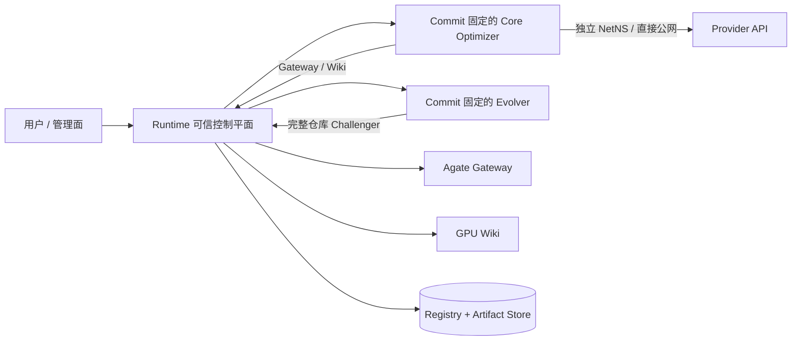

# 架构设计

[English](architecture.md) | 中文

Atrex Kernel Agent Runtime 是 Python 可信控制平面。Core 与 Evolver 是独立版本化、按完整 Commit 导入的不可信 Git 仓库；GPU Wiki 与 Agate 是外部服务。生产 Worker 使用 bubblewrap 与逐 Session cgroup v2 隔离。显式 `development` Launcher 在复用宿主 CLI 登录态时只提供轻量只读 Mount Namespace，仍缺少其余生产边界，也绝不会作为生产降级路径。

## 权责边界

Runtime 持有 Campaign/Epoch 状态、Fencing、Capability、不可变 Artifact、Backend/Model Policy、Token Report 校验、比较、晋升、恢复、Wiki Feedback 与进程生命周期。Core 持有 Adapter 实现、Prompt、Skill、Tool Binding 和优化 Workflow。Evolver 为当前固定 DSL 的一个 Challenger 提出假设并选择来源；需要创建 Revision 时再修改完整 Core 仓库 Candidate。Agate 负责正确性和性能测量。GPU Wiki 只负责外源知识；Lineage 历史经验不属于 Wiki。

## 私有评测边界

Campaign Evaluation Contract 永远属于可信私有状态。准确 Shapes、`reference.py`、`input.py`、
Metadata 与 Roofline 输入都不会进入 Optimizer、Baseline 或 Evolver Workspace，也不会通过环境变量
注入任何私有宿主路径。无论 Agent Problem 来自输入还是自动生成，都必须声明准确 Case 私有，开发
Case 必须为合成数据；一旦包含私有字段或复制某个评测 Case，Bootstrap 会拒绝它。

Gateway 调用只在 Runtime 内解析已封存 Contract。完整 Agate 原始 Job 进入 Artifact Store，供管理面
审计与权威选择；Worker 得到独立投影，只含聚合正确性与延迟、由不透明 ID 标识的逐 Case 延迟，以及
统一的隐藏 Case 失败信息。Profile 只使用一个由不透明 ID 选择（或可信默认选择）的私有 Case，返回
前移除 Request、Spec 与 Case 内容。Runtime 的权威 Bootstrap 和留存 Comparator 始终使用完整隐藏集合。

`development` 与 `sandbox` 使用完全相同的协议。`development` 可避免 Workspace、Request、Result
和环境变量造成的意外泄漏，但它仍是无隔离的本地调试模式，无法抵抗同一宿主用户下的恶意进程扫描。
`sandbox` 会进一步自动遮蔽 Runtime Storage 与所有兄弟 Worker Root，只挂载当前 Workspace，从而
提供对抗性文件系统边界。

## 生命周期

Campaign Bootstrap 只接受独立的 Campaign schema-v3 定义和一个完整 Core Commit。Runtime 部署配置持有服务、Backend、凭据与策略，不持有 DSL 拓扑或具体 Model 身份；Campaign 的 `lineages` Key 是完整的初始 Bootstrap DSL 集合，每个 Lineage 绑定自己的 Optimizer/Evolver Model。Bootstrap 会把配置中的完整 Evolver Commit 复制进不可变 Campaign 状态，后续调度和调试会在解析 Evolver Bundle 前拒绝部署漂移。在执行 Agent 前，可选的可信、Commit 固定 Atrex Bench Builder 会补全缺失的 Roofline，Runtime 再把它封存进 Campaign 共用 Evaluation Contract；已有 Campaign 复用已封存结果。随后 Runtime 只导入一次 Core，创建或校验共用 Agent Problem，再为选定 DSL 顺序运行 `framework_baseline`。稳定 Bootstrap Attempt 持有 Append-only 物理执行 Generation；每个 Generation 都有新 Authority，以及持久 Session、Token、Report、Failure、Workspace、Operation 和结果审计。Active Campaign 之后还可从已封存 Agent/Kernel Artifact 增加独立 Lineage；Runtime 会重新校验 Agent，并在目标 Contract 下重评 Kernel，再创建新的 `agent-v0`/`v0` 根。新 Lineage 继承 Campaign 冻结的 Evolver Commit。

一个 Epoch 先冻结 Active Agent、起始 Kernel 和 Evidence，再串行提出 `K` 个 Challenger。每次
Evolver 调用从三种形态中选择一种：从 Active 创建新 Revision（`evolved`）、原样复用一个历史
Revision（`reuse`），或从一个历史 Revision 创建新 Revision（`evolve_from_history`）。它能查看
已挂接到该 Lineage 的全部 Agent Revision，包括同一 Epoch 内此前创建的 Challenger。Runtime 将
本轮参赛提案的来源信息独立于 Revision 祖先关系持久化。对于 `evolve_from_history`，受约束的
Runtime Tool 会在 Evolver 修改前将 Candidate 原子切换到已完成的 Lineage 历史并记录 Base；最终
封存会核对该记录、提案声明和真实仓库 Diff。新 Revision 仍只有一个 Parent，因此
Revision 图仍是树，复用与晋升构成另一条 Epoch 时间线。冻结 Pool 后，Runtime 在部署策略
`max_parallel_branches` 的上限内并发运行 Active 和 Challenger Branch；每个获准运行的 Branch
内部也并发启动 `Y` 条独立 Trajectory。所有 Trajectory 从相同的 Epoch Kernel 出发，每条
Trajectory 再串行执行 `X` 个全新 Session Attempt。最后，Runtime 从所有 Trajectory 中选择
一个保留 Kernel，最多晋升一个 Agent Revision，追加一个累计 Evidence Checkpoint，并原子入队
可选 Wiki Feedback。因此，一个 Epoch 包含 `(1 + K) × Y × X` 个 Optimizer Session 和 `K`
个 Evolver Session。

Session 永远使用全新进程，不复用模型上下文。Attempt Evidence 只包含同一 Trajectory 内较早的
Attempt。Optimizer View 只包含已晋升的完成 Agent Lineage；Evolver View 包含每个已完成的
Active/Challenger 分支、Agent 选择结果、Attempt Outcome 与被引用的精确 Kernel Artifact。
Runtime 还会在每个 Evolution Workspace 中冻结版本化 Agent/Kernel Catalog、全部历史 Kernel
Artifact，以及带受约束 Candidate Reset 的本地工具。Evidence 保存规范化摘要和 Session 来源 Digest；Agent Workspace 按 Digest 物化原始、未
脱敏 Session Artifact。Wiki Query 暴露外部服务完整、安全的 `records`/`notes` 投影，并以稳定
Record ID 作为 Mapping Key；Runtime 冻结每次 Query 交互，Core 只暴露知识内容。Epoch 后 Wiki
Feedback 独立上传有界的原始 Session 文件与已冻结 Wiki Interaction。

## 安全状态

Capability 绑定 Attempt、操作集合、调用配额和过期时间，签名密钥只由 Runtime 解析。Git 导入拒绝非精确 Revision、链接、特殊文件、未批准 Submodule、不安全 Archive 和越界内容。

Sandbox 将宿主根只读覆盖，遮蔽 Runtime Storage 与全部 Worker Root，只把当前 Session 读写挂载到 `/home/agent/workspace`，并提供私有 `/home`、`/tmp`、`/run`、`/dev` 与 `/proc`；它丢弃全部 Capability，并隔离 User/PID/IPC/UTS/cgroup Namespace。System manager 以已配置的非 root Worker 账号运行 bwrap，并把完整进程树放入唯一 transient-service cgroup，限制内存、Swap、CPU 与 PID。同一个 System Manager 身份直接创建和探测 Worker Root；Runtime 不依赖“root 创建后 chown”，因为 Lima virtiofs 上的 Owner 变更可能不生效。多个 DSL Bootstrap 同时启动时，跨进程锁保证共享 Host Check 串行完成。Worker 有意保留宿主 Network Namespace，并只读投影 Resolver，因此 Provider CLI 使用与宿主一致的 DNS/路由，也能访问宿主服务和其他 Worker。Lima 参考边界套件以及 Claude/Codex/QoderCLI 真实请求覆盖这一明确边界；准确生产镜像上的逃逸与资源耗尽验收仍是发布门禁。

当前设计为单节点，使用 SQLite 与可续租 Registry Fencing。多节点调度、全局 Agent 晋升、跨 Campaign 共享和递归 Evolver 自进化均延后。
