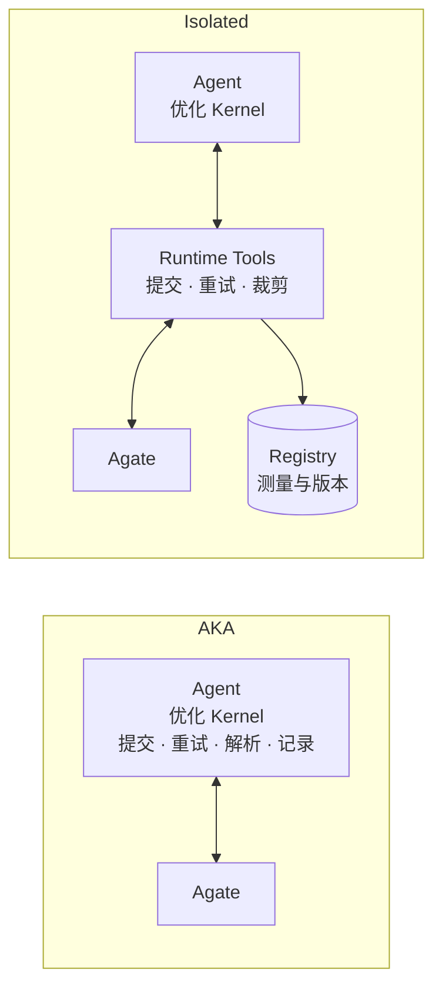
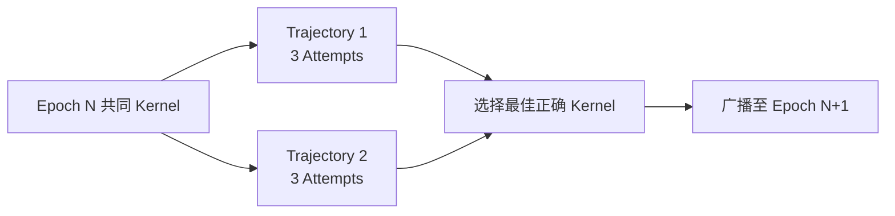
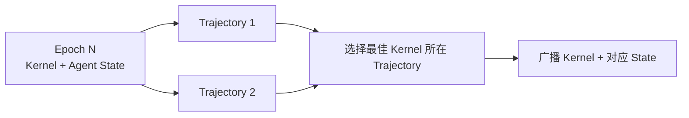
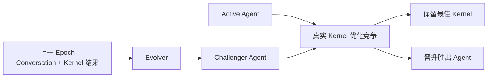
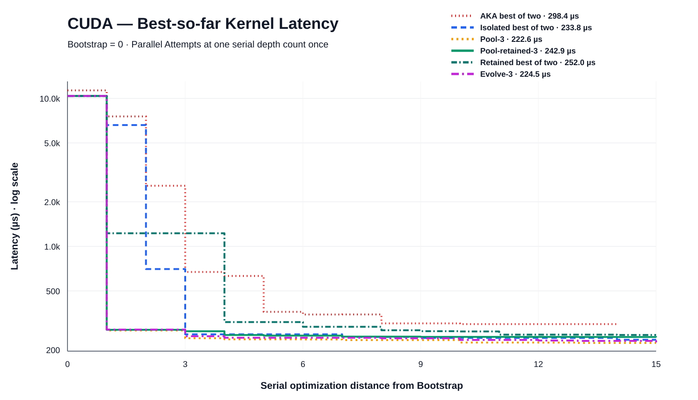
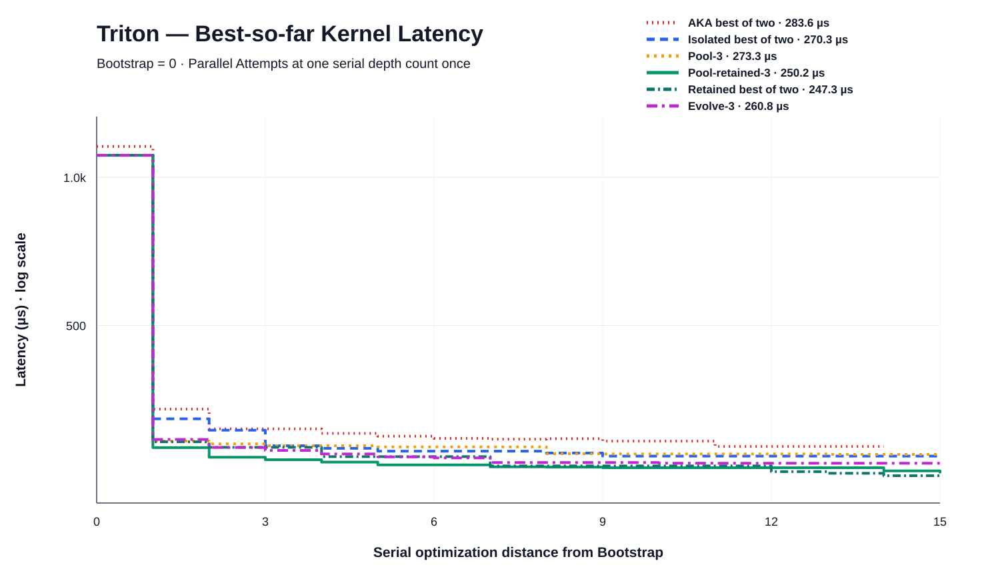
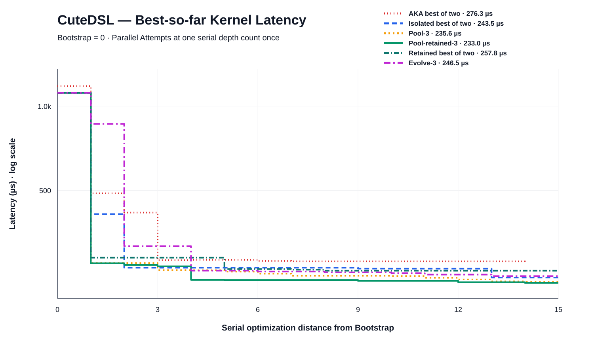

# Flash Attention：从 AKA 到 Isolated、Pooled、Retained 与 Evolve 的消融分析

## 摘要

本报告联合分析 Flash Attention 的两个 AKA 独立运行归档 `standalone-run7/run8` 与 Runtime 消融归档 `workspace-full-20260909.tar.zst`。实验覆盖 CUDA、Triton、CuteDSL。AKA 的 run7/run8 在每种 DSL 上使用完全相同的 `v1` Commit，各完成 14 个非 Bootstrap Episode；Runtime 的 7 个实例使用由同一计算实现适配而来的 seed，各运行 5 个 Epoch、15 层串行搜索。Runtime 只增加了 `Model()` 检查所需的默认构造参数和等价 fallback，GPU Kernel 主体没有变化。

两遍 AKA 共完成 84 个 Optimizer Episode，修正旧终态用量低估后共消耗 **1,397.722M Token**。其中可按 Provider 类型复核的 1,368.714M Token 中，**94.5% 是 cache read**；另外 29.008M Policy Reviewer Token 只保存了总量。84 份主 Trace 包含 12,929 次模型响应、16,202 次工具调用和 11,000 次 Bash 调用，说明其成本主要伴随长交互链和历史上下文的反复读取。

Runtime 把 Agate 提交、基础设施失败重试、原始结果持久化和 Agent-facing 输出裁剪移到可信控制面。两个 isolated 实例合计执行 90 个 Attempt，比 AKA 多 7.1% 的外层优化轮次，但 Token 为 **1,279.457M**，低 8.5%；三个 DSL 的最终 latency 也都低于 AKA Best-of-Two。

在相同 30 Attempt / DSL 的 Runtime 预算下，`pool-3`、`pool-retained-3`、retained best-of-two 和 `evolve-3` 分别消耗 1,155.654M、1,399.269M、1,236.342M 和 1,313.551M Token。所有机制在三个 DSL 上都优于 AKA Best-of-Two，但内部没有单一机制全面胜出：CUDA 最佳是 `pool-3` 的 **222.558 µs**，Triton 最佳是 `retained-02` 的 **247.344 µs**，CuteDSL 最佳是 `pool-retained-3` 的 **232.952 µs**。

Evolve 的 12 个 Evolved Challenger 中有 5 个胜出，证明 Agent Revision 已能通过真实 Kernel 优化任务进行生成、竞争、晋升和回滚；但它没有稳定支配 Pool 或 Retained。当前结果更强地支持 Runtime 化和多路线竞争的价值，尚不足以证明状态继承或 Agent 自进化对每种 DSL 都有稳定增益。

## 1. 实验设置与比较口径

### 1.1 Workload 与冻结环境

- 算子：`flash_attention`，即 causal variable-length paged GQA attention。
- 目标环境：L20N，Agent-facing Architecture 为 `sm_120`。
- Agent backend：Claude CLI，Reasoning Effort 为 `max`。
- Core Commit：`6d9cdda95e8a58b63dea025cbe233bac809824d5`。
- Evolver Commit：`946d0f2069372bc98e8e878912ddd215ade3f229`。
- Atrex Bench Commit：`8022dd01b90895b7e848606de5125297c4ac3d66`。
- 权威比较：Runtime 通过 Agate 执行同 Allocation ABBA；本文使用 Registry 中最终保留 Kernel Revision 的权威 GeoMean latency。
- 每份最终结果覆盖 90 个 Validation Shape。精确 Shape 由评测侧掌握，不从 Agent 的训练域信息反推。
- AKA：run7/run8 是两个独立实例；每个 DSL 配置 `max-iters=15`，实际完成 14 个非 Bootstrap Episode，两遍合计 28 个 Episode / DSL。
- Runtime：每个汇总机制执行 30 个 Optimizer Attempt / DSL。并行 Attempt 在延迟曲线中按同一串行层合并，因此搜索距离为 15。
- Bootstrap 不计入优化轮次和 Token 对比。AKA run7 的 3 个 V0/V1 Session 共 21.383M Token，run8 直接复用相同 V1 Commit；Runtime 的 3 个 Framework Baseline Session 也单独排除。
- AKA Token 使用 Trace 中每个 `message.id` 最后一次出现的 Provider usage，修正旧 Telemetry 在 4 个 Episode 上的低估；Policy Reviewer 只有总量、没有 Provider 分项。Runtime 使用 Registry 中 Worker Session 的终态 Provider usage。

三个 DSL 各自使用固定 seed，不要求不同 DSL 共用源码。AKA run7/run8 的 V1 Commit 完全一致；Runtime 从这些计算实现构造 seed，但增加了默认 `Model` 构造参数和 bare-`Model()` 检查 fallback，因此源码 SHA 不完全相同：

| DSL | AKA V1 Commit | Runtime Bootstrap latency | Runtime Artifact | 兼容性差异 |
|---|---|---:|---|---|
| CUDA | `32cbb0c2…` | 10,377.054 µs | `sha256:d413f1ef…` | 默认 `max_seqlen_*`；GPU source 不变 |
| Triton | `19f7c844…` | 1,108.387 µs | `sha256:4f64a375…` | 默认 `max_seqlen_*`；bare-`Model()` 时安全放大 grid |
| CuteDSL | `aa038ad4…` | 1,116.279 µs | `sha256:de3b3349…` | 默认 `max_seqlen_*`；GPU source 不变 |

因此本文比较的是同一计算 seed 的两种 Harness，而不是声称两个归档逐字节相同。各系统的最终 latency 来自各自归档中的权威测量，并非一次跨系统、同 Allocation 的配对 ABBA；百分比用于比较归档终点，不等价于置信区间。

### 1.2 消融配置

| 配置 | 每 Epoch 的并行搜索 | 每条串行长度 | Epoch | Optimizer Attempt / DSL | State 继承 | Evolver |
|---|---|---:|---:|---:|---|---|
| `AKA-1/2` | 各 1 条独立路线 | 14 Episode | — | 14 × 2 | Memory/Profile 文件 | 否 |
| `isolated-01/02` | 各 1 条独立 Trajectory | 3 | 5 | 15 × 2 | 否 | 否 |
| `pool-3` | 2 条 Trajectory | 3 | 5 | 30 | 否 | 否 |
| `pool-retained-3` | 2 条 Trajectory | 3 | 5 | 30 | 是 | 否 |
| `retained-01/02` | 各 1 条独立 Trajectory | 3 | 5 | 15 × 2 | 是 | 否 |
| `evolve-3` | Active 与 Challenger 各 1 条 | 3 | 5 | 30 | 是 | Epoch 2–5，共 4 次 |

`evolve-3` 的 Epoch 1 也运行两条 Branch，但两侧使用相同 Agent Revision；从 Epoch 2 开始，每轮由 Evolver 生成一个 Challenger。这样第一轮仍保持与其他双路线配置相同的 6-Attempt 预算。AKA Best-of-Two 共付出 28 个 Episode / DSL，Runtime Best-of-Two 或双路线机制共付出 30 个 Attempt / DSL，外层轮次数相近但不严格等价；一个 Episode 或 Attempt 内都可能执行多次 GPU 实验。

### 1.3 数据完整性

| 对象 | 归档状态 |
|---|---:|
| AKA Optimizer Episode | run7 42 / 42，run8 42 / 42 |
| AKA 主 Trace / 子 Agent Trace | 84 / 5 |
| AKA Policy Review | 92 次，3 次 timeout kill；最终 6 条 DSL 路线均保留 PASS Kernel |
| Campaign / Lineage | 21 / 21 条 Lineage 均为 `ready` |
| Epoch | 105 / 105 completed |
| Attempt | 450 / 450 completed |
| Optimizer Session | 449 completed，4 failed；其中 3 个产生 Recovery Session |
| Evolver Session | 12 / 12 completed |
| Framework Baseline Session | 3 / 3 completed |
| Kernel Revision | 250 |
| Kernel Measurement | 964 |

Runtime Session 时间跨度为 2026-09-07 08:00:09 UTC 至 2026-09-09 04:24:33 UTC，约 44 小时 24 分。4 个失败 Session 没有造成 Attempt、Epoch 或 Lineage 丢失。AKA run7 的 Triton 和 run8 的 CUDA Campaign 最终因独立 Policy Reviewer 失败而返回非零退出码，但 Manifest 均封存了此前已经通过 Production Gate 的最佳 Kernel；本文使用这些 `best_pass_candidate`，不把未晋升候选当作最终结果。

## 2. 总体结果

### 2.1 每条 Lineage 的最终 latency

| 配置 | CUDA，µs | Triton，µs | CuteDSL，µs |
|---|---:|---:|---:|
| `AKA-1` / run7 | **298.424** | **283.589** | **276.308** |
| `AKA-2` / run8 | 318.317 | 298.469 | 285.547 |
| `isolated-01` | 265.476 | **270.268** | 262.151 |
| `isolated-02` | **233.838** | 277.281 | **243.521** |
| `pool-3` | **222.558** | 273.297 | 235.593 |
| `pool-retained-3` | 242.879 | 250.225 | **232.952** |
| `retained-01` | 267.585 | 265.992 | **257.774** |
| `retained-02` | **251.955** | **247.344** | 299.711 |
| `evolve-3` | 224.457 | 260.765 | 246.501 |

粗体只表示同一重复组或同一单实例配置中的较优值。AKA run7 在三个 DSL 上都优于 run8；两次运行相差 3.3%–6.7%，说明同一 seed 的单路线仍有路径方差。全局最优在下一节单独标出。

### 2.2 统一 30-Attempt 预算的比较

| DSL | AKA Best-of-Two | Isolated Best-of-Two | Pool-3 | Pool-retained-3 | Retained Best-of-Two | Evolve-3 |
|---|---:|---:|---:|---:|---:|---:|
| CUDA | 298.424 | 233.838 | **222.558** | 242.879 | 251.955 | 224.457 |
| Triton | 283.589 | 270.268 | 273.297 | 250.225 | **247.344** | 260.765 |
| CuteDSL | 276.308 | 243.521 | 235.593 | **232.952** | 257.774 | 246.501 |
| 三 DSL 几何平均，仅作汇总 | 285.960 | 248.742 | 242.892 | **241.915** | 252.322 | 243.445 |

所有 Runtime 机制在三个 DSL 上都低于 AKA Best-of-Two。三 DSL 几何平均不是新的 Benchmark Score，只用于压缩展示三条不同 DSL 路线的整体方向。单 DSL 结论优先于这一汇总值。

### 2.3 全局最佳 Kernel

| DSL | 最佳配置 | 最终 GeoMean latency | 相对 Bootstrap 加速 | Validation Shape | 正确性 |
|---|---|---:|---:|---:|---|
| CUDA | `pool-3` | **222.558 µs** | **46.63×** | 90 | PASS |
| Triton | `retained-02` | **247.344 µs** | **4.48×** | 90 | PASS |
| CuteDSL | `pool-retained-3` | **232.952 µs** | **4.79×** | 90 | PASS |

三个最佳 Result Artifact 都没有 SOL 数据，因此本文不从 latency 反推 SOL，也不把 NCU 局部 Profile 当作完整 90-Shape SOL。

## 3. 从 AKA 简化为 Isolated

AKA 让 Agent 在同一条交互链中同时负责 Kernel 优化和 Harness 工作，包括组装 Agate 请求、判断基础设施故障、安排重试、解析原始返回以及维护跨 Episode 交接文件。Isolated 保留单路线、全新 Session 的优化形态，但把这些确定性控制职责移到 Runtime：Agent 只接收裁剪后的必要结果，原始测量、重试过程和版本关系由 Runtime 写入 Registry 与 Artifact Store。

### 3.1 Latency

AKA 和 Isolated 都运行两次独立单路线实例。AKA 每个实例完成 14 Episode / DSL；Isolated 每个实例完成 15 Attempt / DSL。下表同时展示单次运行波动和 Best-of-Two 终点。

| DSL | AKA-1 | AKA-2 | AKA Best-of-Two | Isolated-01 | Isolated-02 | Isolated Best-of-Two | Isolated 相对 AKA Best |
|---|---:|---:|---:|---:|---:|---:|---:|
| CUDA | **298.424 µs** | 318.317 µs | 298.424 µs | 265.476 µs | **233.838 µs** | **233.838 µs** | **低 21.6%** |
| Triton | **283.589 µs** | 298.469 µs | 283.589 µs | **270.268 µs** | 277.281 µs | **270.268 µs** | **低 4.7%** |
| CuteDSL | **276.308 µs** | 285.547 µs | 276.308 µs | 262.151 µs | **243.521 µs** | **243.521 µs** | **低 11.9%** |

同一 seed、相同配置下，两次 AKA 的终点相差 3.3%–6.7%，两次 Isolated 相差 2.6%–13.5%。两种单路线系统都存在路径方差；在本次归档中，Isolated Best-of-Two 在三个 DSL 上均低于 AKA Best-of-Two。

### 3.2 Token

| 配置 | 外层优化轮次 | Uncached input | Cache read | Cache write | Output | 未分项 Reviewer | Total | 平均每轮 |
|---|---:|---:|---:|---:|---:|---:|---:|---:|
| AKA-1 + AKA-2 | 84 | 0.079M | 1,293.659M | 55.411M | 19.565M | 29.008M | 1,397.722M | 16.640M |
| Isolated-01 + Isolated-02 | 90 | 0.076M | 1,215.702M | 43.319M | 20.361M | 0 | **1,279.457M** | **14.216M** |

Isolated 比 AKA 多完成 7.1% 的外层优化轮次，总 Token 仍低 8.5%，平均每轮低 14.6%。AKA 可按 Provider 分项的 Token 中有 94.5% 是 cache read；84 份主 Trace 共记录 12,929 次模型响应、16,202 次工具调用和 11,000 次 Bash 调用。证据支持的结论是：AKA 的高成本主要伴随长交互链、Harness 操作和历史上下文的持续重读；本实验不能把每个 Token 精确归因到某一条指令。

## 4. Pool-3：并行搜索与周期广播

`pool-3` 在每个 Epoch 内启动两条独立 Trajectory，每条串行运行 3 个 Attempt。Epoch 结束后，Runtime 选择所有正确候选中的最佳 Kernel，并广播成下一 Epoch 的共同起点；Agent State 仍在每个 Attempt 重置。

### 4.1 性能

| DSL | AKA Best-of-Two | Isolated Best-of-Two | Pool-3 | Pool 相对 AKA | Pool 相对 Isolated |
|---|---:|---:|---:|---:|---:|
| CUDA | 298.424 µs | 233.838 µs | **222.558 µs** | **低 25.4%** | **低 4.8%** |
| Triton | 283.589 µs | **270.268 µs** | 273.297 µs | **低 3.6%** | 高 1.1% |
| CuteDSL | 276.308 µs | 243.521 µs | **235.593 µs** | **低 14.7%** | **低 3.3%** |

Pool-3 在 CUDA 和 CuteDSL 上优于两条 isolated 路线的乐观 Best-of-Two，在 Triton 上略差。它没有稳定支配 isolated，但确实以同样 30-Attempt 总预算获得了不同的搜索终点。

### 4.2 Token

| 配置 | 外层优化轮次 | Token | 平均每轮 | 相对 AKA |
|---|---:|---:|---:|---:|
| AKA Best-of-Two | 84 | 1,397.722M | 16.640M | — |
| Isolated Best-of-Two | 90 | 1,279.457M | 14.216M | 少 8.5% |
| Pool-3 | 90 | **1,155.654M** | **12.841M** | **少 17.3%** |

Pool-3 并没有通过少跑 Runtime Attempt 获得更低成本：它和 Isolated 都完成 90 个 Attempt，并且比 AKA 多 6 个外层优化轮次。当前数据说明周期广播没有引入额外 Token 成本，但只凭一次三 DSL 运行还不能判断相对 Isolated 少 9.7%、相对 AKA 少 17.3% 是否可重复。

## 5. Retained：继承 Agent State

Retained 允许 Optimizer 在 `memory/`、`knowledge/`、`skills/`、`tools/`、`hooks/` 和 `prompts/` 中沉淀可复用状态。`pool-retained-3` 保留最佳 Trajectory 的状态并广播到下一 Epoch；单路线 `retained-01/02` 则沿自己的路线继承。

### 5.1 Pool-retained 与 Pool

| DSL | AKA Best-of-Two | Pool-3 | Pool-retained-3 | Pool-retained 相对 AKA | Pool-retained 相对 Pool |
|---|---:|---:|---:|---:|---:|
| CUDA | 298.424 µs | **222.558 µs** | 242.879 µs | **低 18.6%** | 高 9.1% |
| Triton | 283.589 µs | 273.297 µs | **250.225 µs** | **低 11.8%** | **低 8.4%** |
| CuteDSL | 276.308 µs | 235.593 µs | **232.952 µs** | **低 15.7%** | **低 1.1%** |

Pool-retained 在 Triton 和 CuteDSL 上优于 Pool，但 CUDA 明显退化；三个 DSL 仍全部优于 AKA Best-of-Two。它的三 DSL 总 Token 为 1,399.269M，比 Pool-3 多 21.1%，也比 AKA 高 0.1%。增加主要落在 cache read：1,335.408M 对 1,098.772M，与更大的继承状态反复进入后续 Session 的机制相符，但单轮实验不能据此建立因果关系。

### 5.2 单路线 Retained 与 Isolated

| DSL | AKA Best-of-Two | Isolated Best-of-Two | Retained Best-of-Two | Retained 相对 AKA | Retained 相对 Isolated |
|---|---:|---:|---:|---:|---:|
| CUDA | 298.424 µs | **233.838 µs** | 251.955 µs | **低 15.6%** | 高 7.7% |
| Triton | 283.589 µs | 270.268 µs | **247.344 µs** | **低 12.8%** | **低 8.5%** |
| CuteDSL | 276.308 µs | **243.521 µs** | 257.774 µs | **低 6.7%** | 高 5.9% |

Retained Best-of-Two 总 Token 为 1,236.342M，比 AKA 少 11.5%、比 Isolated Best-of-Two 少 3.4%，因此本次单路线继承没有带来 Token 膨胀；相对 Isolated 的性能收益则只出现在 Triton。

### 5.3 实际沉淀了什么

以下统计把每条 retained 路线最终最佳 Kernel 对应的 Runtime State 与该 DSL 的初始 State 做逐文件 SHA-256 对比。

| State | 新增文件 | 修改文件 | 删除文件 | 主要新增内容 |
|---|---:|---:|---:|---|
| CUDA Pool-retained | 35 | 4 | 0 | 17 个 Probe/变换脚本、16 份实验 Memory、1 个 Skill、1 份技术 Knowledge |
| Triton Pool-retained | 37 | 6 | 0 | 18 个 Probe/构建/分析脚本、12 份 Memory、Prompt 更新，另有 7 个 `__pycache__` 文件 |
| CuteDSL Pool-retained | 36 | 6 | 0 | 14 个 Probe/仿真脚本、13 份 Memory、1 个 Cost-model Skill、1 份 Roofline Knowledge，另有 7 个 `__pycache__` 文件 |
| CUDA Retained-01/02 | 25 / 25 | 5 / 7 | 0 / 0 | NVRTC、正确性、dispatch 与测量经验 |
| Triton Retained-01/02 | 29 / 33 | 4 / 4 | 0 / 0 | Split-KV、TMA、combine、ABBA 分析工具 |
| CuteDSL Retained-01/02 | 15 / 20 | 4 / 4 | 0 / 0 | Layout、dispatch cost model、parity 与 profile 记录 |

Agent State 不是只保存成功方案。它也记录被否定的实现、测量噪声、正确性边界、Profiler 结论以及下一轮不可重复的方向。例如：

- CUDA 的 [`flash_attention_component_probe.py`](analysis/retained-state-examples/cuda/tools/flash_attention_component_probe.py) 分解 wall、CPU enqueue、各 GPU Kernel 和 CUDA Graph replay 时间；对应 Memory 记录 Split-KV 过度切分的保留结论。
- Triton 的 [`analyze_abba.py`](analysis/retained-state-examples/triton/tools/analyze_abba.py) 读取配对测量并按 Shape 分析速度比；对应 Memory 记录 TMA 变换的收益边界。
- CuteDSL 的 [`gate_sim.py`](analysis/retained-state-examples/cutedsl/tools/gate_sim.py) 在不调用 GPU 的情况下模拟 dispatch cost model；对应 Memory 记录 fp16 Split-KV partial 的实测收益。

不过，9 条继承路线全部是“新增 + 修改”，没有删除文件；部分 State 甚至保留了 `__pycache__`。因此当前机制已经证明 Agent 能积累工具和经验，但没有证明它能主动压缩、去重或淘汰失效状态。Pool-retained 的 Token 上升与这一累积模式值得在更长运行中继续验证。

## 6. Evolve：让 Agent Revision 参与竞争

Evolve 在每个 Epoch 边界读取上一轮 Active/Challenger 的 Conversation、Kernel 结果和 Agent State，由 Evolver 生成新的 Challenger Agent。Active 与 Challenger 从相同 Kernel 和共同起始 State 开始真实优化，Runtime 独立决定最佳 Kernel 和下一轮 Active Agent。

### 6.1 Challenger 胜负

Epoch 1 的 Challenger 是同 Agent Replica，不计入 Evolved Proposal。Epoch 2–5 共生成 12 个 Evolved Challenger。

| DSL | Evolved Challenger | 胜出 | 胜率 | 最终 Active Agent |
|---|---:|---:|---:|---|
| CUDA | 4 | 1 | 25% | `agent-v1` |
| Triton | 4 | 2 | 50% | `agent-v3` |
| CuteDSL | 4 | 2 | 50% | `agent-v4` |
| **合计** | **12** | **5** | **41.7%** | — |

CUDA 的最终最佳 Evolve Kernel 是 Epoch 5 的 `agent-v4` Challenger 生成的，但该 Challenger 没有赢得 Agent 晋升，下一轮 Active 仍是 `agent-v1`。这说明 Runtime 的 Kernel 保留和 Agent 晋升确实是两次独立裁决：一次偶然生成更好 Kernel，不等价于该 Agent 在整体比较中更好。

### 6.2 Evolver 修改了什么

12 份 Evolution Report 共声明 165 个 changed-path occurrence，涉及 68 个不同路径：

| 顶层区域 | 修改出现次数 |
|---|---:|
| `tools/` | 58 |
| `memory/` | 42 |
| `knowledge/` | 26 |
| `prompts/` | 20 |
| `skills/` | 9 |
| `hooks/` | 8 |
| `CLAUDE.md` | 2 |

Evolver 的主要假设不是直接替换 Flash Attention 算法，而是从上一 Epoch Conversation 中定位 Agent 运行缺陷，再修改下一轮的工作方法。反复出现的主题包括：

- 对 `evaluate` 无数字失败的分类、重试和 fresh-bytes 再提交策略。
- Agent 在后台 GPU 任务仍运行时提前结束 Session，导致候选无法完成终态提交。
- Winner-only State 让输掉的 Sibling Branch 中已验证的反例、工具和优化结果丢失。
- 把单 Branch 的“方向已耗尽”错误上升为全局结论，导致另一 Branch 重复探索或错过有效方向。
- 候选已经获得收益后仍继续修改，最终用较差版本覆盖可晋升版本的 nomination 决策问题。

这些修改集中在 Prompt、Memory、Knowledge、Tool 和 Hook，表明 Evolver 确实使用 Conversation 诊断流程问题，而不是只追加一段泛化建议。12 份 Report 还提出了 33 个自身未实现的能力需求，主要涉及更强的 Runtime 事件 Hook、跨 Branch 结构化证据合并和自动化测量分析。

### 6.3 性能与 Token

| DSL | AKA Best-of-Two | Pool-3 | Pool-retained-3 | Evolve-3 | Evolve 相对 AKA |
|---|---:|---:|---:|---:|---:|
| CUDA | 298.424 µs | **222.558 µs** | 242.879 µs | 224.457 µs | **低 24.8%** |
| Triton | 283.589 µs | 273.297 µs | **250.225 µs** | 260.765 µs | **低 8.0%** |
| CuteDSL | 276.308 µs | 235.593 µs | **232.952 µs** | 246.501 µs | **低 10.8%** |

Evolve 没有稳定支配两种 Pool：它几乎追平 CUDA Pool-3，在 Triton 优于 Pool-3、但不及 Pool-retained，在 CuteDSL 则落后两者。41.7% 的中间 Challenger 胜率没有转化为三个 DSL 全面更低的最终 latency。

| Evolve 用量 | Session | Token |
|---|---:|---:|
| Optimizer | 90 | 1,208.370M |
| Evolver | 12 | 105.180M |
| **合计** | **102** | **1,313.551M** |

Evolver 占 Evolve 完整系统 Token 的 8.0%。包含这部分成本后，Evolve 比 AKA 少 6.0% Token，比 Pool-3 多 13.7%，比 Pool-retained 少 6.1%，比 Retained Best-of-Two 多 6.2%。这证明 Evolver 的成本没有压倒 Optimizer，但尚不能证明它产生了等价的最终性能回报。

## 7. Token 构成

下表均排除 3 个 Bootstrap Session，并包含失败后重试 Session 已产生的实际 Token。

| 配置 | Uncached input | Cache read | Cache write | Output | 未分项 Reviewer | Total |
|---|---:|---:|---:|---:|---:|---:|
| AKA Best-of-Two | 0.079M | 1,293.659M | 55.411M | 19.565M | 29.008M | 1,397.722M |
| Isolated Best-of-Two | 0.076M | 1,215.702M | 43.319M | 20.361M | 0 | 1,279.457M |
| Pool-3 | 0.101M | 1,098.772M | 38.507M | 18.275M | 0 | **1,155.654M** |
| Pool-retained-3 | 0.081M | 1,335.408M | 42.877M | 20.903M | 0 | 1,399.269M |
| Retained Best-of-Two | 0.145M | 1,169.541M | 46.482M | 20.175M | 0 | 1,236.342M |
| Evolve-3 | 0.076M | 1,245.499M | 46.808M | 21.167M | 0 | 1,313.551M |

两遍 AKA 和五种 Runtime 机制总计消耗 7,781.995M Token。AKA 可分项部分与 Runtime 各配置都由 cache read 主导；AKA 另有 29.008M Policy Reviewer Token 无法继续拆分。不同机制的成本差异也主要随 cache read 变化，说明这轮 Agent 成本的首要变量仍是有多少历史上下文被后续请求反复读取，而不是初始 Prompt 或最终 Output 的绝对长度。

## 8. Kernel latency 随搜索距离的变化

横轴 0 是各系统的 Framework Baseline；之后每个点代表相对 Baseline 的一个串行优化层。AKA run7/run8 在同一 DSL 上逐点取 Best-of-Two，覆盖 0–14；Runtime 在同一 Epoch、相同 `iteration_ordinal` 上合并并行 Trajectory 或 Active/Challenger Attempt，覆盖 0–15，而不是把双路线计成 30。曲线表示截至当前位置已经保留的最佳 Kernel；被拒绝 Candidate 不改变历史最优值。

### 8.1 CUDA

CUDA 的绝大部分数量级收益在早期完成；后续主要在约 220–300 µs 区间进行 Split-KV、Warp specialization、dispatch 和 merge 细化。AKA Best-of-Two 最终为 298.424 µs；Pool-3 以 222.558 µs 领先，Evolve-3 的 224.457 µs 非常接近。

### 8.2 Triton

Triton 的路线都从约 1.1 ms 快速下降到 250–300 µs。AKA Best-of-Two 最终为 283.589 µs；Retained-02 通过跨 Attempt 积累的 packed GQA、TMA、Split-KV 和 partial dtype 优化取得最低的 247.344 µs。

### 8.3 CuteDSL

CuteDSL 的 AKA Best-of-Two 最终为 276.308 µs；Runtime 最佳两条路线来自 Pool-3 与 Pool-retained-3。Pool-retained 以 232.952 µs 最低，但相对 Pool 的优势只有约 1.1%，而同一配置的 Agent State 已明显增长；后续需要通过更多重复实例判断这是可复现收益还是测量与搜索方差。

## 9. 最佳 Kernel 实现

完整 Kernel 源码、终态 Attempt Report 和权威 Gateway Result 的结构化摘要均已从 Artifact Store 提取到 `analysis/best-kernels/`，没有根据报告文字重建。Result 摘要保留 Candidate、Incumbent、逐 Shape Measurement 和比较计划，去掉体积很大的原始 Job/Payload 日志，并保留源 Result Artifact Digest。

### 9.1 CUDA：Tensor Core FA2、Split-KV 与双执行引擎

- 来源：`pool-3`，Epoch 5 / Trajectory 1 / Attempt 1。
- 结果：222.558 µs，90/90 Shape 正确；Shape latency 范围 23.232–1,801.216 µs。
- 正确性：`max_abs_err=0.001953125`，`max_rel_err=0.0078125`。
- 完整源码：[CUDA kernel.py](analysis/best-kernels/cuda/kernel.py)。
- 权威结果摘要：[Gateway Result](analysis/best-kernels/cuda/gateway-result.json)；Agent 报告：[Attempt Report](analysis/best-kernels/cuda/attempt-report.json)。

实现以自编译 CUDA 为核心，使用 `mma.sync.m16n8k16`、`ldmatrix` 和 `cp.async` 构建 FlashAttention-2 风格在线 Softmax。它把同一 KV Head 的 8 个 GQA Query Head 折叠进 M 维，以减少 K/V 重复读取；对 CTA 不足的 Decode Shape 使用 Split-KV 和独立 Combine；对长 Prefill 则启用 4 Producer + 4 Consumer Warp 的 Warp-specialized 主 Kernel。最终一次保留主要把 Sibling Trajectory 已验证的 sub-wave split 规则合并到当前最佳实现，避免低 Batch Decode 过度切分。

### 9.2 Triton：Packed GQA、TMA 与 Fused low-split combine

- 来源：`retained-02`，Epoch 5 / Attempt 2。
- 结果：247.344 µs，90/90 Shape 正确；Shape latency 范围 32.000–1,880.064 µs。
- 正确性：`max_abs_err=0.001953125`，`max_rel_err=0.0591716`。
- 完整源码：[Triton kernel.py](analysis/best-kernels/triton/kernel.py)。
- 权威结果摘要：[Gateway Result](analysis/best-kernels/triton/gateway-result.json)；Agent 报告：[Attempt Report](analysis/best-kernels/triton/attempt-report.json)。

实现把 GQA Head 直接打包进 64-row Tile 的 M 维，使每次 K/V Gather 被更多输出行复用；K/V Block 通过 Triton TensorDescriptor/TMA 搬运。低 Split 数时，最后到达的 Stage-1 CTA 通过原子计数器原地完成 LSE Combine，省去额外 Kernel Launch；单 Pass 分支还移除逐 Tile Max/Rescale 链。最终保留的关键变化是在 Split-KV 路径使用 fp16 output partial，降低 partial 写回与读取流量，同时保持 fp32 `m/l` 和最终累加。

### 9.3 CuteDSL：多 Geometry、2-CTA/SM Decode 与 fp16 partial

- 来源：`pool-retained-3`，Epoch 5 / Trajectory 2 / Attempt 2。
- 结果：232.952 µs，90/90 Shape 正确；Shape latency 范围 20.480–1,883.136 µs。
- 正确性：`max_abs_err=0.001953125`，`max_rel_err=0.0289917`。
- 完整源码：[CuteDSL kernel.py](analysis/best-kernels/cutedsl/kernel.py)。
- 权威结果摘要：[Gateway Result](analysis/best-kernels/cutedsl/gateway-result.json)；Agent 报告：[Attempt Report](analysis/best-kernels/cutedsl/attempt-report.json)。

实现基于 CuteDSL 表达 `cp.async`、`ldmatrix` 与 `mma.sync` 的 FA2 数据流，并维护多个执行 Geometry：常规路径、长 Prefill 大配置以及能够达到 2 CTA/SM 的 BN16 Decode Engine。Host 端根据公开 Runtime 属性用显式 cost model 选择 Geometry 和 Split 数；Split-KV Merge 使用 Sentinel 处理空 Split。最终版本只对 DRAM-bound 的 2-CTA Decode Engine 将 raw output partial 改为 fp16，保留其他分支为 fp32，从而把流量优化限制在已验证有效的 Band。

## 10. 结论与下一步

第一，run7/run8 应当作为两次正式 AKA 对照，而不是旁证。它们从每个 DSL 完全相同的 V1 Commit 出发，各完成 14 个非 Bootstrap Episode；AKA Best-of-Two 的 CUDA、Triton、CuteDSL 终点分别为 298.424、283.589、276.308 µs。本文纳入的全部 Runtime 机制都在三个 DSL 上低于这一终点，但跨系统测量不是同 Allocation 的配对 ABBA，因此这里只能把它视为归档级实验结果，不能把差值解释为精确置信界。

第二，从 AKA 简化为 Runtime 管理的 Isolated 后，在多完成 7.1% 外层轮次的同时，总 Token 下降 8.5%，三个 DSL 的 Best-of-Two latency 均下降。Pool 是本轮成本最低的机制：它比 AKA 少 17.3% Token，并在三个 DSL 上分别低 25.4%、3.6% 和 14.7%；相对 Isolated 则在 CUDA、CuteDSL 更好，在 Triton 略差。更多算子和重复实例才能确认这些收益是否稳定。

第三，保留 Agent State 的价值具有明显 DSL 依赖。Pool-retained 在 Triton 和 CuteDSL 上优于 Pool，但 CUDA 退化且 Token 比 Pool 增长 21.1%；它的成本也与 AKA 基本持平。单路线 Retained 相对 Isolated 只在 Triton 上胜出。当前 State 几乎只增长不收缩，未来需要显式评估去重、淘汰和大小预算，而不只是继续增加 Memory 与 Tool。

第四，Evolver 已经能从 Conversation 中识别真实流程缺陷，修改 Prompt、Hook、Knowledge、Memory、Skill 和 Tool，并通过下一 Epoch 的 Kernel 优化竞争获得 5/12 的晋升。Evolve 比 AKA 少 6.0% Token，三个 DSL 的最终 latency 也都更低，但没有跨 DSL 支配 Pool/Retained，说明“能生成有效 Challenger”与“稳定提高长期最优性能”仍是两个不同目标。

第五，Kernel 与 Agent 的独立裁决是必要的。CUDA Evolve 的最终最佳 Kernel 来自一个未赢得 Agent 晋升的 Challenger；如果把 Kernel 结果直接等同于 Agent 质量，系统会错误晋升偶然命中的 Agent，或者反过来丢失它生成的更优 Kernel。

下一轮建议保持同一 Bootstrap DSL seed、30-Attempt 总预算和 15 层串行深度，至少增加多个独立重复实例；同时记录 State 字节数、文件增删、每次 Session 实际加载文件和 cache read，用于区分“有效历史复用”与“上下文累积成本”。对 Evolve 还应分别消融 Conversation Evidence、跨 Branch State 汇总和 Prompt/Tool 修改，确认 41.7% Challenger 胜率究竟由哪类变更贡献。

## 复核材料

- 机器可读汇总：[analysis/summary.json](analysis/summary.json)
- 曲线明细：[analysis/latency-curves/curves.json](analysis/latency-curves/curves.json)
- 可复现生成脚本：[analysis/generate.py](analysis/generate.py)
- Runtime 原始归档：`/Users/guoyuqi/atrex-runs/workspace-full-20260909.tar.zst`
- AKA run7：`/Users/guoyuqi/atrex-runs/production-qwen35-35b-fp8-atrex-gdn-4k256-20260814--flash-attention--l20n--claude--standalone-run7`
- AKA run8：`/Users/guoyuqi/atrex-runs/production-qwen35-35b-fp8-atrex-gdn-4k256-20260814--flash-attention--l20n--claude--standalone-run8`
