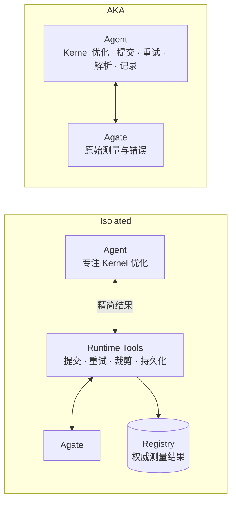
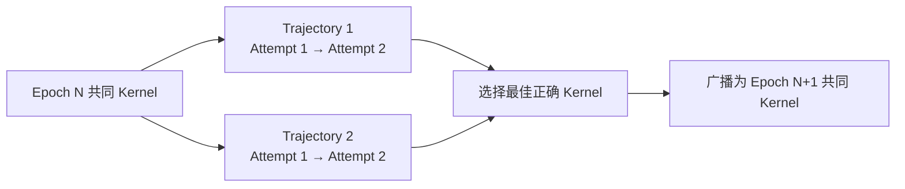
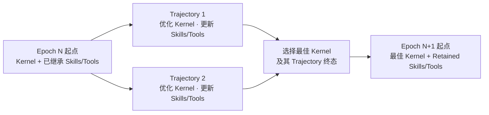
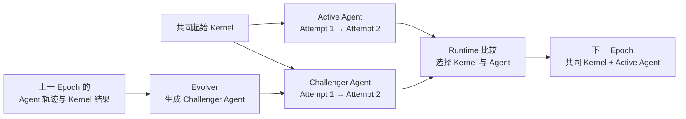
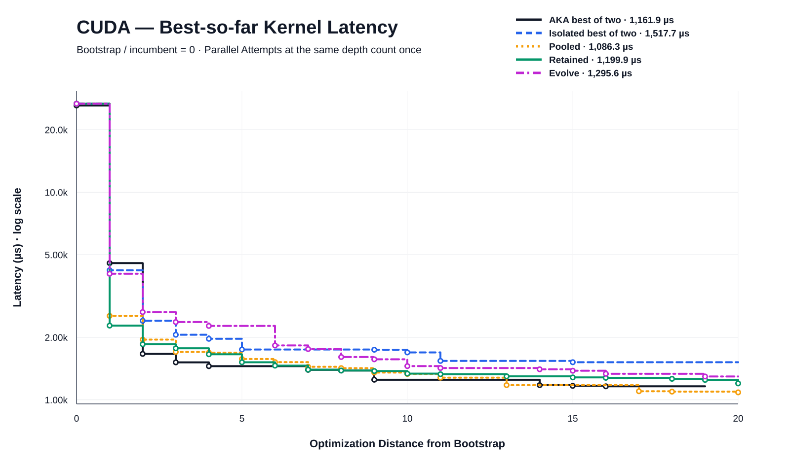
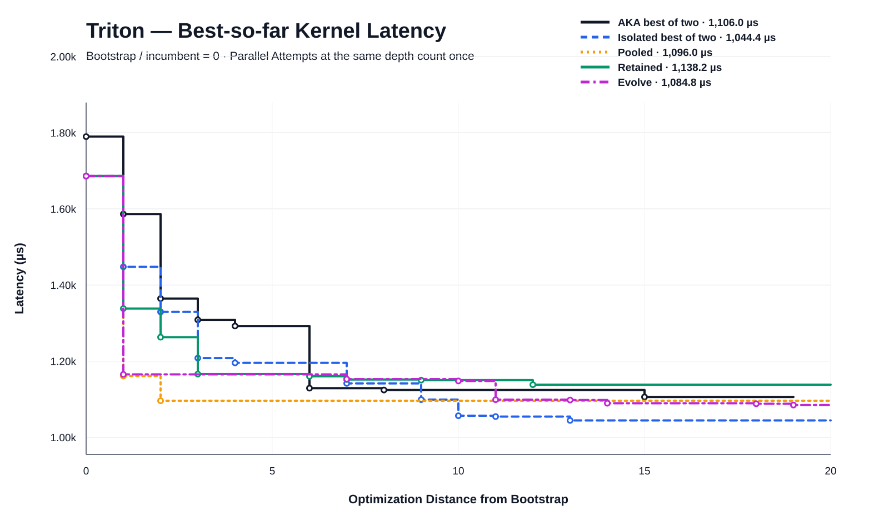
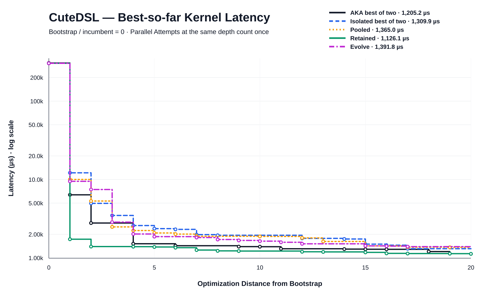

# Fused MoE FP8：从 AKA 到 Isolated、Pooled、Retained 与 Evolve 的消融分析

## 摘要

本报告统一采用完整实验预算：Runtime 取 **10 个 Epoch**；AKA 取 `max-iters=20` 的完整归档。AKA 归档实际只生成了每条路线 **19 个非 Bootstrap Optimizer Episode**，因此下文把它记为“20-Episode 配置（实际完成 19）”，不补造缺失数据。Bootstrap 均不计入 Token 和优化轮次，同一 DSL 的所有路线从相同的 Bootstrap Kernel seed 开始。

两遍 AKA、三个 DSL 共消耗 **1,911.906M Token**，其中 **95.7% 是 cache read**。114 个 AKA Optimizer Episode 产生了 17,891 次可见模型响应、21,156 次工具调用和 13,745 次 Bash 调用；Trace 表明大量交互用于理解和操作 Harness、恢复历史状态、组织阶段与校验流程、读取测量与 Profile 日志，以及解析 GPU 输出。由此可以判断，AKA 的主要成本不是最终生成了多少新文本，而是长交互链不断把既有上下文带入后续请求。

为减少这部分成本，我们将 Kernel 优化 Agent 从 AKA 的长流程和文件交接控制中拆出，由 Runtime 负责权威评测、Gate、Journal、版本与恢复，形成单路线的 **isolated** 配置。两个 isolated 重复实例合计消耗 **1,247.803M Token**，比两遍 AKA 少 **34.7%**，但性能并未在三个 DSL 上一致优于 AKA。

AKA 与 isolated 的重复运行都表现出路径依赖：同一 DSL、同一 Bootstrap seed 下，AKA 两次运行的最终 latency 相差最高 **35.0%**，isolated 两次运行最高相差 **30.8%**。为降低单条路线过早陷入次优搜索方向的风险，我们进一步引入 **pooled**：每个 Epoch 并行运行两条 Trajectory，并在 Epoch 边界选择、广播最佳正确 Kernel。Pooled 使用 40 个 Optimizer Attempt，消耗 **1,161.755M Token**，比两遍 AKA 少 **39.2%**，比两个 isolated 实例合计少 **6.9%**；它在 CUDA 上取得最优结果，在 Triton 和 CuteDSL 上则没有全面胜出。现有结果支持继续研究多路线竞争，但不足以证明 pooled 已稳定提高所有 DSL 的最终性能。

在 pooled 之上，**retained** 允许 Agent 在优化过程中创建或更新可复用的 Skills/Tools，并把最佳 Kernel 所在 Trajectory 的终态状态继承到下一 Epoch。Retained 消耗 **1,113.496M Token**，比 pooled 少 **4.2%**、比两遍 AKA 少 **41.8%**。它把 CuteDSL latency 从 pooled 的 1,365.019 µs 降至 1,126.074 µs，但 CUDA 和 Triton 分别比 pooled 高 10.5% 和 3.8%。现有结果说明状态继承没有增加总成本，并可能帮助部分 DSL 累积有效方法，但尚未表现出跨 DSL 的一致性能收益。

最后，**evolve** 在 Epoch 边界调用 Evolver，根据上一轮 Agent 的 Conversation、优化结果和历史版本生成 Challenger Agent，再让 Active 与 Challenger 在下一轮竞争。三个 DSL 共执行 114 个 Optimizer Attempt 和 27 个 Evolver Session，消耗 **1,078.253M Token**，比两遍 AKA 少 **43.6%**、比 retained 少 **3.2%**。Evolve 在 Triton 上优于 AKA best-of-two 和 retained，但 CUDA、CuteDSL 均落后于二者；27 个 Challenger 中有 11 个赢得当轮晋升。现有实验说明 Agent Revision 已经能够被修改、评估和回滚，但尚未证明自进化能稳定改善最终 Kernel 性能。

## 1. 实验设置与比较口径

- 算子与环境：`fused_moe_fp8`，L20N / `sm_120`，production 模式；Runtime 通过 Claude CLI 调用 `qwen3.8-max`。
- AKA：两个独立重复实例；每个 DSL 配置 `max-iters=20`，归档实际完成 19 个非 Bootstrap Optimizer Episode。因此单实例、单 DSL 为 19 次优化，两遍合计 38 次。
- Isolated：两个独立重复实例；每个实例只有一条 Trajectory，每个 Epoch 运行 2 个 Attempt，共 10 Epoch、20 个 Optimizer Attempt。每个 Attempt 使用全新 Session，不继承自适应 Agent State。
- Pooled：一个实例包含两条并行 Trajectory；每条 Trajectory 每个 Epoch 运行 2 个 Attempt，共 10 Epoch、40 个 Optimizer Attempt。每个 Epoch 结束时选择最佳正确 Kernel，并广播为下一 Epoch 的共同起点。
- Retained：与 pooled 使用相同的双 Trajectory 和 40-Attempt 预算；Agent 可在每个 Attempt 中创建或更新可复用 Skills/Tools，串行 Attempt 继承这些文件，Epoch 边界则保留最佳 Kernel 所在 Trajectory 的终态 Skills/Tools，作为下一 Epoch 的共同起点。
- Evolve：Epoch 1 只运行 Active Agent 的 1 条 Trajectory；Epoch 2–10 各由 Evolver 生成 1 个 Challenger，Active 与 Challenger 各运行 1 条 Trajectory、每条 2 个 Attempt。每个 DSL 共执行 38 个 Optimizer Attempt 和 9 个 Evolver Session；胜出的 Agent Revision 成为下一 Epoch 的 Active。
- Bootstrap 不计入 Token 和优化轮次。不同 DSL 使用各自的共同 seed；同一 DSL 内 AKA、isolated、pooled 和 retained 的 Bootstrap Kernel 一致。
- Latency 采用归档 Registry 中最终最佳 Kernel Revision 的权威 GeoMean latency，越低越好；不使用单次重复测量中的偶然最小值。
- Token 为 Provider 终态用量。AKA 包含 Optimizer、独立 Policy Review 和嵌套子 Agent；Runtime 使用 Session 终态 `modelUsage`，不重复累加 Provider 管理的子请求。

比较分成两个层次：单路线稳定性使用 AKA 的两个独立 19-Episode 实例与 isolated 的两个独立 20-Attempt 实例；总预算比较使用 AKA best-of-two（38 次优化的乐观选择）、isolated best-of-two（40 次优化的乐观选择）、pooled、retained 和 evolve。Pooled/retained 各执行 40 个 Optimizer Attempt；evolve 执行 38 个 Optimizer Attempt，并额外运行 9 个 Evolver Session，因此它们是相近总轮次下的完整系统对比，而不是严格等价的单步预算。

## 2. AKA 的 Token 成本

### 2.1 Provider 用量

两遍 AKA 的完整归档包含 114 个 Optimizer Episode、113 个独立 Policy Review 和 10 个嵌套子 Agent Trace。

| Provider 用量类别 | Token，M | 占总量 |
|---|---:|---:|
| Uncached input | 0.114 | 0.006% |
| Cache read | **1,830.480** | **95.7%** |
| Cache write | 59.956 | 3.1% |
| Output | 21.134 | 1.1% |
| 未保留分项的 Policy Review | 0.222 | 0.01% |
| **合计** | **1,911.906** | **100%** |

Output 只占 1.1%，cache read 却占 95.7%。这意味着 AKA 的高 Token 成本主要发生在已有上下文被后续请求反复读取的过程中，而不是最终答案本身。

### 2.2 Optimizer 主循环的交互长度

| 指标 | AKA Optimizer 主 Trace |
|---|---:|
| Optimizer Episode | 114 |
| Optimizer Token | 1,859.139M |
| 平均每 Episode Token | 16.308M |
| 可见模型响应 | 17,891 |
| 平均每 Episode 响应 | 156.9 |
| 工具调用 | 21,156 |
| 平均每 Episode 工具调用 | 185.6 |
| Bash 调用 | 13,745 |
| 上下文压缩 | 230 |
| 工具返回文本 | 47.52M 字符 |

AKA 的一个 Episode 通常不是“修改一次 Kernel、评测一次、结束”，而是由大量短响应、工具调用、文件读取、命令输出和上下文压缩组成。随着这些内容进入对话历史，后续每次模型请求都会继续携带其中一部分，从而放大 cache read。

### 2.3 Token 主要消耗在哪里

下面按 Bash 调用用途汇总命令、返回文本及其相邻 thinking。Token 是用 `o200k_base` 对可见文本做的累计读取估算，用于比较交互结构，不等同 Provider 账单，也不与上表相加。

| Bash 用途 | 调用数 | Bash 与相邻 thinking 累计估算，M |
|---|---:|---:|
| 测量、Profile、任务日志与 GPU 输出处理 | 3,036 | 113.851 |
| Harness、CLI 和显式控制流程 | 3,012 | 104.758 |
| Memory、Journal、Plan、Report 等历史状态恢复 | 931 | 53.850 |
| 外部参考库实现与文档 | 671 | 36.202 |

全部 Bash 命令与返回的累计文本估算为 **257.668M Token**；与 Bash 前后相邻的 thinking 为 **320.155M**，合计 **577.823M**。这里既包含有价值的 Kernel 研究，也包含为执行既定 Workflow 而进行的 Harness 理解、阶段控制、文件交接、日志截取和格式修复。

综合 Provider 分项和 Trace 行为，AKA 高 Token 成本主要由三件事共同造成：第一，单个 Episode 的交互链很长；第二，Agent 同时承担 Kernel 优化与 Harness 控制、状态交接、结果整理等工作；第三，这些过程产生的历史内容在后续请求中反复参与上下文。独立 Reviewer 和嵌套子 Agent 并不是主要差额来源，包含那次未保留分项的 Review 后合计约 52.8M Token。

## 3. 从 AKA 简化为 Isolated

Isolated 的核心变化只有一个：把与 Kernel 优化无关的 Harness 工作从 Agent 对话中移到 Runtime。



在 AKA 中，Agent 直接面对 Agate 的原始输出，还要判断失败类型、组织重试、截取日志、解析测量结果，并把结果重新写入 Journal、Memory 或 Profile 等交接文件。这些 Harness 操作及其中间输出都会进入 Session 上下文，并在后续请求中被反复读取。

在 isolated 中，Agent 只通过 Runtime Tools 请求 Check、Evaluate 或 Profile。Runtime 负责提交和轮询 Agate 任务、识别基础设施错误并自动重试、把标准化的权威测量写入 Registry 并封存原始结果，同时把返回内容裁剪成 Agent 当前决策所需的最少字段。Agent 仍然决定优化方向、修改 Kernel 并分析结果，但不再需要把 Agate 输出重新解析成权威测量记录。

因此，isolated 减少的不是 Kernel 探索，而是 Agent 对话中的 Harness 管理工作和无关输出。每个 Attempt 仍从当前最佳 Kernel 继续单路线搜索，但使用全新 Session 且不继承自适应 Agent State；这可以减少上下文和 Token 消耗，却不会消除 Kernel 搜索本身的路径依赖。

### 3.1 Latency 对比

| DSL | AKA-1，µs | AKA-2，µs | Isolated-1，µs | Isolated-2，µs |
|---|---:|---:|---:|---:|
| CUDA | 1,275.351 | **1,161.882** | 1,662.813 | 1,517.681 |
| Triton | 1,105.962 | 1,293.979 | **1,044.369** | 1,058.530 |
| CuteDSL | 1,626.643 | **1,205.153** | 1,713.244 | 1,309.905 |

将每种方案的两个独立实例取较优结果后，对比如下。Best-of-Two 是付出两次完整运行成本后的乐观选择，不代表单次运行的期望值。

| DSL | AKA Best of Two，µs | Isolated Best of Two，µs | Isolated 相对 AKA |
|---|---:|---:|---:|
| CUDA | **1,161.882** | 1,517.681 | 高 30.6% |
| Triton | 1,105.962 | **1,044.369** | **低 5.6%** |
| CuteDSL | **1,205.153** | 1,309.905 | 高 8.7% |

Isolated 在 Triton 的两个重复实例上都优于 AKA，Best-of-Two latency 低 5.6%；CUDA 和 CuteDSL 则由 AKA 取得更低 latency。简化 Workflow 没有表现出统一的性能增益，也没有导致所有 DSL 一致退化。

### 3.2 Token 与交互成本对比

按 DSL 汇总完整系统用量，isolated 在三个 DSL 上都明显低于 AKA。

| DSL | AKA 两遍，M | Isolated 两个实例，M | Isolated 相对 AKA |
|---|---:|---:|---:|
| CUDA | 667.349 | 400.199 | **少 40.0%** |
| Triton | 553.115 | 394.275 | **少 28.7%** |
| CuteDSL | 691.442 | 453.330 | **少 34.4%** |
| **合计** | **1,911.906** | **1,247.803** | **少 34.7%** |

Provider 分项进一步说明了差额来自哪里。AKA 的一条 Policy Review 只有 total、没有分类，单独列出；其余用量均使用 Provider 终态分类。

| Provider 用量类别 | AKA 两遍，M | Isolated 两个实例，M | Isolated − AKA，M | 相对变化 |
|---|---:|---:|---:|---:|
| Uncached input | 0.114 | 22.231 | +22.117 | 增加 |
| Cache read | 1,830.480 | 1,176.333 | **−654.147** | **少 35.7%** |
| Cache write | 59.956 | 31.953 | −28.003 | 少 46.7% |
| Output | 21.134 | 17.286 | −3.848 | 少 18.2% |
| 未保留分项的 Policy Review | 0.222 | 0 | −0.222 | — |
| **合计** | **1,911.906** | **1,247.803** | **−664.103** | **少 34.7%** |

Isolated 的 uncached input 增加了 22.117M，但 cache read 减少了 654.147M；后者相当于净 Token 降幅的 **98.5%**。账面结果与设计目标一致：新的公开上下文会在全新 Session 中输入一次，但更短的交互链减少了历史内容在后续请求中的反复读取。

完整 Optimizer Trace 也显示，isolated 并不是通过少跑优化轮次降低 Token。它实际完成 120 个 Attempt，略多于 AKA 的 114 个 Episode。

| 交互指标 | AKA | Isolated | Isolated 相对 AKA |
|---|---:|---:|---:|
| Optimizer Episode / Attempt | 114 | 120 | 多 5.3% |
| 平均每轮 Token | 16.308M | 10.398M | **少 36.2%** |
| 平均每轮可见模型响应 | 156.9 | 103.0 | **少 34.4%** |
| 平均每轮工具调用 | 185.6 | 119.8 | **少 35.4%** |
| Bash 调用总数 | 13,745 | 7,259 | **少 47.2%** |
| 上下文压缩总数 | 230 | 160 | 少 30.4% |
| 工具返回文本 | 47.52M 字符 | 36.00M 字符 | 少 24.2% |

按照第 2.3 节相同的 Bash 分类与 `o200k_base` 累计读取估算，Harness 工作的减少更加直接。这里的 Token 只用于比较可见命令、返回和相邻 thinking 的交互结构，不等同 Provider 账单。

| Bash 用途 | AKA 调用数 | Isolated 调用数 | AKA 累计估算，M | Isolated 累计估算，M | Isolated 少用 |
|---|---:|---:|---:|---:|---:|
| 测量、Profile、任务日志与 GPU 输出处理 | 3,036 | 287 | 113.851 | 13.832 | **87.9%** |
| Harness、CLI 和显式控制流程 | 3,012 | 244 | 104.758 | 9.812 | **90.6%** |
| Memory、Journal、Plan、Report 等历史状态恢复 | 931 | 238 | 53.850 | 12.830 | **76.2%** |
| 外部参考库实现与文档 | 671 | 2 | 36.202 | 0.422 | **98.8%** |
| **全部 Bash 与相邻 thinking** | **13,745** | **7,259** | **577.823** | **337.159** | **41.7%** |

Isolated 把 Agate 提交、基础设施失败重试、原始结果持久化和 Agent-facing 输出裁剪移到 Runtime 后，Harness/CLI/控制类调用减少 91.9%，测量与 GPU 输出处理类调用减少 90.5%。Agent 仍会调用 Runtime Tools、记录 Direction/Experiment 并分析测量，但不再需要在对话中反复实现同一套 Harness 逻辑。

因此，isolated 的主要已验证收益是成本下降：即使优化轮次略多，总 Token 仍减少 34.7%，平均每条单 DSL 路线从 **318.651M** 降至 **207.967M**。Latency 结果仍取决于 DSL 和具体搜索路线，说明 Workflow 简化本身不能保证更优 Kernel。

## 4. 单路线搜索仍然不稳定

AKA 和 isolated 都各有两个从相同 DSL seed 开始的独立实例。下表的相对差距按 `(较慢值 / 较快值) - 1` 计算。

| DSL | AKA latency 范围，µs | AKA 相对差距 | Isolated latency 范围，µs | Isolated 相对差距 |
|---|---:|---:|---:|---:|
| CUDA | 1,161.882–1,275.351 | 9.8% | 1,517.681–1,662.813 | 9.6% |
| Triton | 1,105.962–1,293.979 | 17.0% | 1,044.369–1,058.530 | 1.4% |
| CuteDSL | 1,205.153–1,626.643 | **35.0%** | 1,309.905–1,713.244 | **30.8%** |

单次运行结果的上下限差距很大，尤其是 CuteDSL。一个合理的解释是 Kernel 搜索具有路径依赖：Agent 在较早阶段选择某种实现结构、性能假设或局部优化方向后，后续轮次会围绕当前最佳 Kernel 继续搜索；如果早期进入次优路径，单条串行路线可能难以重新覆盖已经错过的结构。

这些结果与“Agent 可能陷入不好的搜索路径”这一假设一致，但每种配置每个 DSL 只有两个独立实例，尚不足以证明因果关系或准确估计方差。它们至少说明，仅缩短 Workflow 并不能解决单路线搜索的不稳定性。

## 5. Pooled Trajectory

Pooled 在一次运行内部引入两条并行 Trajectory。两条 Trajectory 从同一个 Epoch 起点独立优化，各执行两个串行 Attempt；Epoch 结束后，Runtime 选择本轮最佳正确 Kernel，并把它广播为下一 Epoch 的共同起点。这样既保留了并行探索的随机性，也允许较好的路线周期性纠正较差路线的起点。



### 5.1 总预算下的 Latency

下表把 pooled 的 40 个 Attempt，与 AKA 两遍合计 38 个 Episode、isolated 两个实例合计 40 个 Attempt 放在一起。AKA best-of-two 和 isolated best-of-two 都是在付出两次独立运行成本后选择较好的最终结果，因此是面向性能的乐观聚合值。

| DSL | AKA Best of Two，µs | Isolated Best of Two，µs | Pooled，µs | Pooled vs AKA | Pooled vs Isolated |
|---|---:|---:|---:|---:|---:|
| CUDA | 1,161.882 | 1,517.681 | **1,086.325** | **低 6.5%** | **低 28.4%** |
| Triton | 1,105.962 | **1,044.369** | 1,096.040 | **低 0.9%** | 高 4.9% |
| CuteDSL | **1,205.153** | 1,309.905 | 1,365.019 | 高 13.3% | 高 4.2% |

Pooled 在 CUDA 上明显优于 AKA 和 isolated，在 Triton 上略优于 AKA、但不及 isolated，在 CuteDSL 上不及两者。也就是说，周期广播确实能产出与单路线不同的结果，并在 CUDA 上避免了两个 isolated 实例都进入较差终点的问题；但一条 pooled 运行还不能证明它能稳定改善所有 DSL。

### 5.2 总预算下的 Token

| DSL | AKA 两遍，M | Isolated 两个实例，M | Pooled，M | Pooled vs AKA | Pooled vs Isolated |
|---|---:|---:|---:|---:|---:|
| CUDA | 667.349 | **400.199** | 407.615 | **少 38.9%** | 多 1.9% |
| Triton | 553.115 | 394.275 | **314.368** | **少 43.2%** | **少 20.3%** |
| CuteDSL | 691.442 | 453.330 | **439.772** | **少 36.4%** | **少 3.0%** |
| **合计** | **1,911.906** | **1,247.803** | **1,161.755** | **少 39.2%** | **少 6.9%** |

Pooled 的总 Token 比 AKA 两遍少 39.2%，比两个 isolated 实例少 6.9%。它没有通过增加 Token 换取并行搜索；在本次归档中，40 个 pooled Attempt 的平均用量为 **9.681M Token**，而 isolated 为 **10.398M**，AKA Optimizer 主循环为 **16.308M**。不过 AKA 实际只有 38 个 Episode，且三种系统的每轮内部实验数量并不完全相同，因此这些数字应理解为完整运行预算的实测总成本，而不是严格等价的单步效率。

## 6. Retained：继承 Agent 自己沉淀的 Skills 与 Tools

Pooled 只把每个 Epoch 的最佳正确 Kernel 广播到下一 Epoch，自适应 Agent State 会重置。Retained 在相同的双 Trajectory 搜索之上，允许 Agent 在每个 Attempt 中创建或更新 Skills/Tools；同一 Trajectory 的后续 Attempt 直接继承这些文件。Epoch 结束后，Runtime 选择最佳 Kernel 所在 Trajectory，并把该 Trajectory 的终态 Skills/Tools 与最佳 Kernel 一起作为下一 Epoch 的共同起点。



### 6.1 总预算下的 Latency

| DSL | AKA Best of Two，µs | Pooled，µs | Retained，µs | Retained vs AKA | Retained vs Pooled |
|---|---:|---:|---:|---:|---:|
| CUDA | 1,161.882 | **1,086.325** | 1,199.896 | 高 3.3% | 高 10.5% |
| Triton | 1,105.962 | **1,096.040** | 1,138.217 | 高 2.9% | 高 3.8% |
| CuteDSL | 1,205.153 | 1,365.019 | **1,126.074** | **低 6.6%** | **低 17.5%** |

Retained 在 CuteDSL 上同时优于 pooled 和 AKA best-of-two，但在 CUDA、Triton 上的 latency 均高于 pooled，也高于 AKA best-of-two。状态继承因此产生了可观测影响，但效果依赖 DSL 和搜索路径；当前每个配置只有一次双 Trajectory 运行，不能把 CuteDSL 的改善单独归因于 Skills/Tools 继承，也不能据此判断 Retained 普遍优于 Pooled。

### 6.2 总预算下的 Token

| DSL | AKA 两遍，M | Pooled，M | Retained，M | Retained vs AKA | Retained vs Pooled |
|---|---:|---:|---:|---:|---:|
| CUDA | 667.349 | 407.615 | **397.642** | **少 40.4%** | **少 2.4%** |
| Triton | 553.115 | 314.368 | **279.218** | **少 49.5%** | **少 11.2%** |
| CuteDSL | 691.442 | 439.772 | **436.636** | **少 36.9%** | **少 0.7%** |
| **合计** | **1,911.906** | **1,161.755** | **1,113.496** | **少 41.8%** | **少 4.2%** |

Retained 与 pooled 都执行 120 个 Optimizer Attempt。Retained 平均每个 Attempt 消耗 **9.279M Token**，低于 pooled 的 **9.681M**，说明继承 Skills/Tools 在本次运行中没有造成上下文成本膨胀，反而伴随 4.2% 的总 Token 降幅。该差额仍可能受到不同搜索路径、工具调用和 Session 长度影响，不能仅凭一次运行认定状态继承本身必然节省 Token。

### 6.3 Retained 实际沉淀了什么

这里比较每个 DSL 第一个 Optimizer Attempt 的输入状态和 Epoch 10 结束后按 Runtime 规则选出的 canonical state，只统计最终获胜路径上真正保留下来的 `skills/` 与 `tools/`；未获胜 Trajectory 中遗失的文件、一次性 `scratch/` 内容和 `tools/README.md` 不计入文件数。

| DSL | Skills：初始 → 最终 | Tools：初始 → 最终 | 最终沉淀的主要内容 |
|---|---:|---:|---|
| CUDA | 5 → 17 | 1 → 12 | FP8 MMA、`ldmatrix`、E4M3 转换等 sm_120 实现配方；MoE dispatch、tiling、gather hoist、epilogue/reduction fusion；流重叠、host plumbing、predicated load 等失败边界；正确性、OOD、bitwise A/B、逐阶段计时和硬件微基准脚本 |
| CuteDSL | 3 → 5 | 1 → 4 | 新增 CuteDSL FP8 warp-MMA 配方和 MoE pipeline pattern，并持续扩充 sm_120 pitfalls；在初始 candidate import checker 之外，新增 paired A/B、host wall-time 与 store-path microbenchmark |
| Triton | 3 → 3 | 1 → 3 | 没有新增 Skill 文件，但持续扩充 operator/baseline facts、Runtime interface 与 sm_120 toolchain；在初始正确性探针之外，新增 candidate/variant latency screening 和 head-to-head reference comparison |
| **合计** | **11 → 25** | **3 → 19** | **新增 14 份 Skill、16 个 Tool；最终状态相对初始状态没有删除文件** |

Skills 沉淀的内容不只是成功方案，也包括已经被实验否定的假设。例如 CUDA 记录了 forked-stream overlap 反而变慢、per-forward plumbing 的收益上限、predicated gather 的控制流陷阱，以及孤立 microbenchmark 的收益可能无法迁移到完整 pipeline。它们的作用是让后续 Session 不必仅凭最终 Kernel 反推此前为什么保留或放弃某条路线。

Tools 则把反复出现的实验过程固化为可执行探针。Trace 与 Gateway 账本可以确认这些脚本确实跨 Attempt、跨 Epoch 被复用，而不是只在最终目录中留下但从未执行。

| Retained Tool | 被引用的 Attempt | Dev 记录 | 覆盖 Epoch | 最终内容版本数 |
|---|---:|---:|---|---:|
| Triton `probe_moe_correctness.py` | 38 | 102 | 1–10 | 1 |
| Triton `bench_moe_latency.py` | 35 | 66 | 1–10 | 1 |
| CUDA `moe_check_probe.py` | 25 | 59 | 1–7、10 | 1 |
| CUDA `moe_bitwise_ab_probe.py` | 15 | 27 | 5–10 | 2 |
| CuteDSL `paired_ab_probe.py` | 14 | 23 | 4–10 | 1 |

下面直接展示这些脚本的关键源码。为避免正文被 711 行完整实现淹没，代码块保留实际核心逻辑并省略常量、参数解析和输入 Tensor 构造；标题后的链接提供未经裁剪的归档脚本。

**Triton [`probe_moe_correctness.py`](agate-dev-analysis/examples/retained-triton-benchmark/files/tools/probe_moe_correctness.py)：自己实现 FP8 MoE Reference，再按容差逐元素比较。**

```python
def ref_moe(hidden, w1, w2, topk_w, topk_ids, w1_s, w2_s):
    M, H = hidden.shape
    K, I, E = topk_w.shape[1], w2.shape[2], w1.shape[0]
    w1f, w2f = dequant_w(w1, w1_s), dequant_w(w2, w2_s)
    ha = quant_act_ref(hidden)
    out = torch.zeros(M, H, dtype=torch.float32, device=hidden.device)
    flat_ids, flat_w = topk_ids.reshape(-1).long(), topk_w.reshape(-1).float()
    tok = torch.arange(M, device=hidden.device).repeat_interleave(K)

    for e in range(E):
        sel = (flat_ids == e).nonzero(as_tuple=True)[0]
        if sel.numel() == 0:
            continue
        rows = tok[sel]
        gate = (ha[rows] @ w1f[e, :I].t()).to(torch.bfloat16)
        up = (ha[rows] @ w1f[e, I:].t()).to(torch.bfloat16)
        inter = F.silu(gate) * up
        partial = quant_act_ref(inter) @ w2f[e].t()
        out.index_add_(0, rows, flat_w[sel, None] * partial)
    return out.to(torch.bfloat16)

def compare(name, candidate, reference, atol=0.01, rtol=0.05):
    diff = (candidate.float() - reference.float()).abs()
    tolerance = atol + rtol * reference.float().abs()
    violations = (diff > tolerance).sum().item()
    print(f"[{name}] {'PASS' if violations == 0 else 'FAIL'} "
          f"viol={violations}/{reference.numel()} max_abs={diff.max().item():.6g}")
    return violations == 0

cases = {
    "small":  lambda: run_case(model, tokens=512, seed=7),
    "sparse": lambda: run_case(model, tokens=512, seed=11, sparse_experts=40),
    "dup":    lambda: run_case(model, tokens=512, seed=13, duplicate_slot=True),
    "odd":    lambda: run_case(model, tokens=457, seed=17),
    "fourk":  lambda: run_case(model, tokens=4096, seed=19),
    "sixk":   lambda: run_case(model, tokens=6144, seed=23),
}
```

这个脚本把动态 Activation Quantization、Weight Block Dequantization、Gate/Up、SiLU 和 Top-k Reduce 全部重新写成 PyTorch Reference，并主动覆盖稀疏路由、重复 Expert 和非整齐 Token 数，因此后续 Attempt 可以复用它快速定位明显的正确性错误。

**Triton [`bench_moe_latency.py`](agate-dev-analysis/examples/retained-triton-benchmark/files/tools/bench_moe_latency.py)：在同一进程中比较当前 Kernel 和一个候选变体。**

```python
def bench_module(model, cases, iters=30, warmup=5):
    result = {}
    for tokens, inputs in cases:
        for _ in range(warmup):
            model(*inputs)
        torch.cuda.synchronize()
        starts = [torch.cuda.Event(enable_timing=True) for _ in range(iters)]
        ends = [torch.cuda.Event(enable_timing=True) for _ in range(iters)]
        for i in range(iters):
            starts[i].record()
            model(*inputs)
            ends[i].record()
        torch.cuda.synchronize()
        samples = sorted(starts[i].elapsed_time(ends[i]) * 1000 for i in range(iters))
        result[tokens] = samples[len(samples) // 2]
    return result

results = []
for index, (tokens, inputs) in enumerate(cases):
    # 每个 Shape 交换测量顺序，降低时间漂移造成的单向偏差。
    if index % 2 == 0:
        candidate_us = bench_module(candidate, [(tokens, inputs)])[tokens]
        variant_us = bench_module(variant, [(tokens, inputs)])[tokens]
    else:
        variant_us = bench_module(variant, [(tokens, inputs)])[tokens]
        candidate_us = bench_module(candidate, [(tokens, inputs)])[tokens]
    results.append(candidate_us / variant_us)

geomean_ratio = math.exp(sum(math.log(x) for x in results) / len(results))
print(f"GEOMEAN_RATIO={geomean_ratio:.4f} (ratio<1 => candidate faster)")
```

它把候选筛选固化为固定预热、CUDA Event 计时、中位数和跨 Shape 几何平均；Agent 可以先用它淘汰明显退化的变体，再调用正式 Evaluate。

**CUDA [`moe_check_probe.py`](agate-dev-analysis/examples/retained-cuda-stress/files/tools/moe_check_probe.py)：用独立 FP32 路径检查 CUDA Kernel 的数值结果。**

```python
def reference(hidden, w1, w2, topk_weights, expert_ids, w1_scale, w2_scale):
    hidden = quantize_groups(hidden.float())
    output = torch.zeros(hidden.shape[0], HIDDEN, dtype=torch.float32, device="cuda")
    flat_ids = expert_ids.reshape(-1)
    rows = hidden.repeat_interleave(TOP_K, dim=0)

    for expert in range(NUM_EXPERTS):
        selected = (flat_ids == expert).nonzero(as_tuple=True)[0]
        if selected.numel() == 0:
            continue
        w1_fp32 = dequant_weight(w1[expert], w1_scale[expert])
        w2_fp32 = dequant_weight(w2[expert], w2_scale[expert])
        gate_up = rows[selected] @ w1_fp32.t()
        inter = (F.silu(gate_up[:, :INTER].bfloat16()) *
                 gate_up[:, INTER:].bfloat16()).float()
        partial = quantize_groups(inter) @ w2_fp32.t()
        output.index_add_(0, selected // TOP_K,
                          topk_weights.reshape(-1)[selected, None] * partial)
    return output.bfloat16()

candidate = Model(...)(*inputs)
expected = reference(*inputs)
abs_error = (candidate.float() - expected.float()).abs()
tolerance = 2 * ATOL + 2 * RTOL * expected.float().abs()
bad = (abs_error > tolerance).sum().item()
print("PROBE_VERDICT", "PASS" if bad == 0 else "FAIL")
```

它与 Triton Probe 的目标相似，但专门服务 CUDA 路线：不用 Candidate 内部实现作为 Reference，而是独立执行反量化矩阵乘和 Top-k Reduction。

**CUDA [`moe_bitwise_ab_probe.py`](agate-dev-analysis/examples/retained-cuda-bitwise/files/tools/moe_bitwise_ab_probe.py)：检查候选与基线是否 Bitwise 一致，并检查寄存器与 Occupancy。**

```python
def run_three_times(model, inputs):
    outputs = []
    for _ in range(3):
        output = model(*inputs)
        torch.cuda.synchronize()
        outputs.append(output.clone())
    return outputs

for tokens in (450, 512, 4096):
    inputs = make_inputs(tokens)
    candidate_outputs = run_three_times(candidate, inputs)
    baseline_outputs = run_three_times(baseline, inputs)
    bitwise_equal = all(
        torch.equal(candidate_outputs[i], baseline_outputs[i])
        and torch.equal(candidate_outputs[i], candidate_outputs[0])
        for i in range(3)
    )
    print(f"AB tokens={tokens} bitwise_equal={bitwise_equal}")

runtime = candidate_module._RUNTIME_CACHE[0]
for name, threads in (("k_gemm_t64", 256), ("k_gemm_t32", 128),
                      ("k_silu_quant", 256), ("k_reduce", 256)):
    function = runtime.funcs[name]
    _, registers = runtime.cu.cuFuncGetAttribute(NUM_REGS, function)
    _, shared_memory = runtime.cu.cuFuncGetAttribute(SHARED_SIZE_BYTES, function)
    _, active_blocks = runtime.cu.cuOccupancyMaxActiveBlocksPerMultiprocessor(
        function, threads, 0
    )
    print(name, registers, shared_memory, active_blocks)
```

这个脚本不只检查一次输出，而是重复执行三次，覆盖 Candidate 的普通 Launch、Graph Capture/Replay 等可能路径；随后直接读取 CUDA Function Attribute，避免低层寻址优化因寄存器膨胀而悄悄降低 Residency。

**CuteDSL [`paired_ab_probe.py`](agate-dev-analysis/examples/retained-cutedsl-paired-ab/files/tools/paired_ab_probe.py)：交错执行 Candidate/Incumbent，进行同窗口 Paired A/B。**

```python
for tokens in (450, 512, 4096, 8192):
    inputs = make_inputs(tokens, seed=1234 + tokens)
    candidate_output = candidate(*inputs)
    incumbent_output = incumbent(*inputs)
    equal = torch.equal(candidate_output, incumbent_output)
    max_diff = (candidate_output.float() - incumbent_output.float()).abs().max().item()

    candidate_ms, incumbent_ms = [], []
    for repetition in range(40):
        if repetition % 2 == 0:
            candidate_ms.append(time_once(candidate, inputs))
            incumbent_ms.append(time_once(incumbent, inputs))
        else:
            incumbent_ms.append(time_once(incumbent, inputs))
            candidate_ms.append(time_once(candidate, inputs))

    candidate_median = statistics.median(candidate_ms)
    incumbent_median = statistics.median(incumbent_ms)
    print(json.dumps({
        "T": tokens,
        "equal": equal,
        "max_abs_diff": max_diff,
        "cand_med_us": candidate_median * 1000,
        "inc_med_us": incumbent_median * 1000,
        "speedup": incumbent_median / candidate_median,
    }))
```

它把 Candidate 和 Incumbent 放进同一个进程、使用相同输入，并逐轮交换先后顺序，用来降低时钟、温度和运行窗口漂移对比较方向的影响。

这些脚本承担的是快速排错、局部归因和正式测量前的候选筛选，而不是权威验收。部分脚本主要依赖文本结果，甚至可能在输出不相等或检查失败时仍以退出码 0 结束；最终正确性、性能和 Kernel 保留决策仍以 Runtime 记录的 Gateway Evaluate 与 Gate 结果为准。

这表明 Retained 主要沉淀的是 **lineage-local 的工程知识与实验基础设施**，而不是一套已经证明能跨算子迁移的通用 Kernel 优化 Skill。稳定输入生成、候选筛选和计时逻辑进入 `tools/`，当前候选和一次性实验仍留在 `scratch/`，两者的边界在实际运行中基本成立。

不过，沉淀内容的质量仍有两个问题。第一，自建探针不是权威 Gate：部分脚本使用重建的 Reference 或自定义容差，Triton 正确性探针即使发现失败也保持退出码 0，CuteDSL 的 paired A/B 也曾在输出不相等时正常退出，Agent 必须正确解释文本结果。第二，当前过程明显偏向累积而不是整理：三个 DSL 的 Skill 正文从 283 行增长到 2,476 行，Tool 代码从 435 行增长到 3,219 行，最终没有删除任何文件。本次 Token 并未因此上升，但更长周期下仍需要验证 Agent 能否合并重复知识、淘汰失效工具并控制状态体积。

## 7. Evolve：让 Agent Revision 参与竞争

Retained 允许同一个 Agent 在运行中积累 Skills/Tools，但 Agent 的 Prompt 和整体工作方法保持不变。Evolve 进一步把 Agent 本身纳入搜索：Epoch 1 先让初始 Active Agent 完成两个 Attempt；此后每个 Epoch 开始前，Evolver 读取上一轮 Active/Challenger 的 Conversation、Kernel 优化结果、历史 Agent 版本和既有 Evolution Report，生成一个 Challenger Agent Revision。

Active 与 Challenger 从相同的起始 Kernel 分别运行一条 Trajectory，每条包含两个串行 Attempt。Runtime 在 Epoch 结束时独立比较两侧结果：最佳正确 Kernel 成为下一 Epoch 的共同 Kernel，胜出的 Agent Revision 成为下一轮 Active；失败的 Challenger 仍被封存，可以审计或由后续 Evolution 从历史恢复。Evolver 不直接优化或评测 Kernel，它修改的是下一轮用于优化 Kernel 的 Agent。



本次归档中，每个 DSL 在 Epoch 2–10 进行了 9 次 Agent 竞争，因此三个 DSL 合计生成 27 个 Challenger，并运行 114 个 Optimizer Attempt 和 27 个 Evolver Session。

### 7.1 总预算下的 Latency

| DSL | AKA Best of Two，µs | Retained，µs | Evolve，µs | Evolve vs AKA | Evolve vs Retained |
|---|---:|---:|---:|---:|---:|
| CUDA | **1,161.882** | 1,199.896 | 1,295.646 | 高 11.5% | 高 8.0% |
| Triton | 1,105.962 | 1,138.217 | **1,084.768** | **低 1.9%** | **低 4.7%** |
| CuteDSL | 1,205.153 | **1,126.074** | 1,391.772 | 高 15.5% | 高 23.6% |

Evolve 只在 Triton 上同时优于 AKA best-of-two 和 retained；CUDA、CuteDSL 均落后于二者。它确实产生了不同于固定 Agent 的搜索轨迹，但本次单实例实验没有显示跨 DSL 的一致性能增益。

### 7.2 总预算下的 Token

| DSL | AKA 两遍，M | Retained，M | Evolve，M | Evolve vs AKA | Evolve vs Retained |
|---|---:|---:|---:|---:|---:|
| CUDA | 667.349 | 397.642 | **376.093** | **少 43.6%** | **少 5.4%** |
| Triton | 553.115 | **279.218** | 355.442 | **少 35.7%** | 多 27.3% |
| CuteDSL | 691.442 | 436.636 | **346.718** | **少 49.9%** | **少 20.6%** |
| **合计** | **1,911.906** | **1,113.496** | **1,078.253** | **少 43.6%** | **少 3.2%** |

Evolve 的总 Token 包含 Agent 进化本身，而不是只统计 Optimizer。

| Evolve 角色 | Session 数 | Token，M | 占 Evolve 总量 |
|---|---:|---:|---:|
| Optimizer | 114 | 907.493 | 84.2% |
| Evolver | 27 | 170.760 | 15.8% |
| **合计** | **141** | **1,078.253** | **100%** |

即使加入 27 个 Evolver Session，Evolve 仍比 AKA 两遍少 43.6% Token，也比 retained 少 3.2%。但两种 Runtime 配置的 Optimizer 预算并不完全相同：retained 每个 DSL 有 40 个 Attempt，evolve 有 38 个 Attempt，后者另有 9 个 Evolver Session。因此可以确认的是完整系统成本没有因 Evolver 上升；不能仅凭总量差额断言 Agent 进化本身节省 Token。

### 7.3 Evolver 实际修改了什么

27 次 Evolution 中，25 次生成了新修改，2 次从历史 Agent 版本恢复。下面把每次 Evolution 相对其 Active Parent 的文件 Diff 累计起来；同一文件在不同 Evolution 中重复修改会重复计数。

| 修改对象 | 文件事件 | 累计新增行 | 累计删除行 | 大小方向 |
|---|---|---:|---:|---|
| Prompt | 修改 26 次 | 454 | 67 | 26 次全部变长 |
| Skills | 新增 44、修改 77、删除 1 | 2,966 | 514 | 修改项中 75 次变长、2 次变短 |
| Tools | 新增 15、修改 23、删除 0 | 742 | 57 | 23 次全部变长 |
| Tests | 修改 1 次 | 13 | 1 | 1 次变长 |

实际修改明显以增加和扩充为主，而不是删除与压缩。Evolver 会先从 Conversation 中寻找重复失败或低效行为，再把修正写入 Prompt、Skills 或 Tools。归档中的典型修改包括：CUDA 路线区分“预期获胜 Shape”和“只要求不退化的 Guard Shape”，避免噪声方向翻转错误否决候选；CuteDSL 路线把串行 DSL API 探测和全量历史重读改为更集中的发现与恢复流程；Triton 路线要求优先读取最新状态、减少重复加载完整旧 Report，并修正“搜索空间已经耗尽”与 Journal 中仍有未探索方向之间的矛盾。

Challenger 的实际晋升结果如下。Epoch 1 没有 Challenger，不计入分母。

| DSL | 新 Evolved Proposal | 从历史恢复 | Challenger 胜出 | Challenger 胜率 |
|---|---:|---:|---:|---:|
| CUDA | 9 | 0 | 6 | 66.7% |
| Triton | 7 | 2 | 2 | 22.2% |
| CuteDSL | 9 | 0 | 3 | 33.3% |
| **合计** | **25** | **2** | **11** | **40.7%** |

两次从历史恢复都发生在 Triton，且均未赢得当轮竞争。整体上，11/27 的 Challenger 能在真实 Kernel 优化任务中击败 Active，证明 Evolver 的修改并非完全无效；但较高的中间晋升次数没有转化为三个 DSL 都更好的最终 Kernel。当前 Evolver 还呈现明显的“继续加规则、加知识、加工具”倾向，长期运行后是否造成 Prompt 和 Agent State 膨胀，仍需要更长周期实验和专门的删除/合并消融验证。

## 8. Kernel Latency 随优化轮次的变化

下面统一画出各系统截至当前轮次获得的历史最优 Kernel latency。横轴表示相对 Bootstrap 的串行优化距离，0 是 Bootstrap / 初始 Incumbent；同一 Epoch、同一串行层上的并行 Attempt，无论来自不同 Trajectory 还是 Active/Challenger Branch，都合并为一个位置，并在该层结束后取所有并行路线中已经保留的最优 Kernel。AKA 每个 Episode 增加一层距离。AKA best-of-two 和 isolated best-of-two 都是在相同距离上取两次独立运行中更低的历史最优值；被拒绝的 Candidate 不会让曲线下降。

这张横轴不是实际执行的 Attempt 总数，也不是严格相等的 GPU 实验预算：一个 AKA Episode 或 Runtime Attempt 内都可能发起多次 Agate 请求。AKA 每条 Run 归档了 19 个 Episode，因此距离为 0–19；所有 Runtime 配置都有 20 层串行搜索深度，因此距离为 0–20。Pooled 和 retained 的 40 个实际 Attempt 被合并为 20 层，evolve 的 38 个实际 Attempt 也按 Active/Challenger 的并行关系合并为 20 层。各系统从同一 DSL Bootstrap Kernel 源码开始，但图中保留各自归档的初始权威测量，因此 0 点可能存在测量差异。CUDA 和 CuteDSL 的初始值与最终值跨越多个数量级，采用对数纵轴；Triton 使用线性纵轴。

### 8.1 CUDA



AKA best-of-two 在前 4 层内快速降到 1,452.729 µs，随后继续缓慢下降到 1,161.882 µs。Pooled 的前期下降没有 AKA 快，但在并行搜索和周期性 Kernel 广播下持续获得新低，最终在距离 20 达到 1,086.325 µs，为五条曲线中的最低值。Retained 和 evolve 分别收敛到 1,199.896 µs 和 1,295.646 µs。

### 8.2 Triton



Triton 的初始 Kernel 已经接近最终区间，改进空间明显小于 CUDA 和 CuteDSL。Pooled 在距离 2 达到 1,096.040 µs 后没有继续下降；evolve 在后半程继续产生小幅改进，最终达到 1,084.768 µs；isolated best-of-two 则在距离 13 达到全组最低的 1,044.369 µs。

### 8.3 CuteDSL



五条 CuteDSL 曲线都在最初数层完成数量级上的下降，但后续收敛路径差异很大。AKA best-of-two 在距离 18 达到 1,205.153 µs；retained 在 20 层搜索中持续刷新最优值，最终达到全组最低的 1,126.074 µs。Pooled 和 evolve 分别停在 1,365.019 µs 与 1,391.772 µs。

| DSL | 本组最低曲线 | 首次达到该最终值的 Bootstrap 距离 | Latency，µs |
|---|---|---:|---:|
| CUDA | Pooled | 20 | **1,086.325** |
| Triton | Isolated best-of-two | 13 | **1,044.369** |
| CuteDSL | Retained | 20 | **1,126.074** |

完整逐点数据和重建脚本保存在 [`analysis/latency-curves/`](analysis/latency-curves/)；其中 JSON 同时记录了 Runtime Lineage、每层包含的并行 Attempt、Epoch、Trajectory、Branch、完成时间和 best-of-two 的来源，便于复核图中每一次下降。

## 9. 各 DSL 的最佳 Kernel 实现

这里的“最佳”取上一节五条曲线在完整预算下的最低权威 latency，而不是每种 DSL 固定取同一个消融配置。三份完整源码均从归档 Artifact Store 逐字节复制；正文只展示决定最终改进的关键片段。

| DSL | 来源配置 | Bootstrap 距离 | Latency，µs | 完整源码 |
|---|---|---:|---:|---|
| CUDA | Pooled | 20 | **1,086.325** | [`cuda/kernel.py`](analysis/best-kernels/cuda/kernel.py) |
| Triton | Isolated-01 | 13 | **1,044.369** | [`triton/kernel.py`](analysis/best-kernels/triton/kernel.py) |
| CuteDSL | Retained | 20 | **1,126.074** | [`cutedsl/kernel.py`](analysis/best-kernels/cutedsl/kernel.py) |

### 9.1 CUDA：融合流水线与并行 Routing Prefix

CUDA 版本是通过 NVRTC 编译的自包含 CUDA C++ 实现。整体策略是把 MoE 组织成 expert histogram/scan/scatter、按 token 一次性 FP8 量化、两个 block-scaled FP8 Tensor Core GEMM 和最终 FP32→BF16 cast；GEMM1 epilogue 融合 SiLU、乘法和中间结果重量化，GEMM2 epilogue 融合 top-k 加权与 FP32 累加，中间张量按 expert-sorted position 连续存储，并用 TMA 搬运稠密 tile。

最后一次关键改进针对 routing 临界路径：原来由单线程串行扫描 256 个 expert；最终版本改为 warp shuffle 加 8 个 warp 汇总的 block-wide exclusive scan，并分别计算 row offset 与 tile offset。Profile 显示 `k_prefix` 从约 44.5 µs 降到 28.6 µs，移除了约 15.9 µs 的固定开销。

```cpp
static __device__ __forceinline__ int block_excl_scan(int input, int* scratch,
                                                      int* total_out) {
  const int lane = threadIdx.x & 31;
  const int warp = threadIdx.x >> 5;
  int val = input;
#pragma unroll
  for (int o = 1; o < 32; o <<= 1) {
    int n = __shfl_up_sync(0xFFFFFFFFu, val, o);
    if (lane >= o) val += n;
  }
  if (lane == 31) scratch[warp] = val;
  __syncthreads();
  const int nw = blockDim.x >> 5;
  if (warp == 0) {
    int w = (lane < nw) ? scratch[lane] : 0;
#pragma unroll
    for (int o = 1; o < 32; o <<= 1) {
      int n = __shfl_up_sync(0xFFFFFFFFu, w, o);
      if (lane >= o) w += n;
    }
    if (lane == nw - 1) *total_out = w;
    if (lane < nw) scratch[lane] = w - scratch[lane];
  }
  __syncthreads();
  return (val - input) + scratch[warp];
}

if (blockIdx.x == 0) {
  int tid = threadIdx.x;
  int c = (tid < P->experts) ? P->hist[tid] : 0;
  int tc = (c + P->tile_m - 1) / P->tile_m;
  s_off[tid] = block_excl_scan(c, s_scan, &s_tot[0]);
  s_tile_off[tid] = block_excl_scan(tc, s_scan, &s_tot[1]);
}
```

### 9.2 Triton：按 Sorted Slot 连续化中间张量

Triton 版本使用纯 Triton Kernel 完成 routing、activation quantization、gate/up/down GEMM 和输出转换。它把 gate 与 up 拆成两个单 accumulator pass，避免双 accumulator 长时间存活造成 255-register 压力，使每个 SM 可以驻留两个 CTA；同时把 SiLU、重量化、top-k 权重与输出 scatter-add 分别融合进 GEMM epilogue。

最终决定性改进是把 `silu_g`、`inter_q` 和 `inter_scale` 从离散 `pair_id` 索引改成 expert 分段中的连续 `sorted slot` 索引。每个 GEMM tile 的 64 行因此连续读写，避免 down GEMM 对 pair-major 内存进行散乱 gather。Profile 中 down GEMM 的 memory SOL 提升到 69.5%，七个 Shape 均获得改进。

```python
row_start = pid_m * BM
slots = row_start + tl.arange(0, BM)
pair_ids = tl.load(sorted_ptr + slots)
valid = pair_ids < num_pairs
token = pair_ids // TOPK

# Gate pass writes by contiguous sorted-slot position.
tl.store(
    silu_g_ptr + slots[:, None] * inter_size + offs_n[None, :],
    s,
    mask=valid[:, None],
)

# Down pass reads the same contiguous layout.
aq = tl.load(
    inter_q_ptr + slots[:, None] * inter_size + offs_k[None, :],
    mask=valid[:, None],
    other=0.0,
)
a_scale = tl.load(
    inter_scale_ptr + slots * num_groups + kb,
    mask=valid,
    other=0.0,
)
```

### 9.3 CuteDSL：双 Geometry 与 TMA Producer

CuteDSL 版本用自定义 CuteDSL Kernel 实现 routing、量化与 gather、两个 Tensor Core GEMM 和 combine。它同时编译 BM=16/64 两套 executor：小 token count 使用较小 tile 减少 expert padding 浪费，大 Shape 保留 BM=64；GEMM1 epilogue 融合 SiLU 与中间 FP8 重量化，并让全部 pair intermediate 按 expert-sorted position 保存。

最终版本进一步把大 Shape 的 GEMM1 producer 从所有线程参与的 `cp.async` ring 改成 warp 0 发起的 TMA bulk tensor copy，并用 `PipelineTmaAsync` 管理双缓冲。共享内存 layout 和 MMA 输入保持不变，但减少了地址计算与 copy-control 指令；Profile 显示 `gemm1_fused` 下降约 5.1%。

```python
if warp_idx == 0:
    cute.nvgpu.cpasync.prefetch_descriptor(tma_atom_A)
    cute.nvgpu.cpasync.prefetch_descriptor(tma_atom_B)

pipe = pipeline.PipelineTmaAsync.create(
    num_stages=GEMM_STAGES,
    producer_group=pipeline.CooperativeGroup(pipeline.Agent.Thread),
    consumer_group=pipeline.CooperativeGroup(
        pipeline.Agent.Thread, GEMM_THREADS // 32
    ),
    tx_count=(BM + BN) * FUSED_BK,
    barrier_storage=ss.bars.data_ptr(),
)

if warp_idx == 0:
    pipe.producer_acquire(p_state)
    cute.copy(
        tma_atom_A,
        tAgA[(None, 0)],
        tAsA[(None, p_state.index)],
        tma_bar_ptr=pipe.producer_get_barrier(p_state),
    )
    cute.copy(
        tma_atom_B,
        tBgBg[(None, 0, e)],
        tBsBg[(None, p_state.index)],
        tma_bar_ptr=pipe.producer_get_barrier(p_state),
    )
    pipe.producer_commit(p_state)
    p_state.advance()
```

三份源码、Artifact Digest 与生产 Attempt 的完整映射见 [`analysis/best-kernels/README.md`](analysis/best-kernels/README.md)。

## 10. 结论

本次实验支持五个递进结论。

第一，AKA 的主要成本是长交互链造成的上下文反复读取。两遍运行共消耗 1,911.906M Token，其中 95.7% 为 cache read；Trace 同时显示大量 Harness 理解、控制流程、历史恢复、测量日志和 GPU 输出处理。

第二，将这些控制职责移交 Runtime，并用全新 Session 执行单路线 isolated Attempt，可以把总 Token 降低 34.7%。这项成本收益在三个 DSL 上都成立，但 latency 表现是混合的，说明 Workflow 简化本身不能保证更优 Kernel。

第三，AKA 和 isolated 的重复实例都暴露出明显的单路线波动。Pooled 用两条并行 Trajectory 和周期性最佳 Kernel 广播来缓解路径依赖，在相近总优化次数下继续降低了 Token，并在 CUDA 上取得明显收益；但 Triton、CuteDSL 尚未全面胜出。

第四，Retained 进一步让最佳 Trajectory 的 Skills/Tools 跨 Epoch 继承。它比 pooled 少用 4.2% Token，并显著改善 CuteDSL，但 CUDA、Triton 出现退化，没有形成一致的性能优势。

第五，Evolve 已经实现了 Agent Revision 的生成、真实任务竞争、晋升、回滚和历史恢复。Challenger 在 27 次竞争中胜出 11 次，完整系统 Token 仍低于 retained 和 AKA，但最终只在 Triton 上同时优于两者；Evolver 的修改也明显偏向内容扩张，尚未证明能够稳定改善所有 DSL 或主动控制 Agent 复杂度。

因此，当前最稳健的结论是：Runtime 化已经显著降低了 Agent 运行成本；多 Trajectory pooling 是应对搜索路径不稳定的合理机制；跨轮次 Skills/Tools 继承和 Agent Revision 竞争都能在不突破现有成本水平的情况下工作，但 pooled、retained 和 evolve 的性能收益仍需更多独立重复、固定硬件窗口和同 allocation 配对复测来验证。
