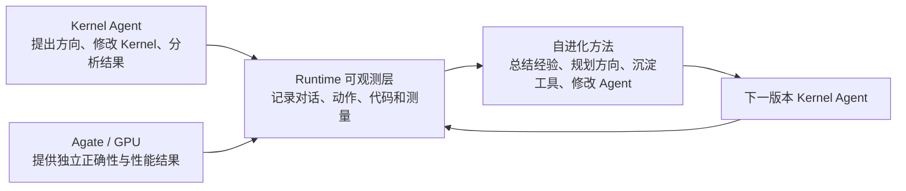

# 面向自进化 GPU Kernel Agent 的研究实验计划

## 摘要与申请事项

GPU Kernel 是直接在显卡上执行的底层计算程序，其效率会直接影响大模型训练和推理成本。目前，大模型 Agent 已经能够自动编写和优化 Kernel，但它还不像一位真正会成长的工程师：一次任务中积累的实验事实、失败原因和优化经验，很难被完整、准确地带到下一次任务；Agent 也缺少可靠的方法判断下一步应该探索什么，以及怎样修改自己的工作方式。

本项目的长期目标，是构建一个能够从真实优化过程持续学习、最终在速度、覆盖范围和稳定性上超越人类工程师的 Kernel Agent。这里的“超越”不是主观判断，而是可以测量的目标：在相同任务和时间预算下，Agent 能够在更多算子上得到不低于人类实现的性能，减少无效尝试，并把一个任务中学到的方法迁移到后续任务。

为实现这一目标，项目已经完成了一套运行与观测基础设施。它能够完整记录 Agent 看到了什么、提出了哪些方向、怎样修改 Kernel、调用了什么工具、GPU 返回了什么结果，以及最终为什么保留或放弃某个版本。Runtime 不是研究终点，而是实验仪器：有了可信、细粒度的运行数据，才能进一步研究自动经验总结、优化方向推理与规划、知识和工具沉淀、Agent Workflow 修改以及新旧 Agent 竞争等自进化技术。

目前系统已经完成端到端实现，并在一个 Fused MoE FP8 核心算子上完成了先导对照实验。结果显示，简化 Agent 承担的管理工作后，模型用量可以明显下降；同一 Agent 从相同起点出发的不同运行也可能得到相差很大的结果；简单保留经验或修改 Agent 有时有效、有时退化。这些现象尚不能形成最终结论，但已经构成明确、可验证且具有论文潜力的研究问题。

## 阅读前：项目中的几个名称

| 名称 | 解释 |
|---|---|
| **Kernel** | 在 GPU 上完成某项具体计算的底层程序。功能相同的 Kernel，运行速度可能相差数倍甚至数百倍。 |
| **Kernel Agent** | 负责自动优化 Kernel 的大模型 Agent，可以理解为一位自动工作的 GPU 性能工程师。 |
| **AKA** | Atrex Kernel Agent，现有的 Kernel 自动优化方案。它不仅修改 Kernel，还需要自己组织测试、读取结果、处理失败并总结历史。 |
| **Runtime** | 本项目已经实现的运行和观测平台，可以理解为 Agent 外部的“实验室仪器与记录系统”。它负责运行、测试、记录、比较和恢复，但不替 Agent 决定具体优化方法。 |
| **Agate** | 公司内部的远程 GPU 测试服务，可以理解为独立测试实验室。它在目标 GPU 上检查程序是否正确，并测量真实性能。 |
| **Atrex Bench** | 标准化 Kernel 任务集合，可以理解为实验题库。每道题定义要实现的计算、输入范围、正确性要求和性能测试条件。 |
| **Token** | 大模型读取和生成文本的计费单位。Token 越多，通常意味着模型成本和运行时间越高。 |
| **DSL** | 编写 GPU Kernel 的不同技术路线，本项目主要研究 CUDA、Triton 和 CuteDSL。 |

## 1. 研究主线：从观察 Agent 到改进 Agent

### 1.1 当前 Kernel Agent 的核心瓶颈

现有方案 AKA 把两类工作同时交给大模型：一类是像工程师一样提出优化思路、修改代码和分析性能；另一类是像实验管理员一样组织测试、读取日志、处理失败和总结历史。第二类工作会消耗大量模型上下文和工具调用，却不一定直接改善 Kernel。

更关键的问题是，Agent 很难仅凭自己在一次长对话结束时写出的总结完成持续学习。经过多轮探索和上下文压缩后，它可能遗漏已经尝试过的方向、混淆不同 Kernel 的测量结果，或者把自己的分析当成客观事实。后续 Agent 即使读到总结，也很难判断哪些方向仍值得探索、哪些结论已被推翻、哪些工具确实帮助过优化。

因此，限制 Agent 继续进步的因素不只是模型能力，还包括缺少完整的行为观测、可靠的实验事实和能够把历史转化为下一步决策的方法。

### 1.2 Runtime 的角色：提供观测和实验基础，而不是替 Agent 思考

Runtime 的作用类似实验室中的传感器、记录仪和裁判。Agent 仍然负责提出假设、修改 Kernel 和解释现象；Runtime 负责把全过程保存下来，并从独立 GPU 测试服务取得可信结果。

这套观测层能够提供五类数据：

1. **运行行为**：Agent 读取了什么、执行了什么命令、调用了哪些工具、哪里失败、消耗了多少 Token 和时间。
2. **搜索过程**：Agent 提出了哪些优化方向，每个方向包含什么假设，进行了哪些实验，何时继续、推翻或放弃。
3. **Kernel 演进**：每次源码变化对应哪个 Kernel，和上一个版本相比改了什么。
4. **权威结果**：每个 Kernel 在真实 GPU 上是否正确、每类输入的运行时间、性能诊断信息，以及最终比较结果。
5. **Agent 演进**：Agent 的 Prompt、知识、技能、工具和工作流程发生了什么变化，新版本是否真的在后续任务中胜出。

Runtime 本身不等于 Agent 自进化。它解决的是“看得见、记得准、比得公平”的问题；研究工作的主体，是如何使用这些观测数据产生更可靠的学习和决策。

### 1.3 基于观测数据可以研究什么

项目将沿着以下递进关系发展自进化能力：

1. **自动经验总结**：不再只依赖 Agent 在会话结束时凭记忆总结，而是把完整对话、Kernel 改动和 GPU 结果关联起来，生成有证据来源的成功经验、失败边界和待验证问题。
2. **优化方向推理与规划**：根据历史实验、当前性能瓶颈、方向的新颖性和预期收益，提出并排序下一轮值得探索的方向，减少重复尝试和局部最优。
3. **知识、技能和工具沉淀**：把反复有效的方法转化为简洁、可复用的知识或工具；合并重复内容，删除过时或误导性的内容，避免状态无限膨胀。
4. **Agent 工作方式进化**：当观测数据持续暴露出流程问题时，修改 Agent 的 Prompt、工具使用方式或整体 Workflow，生成候选 Agent。
5. **真实任务竞争**：候选 Agent 不因“看起来更合理”而直接替换原版本，而是和原 Agent 从相同 Kernel 起点出发完成真实优化，由独立测量决定是否晋升。

最终形成一个闭环：Agent 运行产生可观测数据，数据驱动经验和策略更新，更新后的 Agent 再通过新任务验证。随着算子数量增加，系统可以逐步学习人类工程师需要长期积累的硬件知识、失败模式和优化方法。

## 2. 已有结果说明了什么

现有 Fused MoE FP8 实验从完全相同的初始 Kernel 开始，比较了原始系统、简化单路线、双路线定期择优、经验继承和 Agent 版本竞争。结果应被视为研究可行性证据，而不是最终结论：

- 两次原始方案共消耗约 **19.12 亿 Token**；两个简化单路线实例共消耗约 **12.48 亿 Token**，下降约 **34.7%**。这说明减少 Agent 自己承担的实验管理工作，确实可能释放大量模型预算用于真正的优化推理。
- 在相同编程路线、相同初始 Kernel 下，原始方案两次运行的最终性能最大相差 **35.0%**，简化单路线方案最大相差 **30.8%**。这说明单次运行具有明显偶然性，也为“基于历史观测进行方向规划”和“并行探索后定期择优”提供了直接动机。
- 简单保留知识和工具后，CuteDSL 得到明显改善，CUDA 和 Triton 却发生退化。它说明“保存更多内容”不等于“学得更好”，需要研究自动总结、价值判断、去重和遗忘机制。
- 27 个候选 Agent 中有 11 个在当轮战胜原版本，但自进化方案尚未在三种技术路线上取得一致的最终收益。它说明 Agent 修改和竞争机制已经可运行，同时表明 Evolver 还需要更准确地利用运行观测，而不是继续堆叠规则。

这组结果为论文提供了三个重要起点：运行成本有真实改善空间；搜索路径差异足够大，值得研究规划和并行搜索；朴素经验继承与 Agent 修改存在正负迁移，值得研究如何从观测数据中学习。

## 3. 计划验证的研究问题

| 编号 | 研究问题 | 待检验假设 | 主要指标 |
|---|---|---|---|
| RQ1 | 能否完整、准确地观察 Agent 优化过程 | Runtime 记录能够重建“优化方向—代码变化—GPU 结果—最终决策”，并减少人工拼接日志和 Agent 错误转述 | 记录覆盖率、错误关联率、人工复核时间、失败恢复率 |
| RQ2 | 自动经验总结是否优于 Agent 自己写总结 | 基于完整观测生成的经验能够减少重复失败和历史重读，并在不增加上下文的情况下改善后续搜索 | 重复实验率、历史使用率、Token、后续 Kernel 性能 |
| RQ3 | 优化方向推理与规划是否能改善搜索 | 基于历史结果和当前瓶颈排序方向，相比自由探索更容易在固定预算内找到高性能 Kernel | 达到目标所需轮次、最终性能、方向命中率、搜索多样性 |
| RQ4 | 并行路线和经验继承如何配合 | 多条路线降低陷入局部最优的风险；经过筛选和整理的经验继承比简单累积全部内容更稳定 | 最终性能、运行间方差、知识复用率、状态增长率 |
| RQ5 | Agent 自我修改能否形成持续收益 | 使用运行观测定位 Agent 弱点后产生的候选版本，能够在后续真实任务中持续胜出，而不是只在一次比较中领先 | 候选胜率、晋升后收益、回退率、跨任务迁移、Agent 复杂度 |
| RQ6 | Agent 能否逐步达到或超过人类工程水平 | 在隐藏任务和固定预算下，完整自进化方案能够达到或超过冻结的人类实现，并覆盖更多任务与输入 | 相对人类 Kernel 的性能、通过率、优化时间、人工介入次数 |

所有问题都允许得到否定答案。比如经验继承可能只对某些 DSL 有效，自动规划可能降低探索多样性，自进化也可能产生规则膨胀。能够用完整证据说明这些方法何时有效、何时失败，本身就具有研究价值。

## 4. 实验设计

### 4.1 递进对照方案

正式实验将把“观测基础”和“自进化方法”分开，逐层增加能力，避免无法判断收益来自哪里。

| 方案 | 直观含义 | 用途 |
|---|---|---|
| 原始 AKA | Agent 同时负责 Kernel 优化、实验管理和历史总结 | 与现有方案比较成本、性能和可观测性 |
| 可观测固定 Agent | Agent 本身不进化；Runtime 只负责运行、记录、测试和恢复 | 判断观测基础设施本身的作用和开销 |
| 多路线 Agent | 从同一 Kernel 起点并行探索两条路线，每隔 3 次尝试选择最佳 Kernel | 检验能否降低单路线的路径依赖 |
| 经验学习 Agent | 在多路线基础上，自动生成有证据的经验，并整理知识、技能和工具 | 检验经验总结、复用和遗忘机制 |
| 方向规划 Agent | 使用历史观测提出、排序和分配下一轮优化方向 | 检验显式搜索规划是否提高单位预算收益 |
| 自进化 Agent | 根据行为和结果修改 Agent 自身，由原版本与候选版本完成真实竞争 | 检验 Agent 修改能否转化为持续性能收益 |

### 4.2 任务选择

计划从标准任务库 Atrex Bench 中选择 **6 个“算子任务 × 编程路线”实验单元**。这些任务将覆盖 CUDA、Triton 和 CuteDSL，并包含启动延迟敏感、计算密集、内存带宽敏感和动态输入等不同情况：

- 一个已完成先导实验的 Fused MoE FP8 任务；
- 一个 Attention 类核心算子；
- 一个归一化或逐元素计算类的低复杂度对照任务；
- 一个矩阵乘或融合投影类的计算密集任务；
- 一个数据路由或不规则内存访问任务；
- 一个 GDN 类多文件代码仓库任务。

最终清单在第 2 周冻结，并记录选择规则，避免根据中间结果挑选“更容易得到好结果”的任务。

### 4.3 分阶段实验

1. **观测验证**：确认一次完整 Agent 运行中的方向、实验、Kernel、GPU 结果和决策能够正确关联；抽样与原始日志进行人工核对。
2. **筛选实验**：6 个实验单元先各运行一次关键方案，用有限资源估计差异、方差和失败类型。
3. **核心消融**：至少选择 3 个代表性单元，对“自动经验总结”“方向规划”“经验整理”“Agent 修改”分别开关，补足至少 3 次独立重复。
4. **人类基线比较**：在 Agent 未见过的任务上冻结官方或工程师实现，使用固定模型、GPU 和时间预算比较最终性能、成功率与人工介入。
5. **多文件任务验证**：在 GDN 类代码仓库上运行小规模固定 Agent、多路线 Agent 和自进化 Agent，验证方法能否扩展到真实仓库工作。

实验先用有限资源估计差异，再把昂贵重复集中到能够回答核心问题的对照上。提前停止规则会在运行前确定，例如测试服务连续故障、程序始终无法通过正确性检查，或不同方案之间的差异已经小到没有实际意义。

### 4.4 公平性

- 同一道任务的不同方案使用完全相同的参考程序、输入范围、初始 Kernel、基础 Agent、模型设置和 GPU 型号。
- Agent 只看到公开的输入范围，不会看到最终验收使用的精确输入，避免针对测试答案进行过拟合。
- 比较两个 Kernel 时，在同一块 GPU、同一时间窗口内交错测量，以抵消机器负载和频率波动。
- 比较新旧 Agent 时，两者使用相同 Kernel 起点、相同任务信息和相同预算；候选 Agent 不参与决定自己是否晋升。
- 模型随机性通过独立重复处理；测试服务故障单独分类，不算作算法失败，也不会从报告中删除。
- 每次实验固定全部代码版本和配置。每次 Agent 会话、Kernel 版本、测试结果、经验来源和 Agent 变化都可以追溯。

### 4.5 评价指标

**Kernel 能力**：最终程序在不同输入下的运行时间、相对初始版本和人类版本的加速、严格正确性验收通过率，以及性能随优化轮次变化的曲线。

**搜索能力**：重复运行的结果方差、达到目标所需轮次、有效优化方向比例、重复实验比例，以及是否持续探索不同类型的方案。

**学习能力**：历史经验被实际读取和使用的比例，重复错误是否下降，知识和工具能否跨轮次或跨任务复用，以及过时内容能否被修正或删除。

**进化能力**：候选 Agent 胜率、晋升后的持续收益、回退比例、跨任务迁移效果，以及 Prompt、知识和工具复杂度是否受控。

**系统成本**：模型 Token、Agent 会话数、工具调用数、GPU 测试数、GPU 时间、实际运行时间和人工介入次数。

统计分析会把“同一道任务、同一种编程路线、同一个初始 Kernel”作为配对单位，优先报告差异大小和置信区间；样本足够时再进行显著性检验。所有失败、超时和负结果都进入结果表，不只展示最好的一次运行。

## 5. 为什么这项工作具有论文潜力

### 5.1 预期研究贡献

1. 提出一个以完整运行观测为基础的 Kernel Agent 自进化闭环，把 Agent 行为、Kernel 变化和权威 GPU 结果统一关联起来。
2. 提出并比较自动经验总结、优化方向规划、知识与工具整理、Agent Workflow 修改等不同层次的自进化方法。
3. 建立一种严格的新旧 Agent 评价方法：候选 Agent 必须在后续真实 Kernel 优化中战胜原版本，而不是依靠主观评价或自己生成的总结晋升。
4. 提供跨多种 GPU 编程路线、包含完整对话和程序演进的长周期实验，分析正迁移、负迁移、路径依赖和规则膨胀。
5. 探索 Kernel Agent 从单文件任务走向多文件代码仓库，并在固定条件下与人类实现进行可复核比较。

### 5.2 论文成立不依赖“所有实验都获胜”

理想结果是完整自进化方案在多个任务上同时提升性能、稳定性和成本效率，并开始超过人类基线。但论文不要求每种自进化方法在所有 DSL 上都获胜。只要正式实验能够稳定支持下列任一组合，工作就具备独立成文价值：

- 自动经验总结显著减少重复失败或历史重读；
- 方向规划或多路线搜索显著降低结果波动，提高固定预算下找到更好 Kernel 的概率；
- 经验继承和 Agent 修改表现出明确的适用边界，并能用完整观测解释正迁移和负迁移；
- 严格实验表明当前自进化方法存在系统性缺陷，例如短期胜率不能预测长期收益、内容累积导致 Agent 复杂度上升；
- 多文件任务证明该方法不局限于单个 Kernel 文件。

完整结果可面向机器学习系统或 AI Agent 系统方向会议；如果跨任务结论仍不充分，也可以先形成高质量 Workshop/ArXiv 论文和可复核实验材料。投稿前需要完成公司内部的合规与脱敏审查。

## 6. 为什么需要在实习期间继续完成

以我目前能够使用的学校资源，无法在计划周期内独立满足以下条件：

- **目标 GPU 与稳定测量条件**：实验需要使用与实际部署一致的 GPU，并能够固定工作频率、运行专业性能分析工具、在同一块 GPU 上公平比较两个方案。消费级或共享学校 GPU 无法等价替代。
- **独立 GPU 测试服务**：Agate 能够隔离编译代码、使用 Agent 看不到的输入检查正确性、执行稳定性能比较并保存日志。若在学校重建，不仅开发成本很高，也无法证明结果与实际部署条件一致。
- **代表性任务和人类基线**：Atrex Bench 提供真实核心算子、动态输入范围、硬件约束和工程师实现。这些资源决定了能否严肃验证 Agent 是否接近或超过人类水平，公开小型测试题无法完全替代。
- **长周期模型预算**：现有先导实验已经消耗十亿级 Token，包含数百次大模型会话和多日并行运行。学校没有等价的模型配额和长期任务运行条件。
- **工程协同**：测试服务、任务库、Kernel Agent 和运行平台仍在共同演进，需要与相关工程同学快速区分基础设施故障、Kernel 错误和 Agent 错误。离开当前环境后，这种闭环很难保持。

学校能够支持论文写作、方法讨论和通用实验分析，但不能替代目标硬件、真实题库、权威测试、人类基线和大规模 Agent 运行条件。继续实习不是为了方便使用更多算力，而是为了让“Agent 能否从真实优化经历中学习并逐步超过人类工程师”这一问题得到可信验证。

即使最终自进化没有表现出普遍收益，团队仍会获得：更稳定、可观测的 Kernel Agent 系统；可复用的失败恢复、结果追踪和版本比较能力；不同学习策略的真实成本数据；以及一套判断 Agent 改动是否真正有效的评测协议。

## 参考材料

- [Atrex Kernel Agent Runtime 设计说明](../DESIGN.zh.md)
- [Fused MoE FP8 消融实验报告](../experiments/production-qwen35-35b-fp8-atrex-gdn-4k256-20260814--fused-moe-fp8--l20n--claude/report.md)
- [生产实验配置与运行说明](../scripts/production/README.zh.md)
